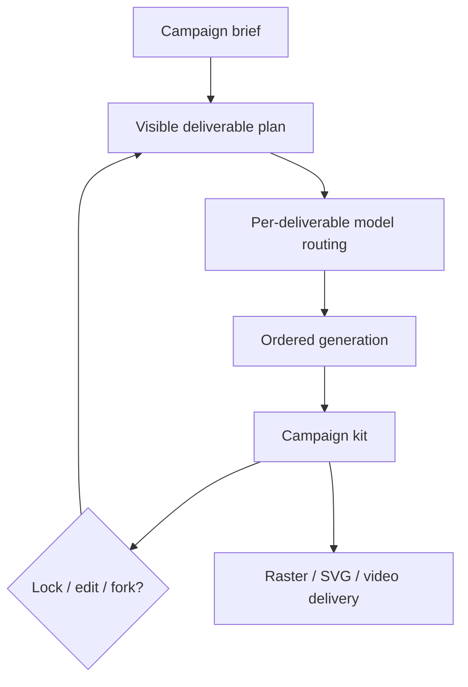

# Open AI Design Agent

> Research status: **Source-level** · Last reviewed: **2026-08-12**

Open AI Design Agent owns a campaign-level plan rather than a single prompt/result pair. A brief can expand into a logo, palette, poster, social variants, packaging mockup and video; dependencies and references are carried forward so the user can inspect and revise the kit as one job.

## The plan is editable orchestration state

The product first proposes a deliverable list and routes each item to a suitable image, vector or video model. Items are generated in dependency order. The user can interrupt, swap a model, lock an accepted result, edit an intermediate, fork the plan and resume.

This differs from a generic image/video studio: plan membership, ordering, locked choices and shared references provide continuing design state across multiple outputs.

## Source boundary

Pinned revision [`e179fe1`](https://github.com/Anil-matcha/Open-AI-Design-Agent/commit/e179fe1a6c47b26ee6afac9128155d9f259a5d14) exposes:

- the reusable [`CreativeCanvas.jsx`](https://github.com/Anil-matcha/Open-AI-Design-Agent/blob/e179fe1a6c47b26ee6afac9128155d9f259a5d14/packages/design-agent/src/CreativeCanvas.jsx);
- [`PlanVisualizer.jsx`](https://github.com/Anil-matcha/Open-AI-Design-Agent/blob/e179fe1a6c47b26ee6afac9128155d9f259a5d14/packages/design-agent/src/components/PlanVisualizer.jsx), which makes plan state visible;
- the [canvas area](https://github.com/Anil-matcha/Open-AI-Design-Agent/blob/e179fe1a6c47b26ee6afac9128155d9f259a5d14/packages/design-agent/src/CanvasArea.jsx);
- the server [creative-agent router](https://github.com/Anil-matcha/Open-AI-Design-Agent/blob/e179fe1a6c47b26ee6afac9128155d9f259a5d14/server/app/routers/creative_agent_router.py) and MuAPI adapter;
- a canvas session route under [`client/app/canvas`](https://github.com/Anil-matcha/Open-AI-Design-Agent/tree/e179fe1a6c47b26ee6afac9128155d9f259a5d14/client/app/canvas).

Generation history and API keys are documented as browser-local storage. The hosted surface supplies a managed entry point, while the MIT repository can be self-hosted.

## Related-project boundary

Vibe Workflow is a separately counted graph editor from the same MuAPI/SamurAIGPT ecosystem. Open Generative AI is excluded: its broad model studio lacks the campaign-specific plan authority evidenced here. Shared models and hosting do not collapse these different artifacts. Public sources did not establish a reliable team region.

## Decisive sources

- [Repository README](https://github.com/Anil-matcha/Open-AI-Design-Agent/blob/e179fe1a6c47b26ee6afac9128155d9f259a5d14/README.md)
- [MIT license](https://github.com/Anil-matcha/Open-AI-Design-Agent/blob/e179fe1a6c47b26ee6afac9128155d9f259a5d14/LICENSE)
- [Hosted agent](https://muapi.ai/assistant)
