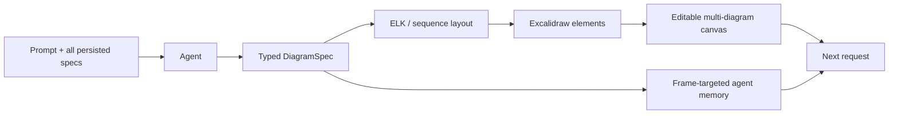

# OpenDiagram

> Research status: **Source-level** · Lifecycle: **active** · Last reviewed: **2026-08-12**

OpenDiagram defines AI architecture design as a semantic-spec compiler targeting an editable Excalidraw workspace. The model decides what the system contains; typed schemas, layout code and renderers decide where it goes and how it looks.

## Two coupled artifacts, with different jobs

At commit [`6fb5795f`](https://github.com/Itz-Agasta/OpenDiagram/tree/6fb5795f7ba1604cc9094718341fc27fc58f73da), [`diagram-schema.ts`](https://github.com/Itz-Agasta/OpenDiagram/blob/6fb5795f7ba1604cc9094718341fc27fc58f73da/packages/harness/src/diagram-schema.ts) defines `DiagramSpec` variants for architecture, flow, sequence and ER diagrams. The agent emits that semantic structure, not Mermaid and not pixel coordinates. [`tools.ts`](https://github.com/Itz-Agasta/OpenDiagram/blob/6fb5795f7ba1604cc9094718341fc27fc58f73da/apps/server/src/lib/agent/tools.ts) validates it, routes sequence diagrams to a dedicated lifeline renderer and other diagrams through ELK, then returns Excalidraw skeletons plus preformed icon elements.

The spec remains agent memory and regeneration input; the Excalidraw scene is the user's direct-manipulation artifact. [`canvas-diagrams.ts`](https://github.com/Itz-Agasta/OpenDiagram/blob/6fb5795f7ba1604cc9094718341fc27fc58f73da/apps/web/src/lib/canvas-diagrams.ts) persists every generated spec beside its assigned frame id so a new conversation can target any diagram already on a multi-diagram canvas.

## Updating means regenerating one owned frame

The canvas context in [`prompt.ts`](https://github.com/Itz-Agasta/OpenDiagram/blob/6fb5795f7ba1604cc9094718341fc27fc58f73da/apps/server/src/lib/agent/prompt.ts) includes full specs and stable target ids. The model must copy `targetId` when modifying an existing diagram. [`use-diagram-canvas.ts`](https://github.com/Itz-Agasta/OpenDiagram/blob/6fb5795f7ba1604cc9094718341fc27fc58f73da/apps/web/src/components/whiteboard/ai-chat-panel/use-diagram-canvas.ts) only honors ids already known by the client; a missing or garbled id creates a new frame rather than overwriting visible work. A valid update removes that generated frame and its members, renders a fresh frame in the same position, and replaces its stored spec.

This is safer than replacing the whole whiteboard, but source mapping is one-way. Arbitrary manual Excalidraw edits are saved in the scene; they are not reverse-compiled into `DiagramSpec`. The next agent turn sees the last generated spec, so a regenerated frame can lose manual edits. The roadmap's “position-locked incremental updates” remains a real boundary, not an already implemented capability.

## Persistence treats local durability and server replication separately

The database splits lightweight file metadata from large scene/spec/content/history columns in [`project-file-content.ts`](https://github.com/Itz-Agasta/OpenDiagram/blob/6fb5795f7ba1604cc9094718341fc27fc58f73da/packages/db/src/schema/projects/project-file-content.ts). Scene revisions support delta conflict detection. Per-file threads and append-only, idempotent messages avoid repeatedly embedding an ever-growing transcript.

On the client, [`useWorkspacePersistence.ts`](https://github.com/Itz-Agasta/OpenDiagram/blob/6fb5795f7ba1604cc9094718341fc27fc58f73da/apps/web/src/components/whiteboard/workspace-layout/useWorkspacePersistence.ts) writes every edit immediately to IndexedDB, then throttles and coalesces server PATCHes. In this design the local write is saving; network persistence is replication. Guest projects use local drafts, while signed-in projects gain server files and chat history. Team collaboration and version history are still roadmap items.

## Why this implementation matters

OpenDiagram's central contribution is a clean allocation of authority: AI owns semantic intent, deterministic code owns layout and visual consistency, and Excalidraw owns user-facing editability. Its unresolved frontier is equally valuable evidence: once users directly alter rendered shapes, the semantic source and visible artifact can diverge unless reverse mapping or patch-level preservation is added.

## Evidence

- [Pinned product contract and roadmap](https://github.com/Itz-Agasta/OpenDiagram/blob/6fb5795f7ba1604cc9094718341fc27fc58f73da/README.md)
- [Typed artifact schema](https://github.com/Itz-Agasta/OpenDiagram/blob/6fb5795f7ba1604cc9094718341fc27fc58f73da/packages/harness/src/diagram-schema.ts)
- [Deterministic layout/render tool boundary](https://github.com/Itz-Agasta/OpenDiagram/blob/6fb5795f7ba1604cc9094718341fc27fc58f73da/apps/server/src/lib/agent/tools.ts)
- [Multi-diagram identity and prompt mapping](https://github.com/Itz-Agasta/OpenDiagram/blob/6fb5795f7ba1604cc9094718341fc27fc58f73da/apps/web/src/lib/canvas-diagrams.ts)
- [Local-first autosave and server replication](https://github.com/Itz-Agasta/OpenDiagram/blob/6fb5795f7ba1604cc9094718341fc27fc58f73da/apps/web/src/components/whiteboard/workspace-layout/useWorkspacePersistence.ts)
