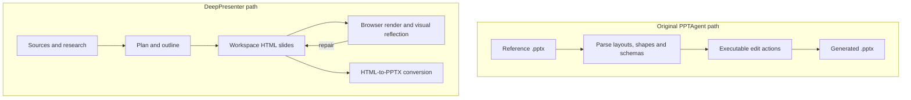

# PPTAgent / DeepPresenter (`icip-cas/PPTAgent`)

> Research status: **Source-level** · Last reviewed: **2026-08-11**

| Field | Value |
|---|---|
| Organization / team | Chinese Information Processing Laboratory, Institute of Software, Chinese Academy of Sciences; current repository contributors |
| Ordinary job | turn documents and research material into a visually coherent presentation, inspect rendered slides, repair failures and export a native PowerPoint deck |
| Status | active transition: the repository retains the original PPTAgent engine and now presents DeepPresenter as the current generation workspace |
| Canonical artifact | current path: workspace HTML slide files; legacy path: structured edits over reference PowerPoint slides; both materialize `.pptx` delivery |
| Source repository | [icip-cas/PPTAgent](https://github.com/icip-cas/PPTAgent) |
| Pinned source revision | [`2419d30b134a71486523e95ded60b32489fd3c61`](https://github.com/icip-cas/PPTAgent/commit/2419d30b134a71486523e95ded60b32489fd3c61) |
| License | MIT |

## One lineage contains an authority transition

The repository should not be counted once as PPTAgent and again as DeepPresenter. Its history shows the newer agent entering the same maintained project while the original engine remains available.

The transition is architectural rather than cosmetic:

Original PPTAgent treats a reference presentation as a structured design source and asks agents to select and edit its slide elements. DeepPresenter instead makes one HTML file per slide the working generative authority, renders those files for reflection, and converts the accepted state to PowerPoint.

## Current workspace authority: HTML before PowerPoint

At the pinned revision, `deeppresenter/agents/design.py` directs the design role to create slides in the workspace. The role and tool stack operate on files rather than a hidden hosted document. `deeppresenter/tools/reflect.py` inspects rendered output; the HTML-to-PPTX boundary lives under `deeppresenter/html2pptx/`.

The important separation is:

| State | Role in the loop |
|---|---|
| source documents and research notes | grounded input; not the slide artifact |
| outline / plan | narrative and task coordination |
| per-slide HTML | editable working authority for layout and content |
| browser render, PDF or JPEG | visual evidence used to find defects |
| `.pptx` | interoperable delivery materialized from the HTML state |

The exported deck can be edited later in PowerPoint, but the repository does not provide a lossless round trip from those downstream edits back into the same HTML workspace. After export, the two states can diverge.

## The older engine explains the project's design inheritance

The original implementation remains in `pptagent/`. `pptagent/presentation/` parses presentation layouts and shapes into programmatic objects. `pptagent/apis.py` exposes editing operations, and generation code selects reference slides and applies actions rather than reconstructing every visual property from scratch. `pptagent/mcp_server.py` makes this path callable as tools and saves generated slides as a PowerPoint file.

This history matters because the current project's visual quality strategy did not begin as unconstrained text-to-HTML generation. The initial engine learned presentation structure from real decks, simplified slide structure into an agent-readable representation, and repaired executable edit failures. The newer workspace changes the authoring representation while preserving the plan → render → inspect → repair discipline.

## Visual reflection is an explicit execution gate

DeepPresenter does not use a screenshot as a decorative final preview. The workspace tooling converts slide HTML, opens or renders it through browser-based infrastructure, and gives the agent visual evidence. Invalid HTML-to-PPTX conversion or visibly defective composition can therefore return to the file authority for another edit.

Acceptance should distinguish three failures:

- **source failure:** HTML or assets are incomplete or invalid;
- **projection failure:** browser/PDF/JPEG rendering does not match the intended source state;
- **materialization failure:** the exported `.pptx` loses layout or unsupported HTML semantics.

A clean screenshot proves neither source durability nor PowerPoint fidelity. The final deck must be opened and checked independently.

## Agent state and artifact state are persisted separately

`deeppresenter/agents/agent.py` maintains chat and tool state for the workspace. `deeppresenter/agents/env.py` creates the workspace environment, MCP/tool connections and history area. The implementation writes JSONL under `.history` for conversations, tool activity and timing, while slide files live in the workspace itself.

That split prevents a common category error: conversation history explains how the agent arrived at a result; it is not the presentation authority. Deleting or compacting chat should not be assumed to delete slide files, and restoring an older chat record should not be assumed to rewind the filesystem.

The repository does not expose a first-class version graph over presentation candidates. Recovery is primarily filesystem/workspace based. Git can version a workspace if the operator places it under Git, but that is not presented as an automatic end-user guarantee.

## Commit history establishes the transition

| Revision | Date | Consequence |
|---|---:|---|
| `bc9f3abcc2d5504b5b7e3218014a23d332aa4e7a` | 2024-06-26 | initial public PPTAgent lineage |
| `c9deeac8aa83b45781b43caae858c60634fee07d` | 2024-07-23 | HTML representation and slide-judging direction become visible |
| `152f4771162a7c5cdb064868273ef4d7f6efb759` | 2025-09-17 | MCP support enters the project |
| `4b7fd079bf3ed53bdaed4397b37dcd28910a7cd1` | 2025-12-10 | DeepPresenter is integrated into the same repository |
| `ea41eb2ca40e537d5fd4141b6e47097c75ac37fb` | 2026-01-07 | environment-grounded reflection is strengthened |
| `8a5676782be3cb99c40a4ad0c427a08cc47feeab` | 2026-01-08 | PPTX generation is added to the DeepPresenter path |
| `2419d30b134a71486523e95ded60b32489fd3c61` | 2026-06-28 | pinned research snapshot |

## Implementation map

| Concern | Pinned path | What it establishes |
|---|---|---|
| agent loop and history | `deeppresenter/agents/agent.py` | messages, tool calls, compaction and workspace history |
| workspace/tool environment | `deeppresenter/agents/env.py` | sandbox, MCP tools, history and per-run workspace boundaries |
| slide design role | `deeppresenter/agents/design.py` and `deeppresenter/roles/Design.yaml` | HTML slide authoring responsibilities |
| visual inspection | `deeppresenter/tools/reflect.py` | rendered slide evidence returned to the agent |
| PowerPoint materialization | `deeppresenter/html2pptx/` | HTML-to-PPTX conversion boundary |
| original presentation graph | `pptagent/presentation/` | structured layouts and shape objects parsed from PowerPoint |
| original edit tools | `pptagent/apis.py` | executable operations over the presentation representation |
| external tool surface | `pptagent/mcp_server.py` | template selection, generation and save operations exposed over MCP |

## What is still not guaranteed

- lossless HTML/CSS-to-PowerPoint feature coverage;
- stable element identity across HTML, rendered browser nodes and PowerPoint shapes;
- transactional rollback across a multi-slide agent run;
- a durable branch/merge graph for alternative decks;
- preservation of downstream manual PowerPoint edits on regeneration;
- one-to-one correspondence between a conversation checkpoint and an artifact revision.

The source establishes a real editable authority and a real materialization path. It does not justify treating every representation as one synchronized document.

## Primary evidence

- [Pinned repository tree](https://github.com/icip-cas/PPTAgent/tree/2419d30b134a71486523e95ded60b32489fd3c61)
- [PPTAgent paper and affiliations](https://arxiv.org/html/2501.03936v3)
- [Project README](https://github.com/icip-cas/PPTAgent/blob/2419d30b134a71486523e95ded60b32489fd3c61/README.md)
