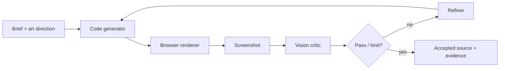

# design-agent by NightGhost

> Research status: **Source-level** · Lifecycle: **active-transition** · Last reviewed: **2026-08-12**

This project makes the visual feedback loop itself the product mechanism. It generates frontend code, renders it in a browser, captures a screenshot, asks a vision critic for a structured assessment and refines the code until the quality gate or iteration limit is reached.

## Candidate code is promoted through evidence

The screenshot is evidence, not authority. Source remains editable; every cycle re-renders it. The critic and refiner are separate modules, which makes it possible to inspect what was judged and what changed rather than hiding iteration in one model response.

## Pinned implementation

At commit [`2ebabc0`](https://github.com/NightGhost4/design-agent/commit/2ebabc0a6d5d044c3d029f8b0d8350ae45ba1cad):

- [`generator.py`](https://github.com/NightGhost4/design-agent/blob/2ebabc0a6d5d044c3d029f8b0d8350ae45ba1cad/agent/generator.py) produces candidate code.
- [`renderer.py`](https://github.com/NightGhost4/design-agent/blob/2ebabc0a6d5d044c3d029f8b0d8350ae45ba1cad/agent/renderer.py) creates browser evidence.
- [`critic.py`](https://github.com/NightGhost4/design-agent/blob/2ebabc0a6d5d044c3d029f8b0d8350ae45ba1cad/agent/critic.py) and [`refiner.py`](https://github.com/NightGhost4/design-agent/blob/2ebabc0a6d5d044c3d029f8b0d8350ae45ba1cad/agent/refiner.py) separate judgment from mutation.
- [`loop.py`](https://github.com/NightGhost4/design-agent/blob/2ebabc0a6d5d044c3d029f8b0d8350ae45ba1cad/agent/loop.py) owns termination and evidence flow; tests cover renderer, critic and the full loop.

## Maturity and rights

The repository was a short development burst and has no license file, so it is marked active-transition and no reuse permission is inferred. No reliable region evidence was found. The review did not supply paid model credentials for a live loop.

## Decisive sources

- [Repository README](https://github.com/NightGhost4/design-agent/blob/2ebabc0a6d5d044c3d029f8b0d8350ae45ba1cad/README.md)
- [Test tree](https://github.com/NightGhost4/design-agent/tree/2ebabc0a6d5d044c3d029f8b0d8350ae45ba1cad/tests)
