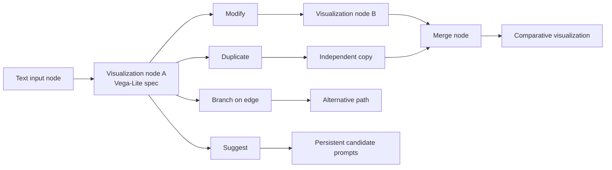

# VisCanvas (`svl-at-asu/VisCanvas`)

> Research status: **Source-level** · Last reviewed: **2026-08-11**

| Field | Value |
|---|---|
| Organization / team | Arizona State University visualization research team |
| Ordinary job | explore a dataset by creating chart states, revising them, branching alternatives, comparing them and merging two directions without losing the exploration structure |
| Canonical artifact | a client-side node/edge graph; visualization nodes contain editable Vega-Lite specifications and analysis goals |
| Status | active public research implementation released with the 2026 paper and reproducibility materials |
| Source repository | [svl-at-asu/VisCanvas](https://github.com/svl-at-asu/VisCanvas) |
| Pinned source revision | [`96dc56af40e71eca658967cb145a2ad3f8d52d93`](https://github.com/svl-at-asu/VisCanvas/commit/96dc56af40e71eca658967cb145a2ad3f8d52d93) |
| Supplemental archive | [OSF reproducibility project](https://osf.io/gsxhn/overview?view_only=98e94f52985c4cc2ad32209db8772058) |

## The history is the canvas

Most chat-based visualization tools keep one current answer and a linear transcript. VisCanvas externalizes alternatives as a graph. Nodes are not thumbnails pointing at an invisible chat state: visualization nodes carry the Vega-Lite specification that can be rendered and edited again.

The exploration graph is therefore both provenance and an active authoring surface. An older visualization remains a usable input for a later branch or merge rather than becoming only a screenshot in history.

## A visualization node contains executable visual state

The frontend uses React, `@xyflow/react`, Zustand and ELK layout. `frontend/src/app/whiteboard/store/app-store.ts` owns arrays of typed nodes and edges. A generated visualization node carries at least the current `visSpec`, a `baseVisSpec`, an `analysisGoal`, status and optional bookmark metadata.

The specification has two direct editing paths:

- a visual builder converts widgets back into a Vega-Lite specification;
- a raw Vega-Lite editor changes the specification text.

Both commit into node data, and the chart renderer immediately projects that state. AI generation is another writer over the same specification field rather than a separate image store.

## Branch and duplicate preserve a predecessor explicitly

`usePlaceholderClick/placeholder-actions.ts` defines modify and duplicate node payloads. The duplicate path copies the parent's visualization specification and analysis goal into a new visualization node, then adds a new placeholder for continued exploration. `useBranchClick.tsx` can copy the target visualization from an edge into a new branch and reconnect it without mutating the original target.

This is a genuine non-linear artifact operation. It is still lighter than a version-control branch:

- copies do not share a merge base with automatic conflict calculation;
- subsequent edits are independent node states;
- node IDs express graph identity but not immutable content hashes;
- promoting one branch does not delete or supersede the others.

The canvas preserves alternatives; the human decides which are useful through comparison, bookmark and later reuse.

## Merge synthesizes rather than structurally reconciling

A merge node accepts two source visualization nodes. `merge-vis-processor.ts` collects their `visSpec` values and sends them with a prompt for a comparative visualization. The prompt asks the model to find shared attributes, align common axes and use layered, dual-axis or otherwise relational views.

The result is a **new** Vega-Lite specification. It is not a deterministic three-way merge of two JSON documents. Source nodes remain intact, and the output must be reviewed as another candidate because the model can omit, reinterpret or misalign fields.

This distinction is important: VisCanvas supports synthesis of analytical directions, not conflict-free synchronization of concurrent edits.

## Each LLM operation is stateless outside graph context

The backend uses FastAPI and LangGraph for data summary, analysis-goal generation, Vega-Lite generation and suggestions. The paper and source make clear that each operation is a fresh invocation. Relevant upstream specifications and graph context are passed explicitly; there is no persistent hidden chat session whose unrecorded memory determines the next chart.

That makes the visible graph a stronger provenance boundary:

| Input supplied to an operation | Where it is represented |
|---|---|
| user instruction | text-input or suggestion node |
| prior visualization | upstream node `visSpec` |
| analytical intent | node `analysisGoal` and path goals |
| dataset summary | cached dataset grounding |
| selected model | node model field |

The exact model provider response is not stored as an immutable generation record, so deterministic replay is not guaranteed. The artifact inputs are nevertheless inspectable.

## Persistence is browser-local and dataset-keyed

`whiteboard/[datasetId]/page.tsx` debounces changes and saves `{ nodes, edges }` through `cacheSet`. `frontend/src/lib/cache.ts` maps that operation directly to `localStorage`. The dataset layout reloads the same key and reconstructs the Zustand store.

This is real durable recovery across an ordinary page reload in the same browser profile. Its boundary is narrow:

- state is not synchronized across browsers or machines;
- local-storage eviction or site-data clearing destroys the working graph;
- there is no account-level project service or immutable version history;
- concurrent tabs can overwrite the same dataset key without revision guards;
- the “leave” warning can coexist with autosave and should not be interpreted as server backup.

The backend's action and final-state JSONL logs support study instrumentation. They do not replace the browser graph as the interactive authority and are not exposed as a normal restore UI.

## Bookmarks select evidence without promoting authority

Visualization nodes can be bookmarked and annotated. The bookmark panel reads the same node and specification and helps the user return to promising charts. Bookmarking changes metadata on the node; it does not make that node the sole accepted result or rewrite downstream branches.

This is deliberate: exploratory analysis may preserve several useful views. An external report or downstream authoring step still needs an explicit choice and export/copy boundary that the current research implementation does not formalize as a project release state.

## Implementation map

| Concern | Pinned path | What it establishes |
|---|---|---|
| graph authority | `frontend/src/app/whiteboard/store/app-store.ts` | typed nodes, edges and mutation actions |
| durable reload | `frontend/src/app/whiteboard/[datasetId]/page.tsx`, `layout.tsx`, `frontend/src/lib/cache.ts` | dataset-keyed localStorage autosave and load |
| visualization source | `frontend/src/app/whiteboard/components/nodes/generate-vis-node.tsx` | Vega-Lite spec and analytical metadata on a node |
| manual source editing | `frontend/src/components/sidebar-editor/` | visual-builder and JSON/spec editing converge on node state |
| branch | `frontend/src/app/whiteboard/hooks/useBranchClick.tsx` | creates a new usable visualization state from an existing edge target |
| duplicate/modify | `frontend/src/app/whiteboard/hooks/usePlaceholderClick/` | explicit graph operations and copied specifications |
| merge | `frontend/src/app/whiteboard/components/nodes/processors/merge-vis-processor.ts` | two source specs become a prompt-grounded comparative spec |
| LLM pipeline | `backend/src/langgraph/generate_vega_spec.py` | data summary, goal generation and specification generation |
| study logs | `backend/src/api/routes/log.py` | action and final-state JSONL separate from interactive persistence |

## Source and archive integrity

The GitHub repository's pinned public commit is `96dc56af40e71eca658967cb145a2ad3f8d52d93`. The reviewed OSF source archive was file `6a67da961a33517eab135b67` with SHA-256 `d772188baf47d49ed6dd40a228337fe9efe4325aefc003239ff6acb3b61362d6`; its contents match the architecture inspected for this dossier.

The implementation proves a complete browser-local authoring loop over reusable visual states. It does not prove collaborative persistence, account backup, immutable versions, deterministic model replay or automatic promotion of one final chart. Those missing mechanisms define the next acceptance boundary rather than weakening the evidence for the graph it actually ships.

## Primary evidence

- [Pinned source](https://github.com/svl-at-asu/VisCanvas/tree/96dc56af40e71eca658967cb145a2ad3f8d52d93)
- [VisCanvas paper](https://arxiv.org/html/2607.21886v1)
- [OSF materials](https://osf.io/gsxhn/overview?view_only=98e94f52985c4cc2ad32209db8772058)
