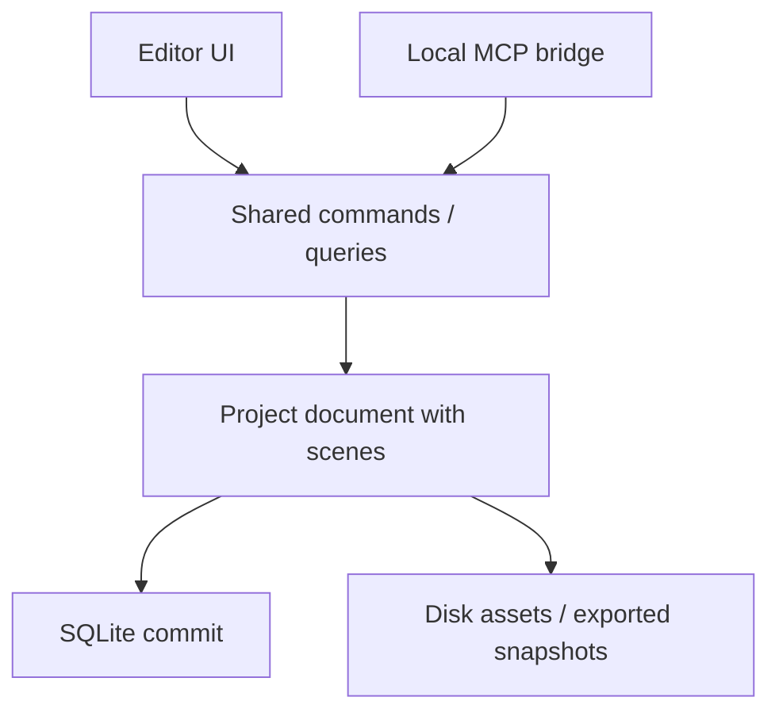

# AI Canvas Desktop

> Research status: **Source-level** · Lifecycle: **active-transition** · Last reviewed: **2026-08-12**

AI Canvas Desktop is a local Electron mockup editor whose human UI and MCP bridge share one document schema, command system and semantic query layer. That shared core is the decisive mechanism: an agent edit cannot bypass the same invariants used by direct editing.

## Scene-first document

A project contains one document in v1, project-local design-system data, history metadata and references to disk-backed assets/exports. Scenes are top-level content units. Successful edit commands, undo and redo commit immediately to SQLite before the changed document is emitted.

MCP remains available on localhost when the window closes for inspection, but mutation/browser capture requires reopening the renderer because computed-layout measurement is browser-backed. That failure boundary is explicitly documented.

## Commit-level trace

Pinned revision [`1547da0`](https://github.com/chadnickbok/ai-canvas/commit/1547da06cfa767383ded72b3dcc995dca7a1e3c8) exposes:

- commands and application in [`packages/document-core`](https://github.com/chadnickbok/ai-canvas/tree/1547da06cfa767383ded72b3dcc995dca7a1e3c8/packages/document-core);
- [local MCP bridge](https://github.com/chadnickbok/ai-canvas/tree/1547da06cfa767383ded72b3dcc995dca7a1e3c8/packages/mcp-bridge) with tests;
- [SQLite project store](https://github.com/chadnickbok/ai-canvas/blob/1547da06cfa767383ded72b3dcc995dca7a1e3c8/apps/desktop/src/main/runtime/projectStore.ts) with tests;
- [command semantics](https://github.com/chadnickbok/ai-canvas/blob/1547da06cfa767383ded72b3dcc995dca7a1e3c8/docs/command-semantics.md), [MCP contract](https://github.com/chadnickbok/ai-canvas/blob/1547da06cfa767383ded72b3dcc995dca7a1e3c8/docs/local-mcp.md) and [snapshot format](https://github.com/chadnickbok/ai-canvas/blob/1547da06cfa767383ded72b3dcc995dca7a1e3c8/docs/project-snapshot-format.md).

## Boundary

The repository is AGPL-3.0 licensed. It is marked active-transition because the documentation identifies v1 constraints and future foundations. The maintainer profile gives USA as location.

## Decisive sources

- [Repository README](https://github.com/chadnickbok/ai-canvas/blob/1547da06cfa767383ded72b3dcc995dca7a1e3c8/README.md)
- [AGPL-3.0 license](https://github.com/chadnickbok/ai-canvas/blob/1547da06cfa767383ded72b3dcc995dca7a1e3c8/LICENSE)
- [Maintainer profile](https://github.com/chadnickbok)
