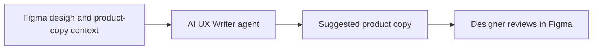

# AI UX Writer

> Research status: **Architecture-level** · Last reviewed: **2026-08-12**

AI UX Writer is a Figma plugin published under Community ID `1636752735091846870`. The stable ID matters because the name is generic: it separates this current executable surface from older products and unrelated search results with similar names.

## Verified product loop

The creator describes an AI agent that helps designers produce clearer and more consistent product copy without leaving the Figma workflow.

That evidence is enough to establish a current design-bound writing surface, but not enough to infer unsupported features. The public creator post does not enumerate selection depth, brand voice, bulk operations, translation, undo, direct node mutation, approval workflow or generated-copy history. Those capabilities are therefore not borrowed from similarly named plugins such as BUX.

## Evidence ceiling

The plugin implementation, model provider, prompt construction, data retention, Figma context extraction and persistence semantics are closed or undocumented in the reviewed material. A suggestion inside Figma is still subject to product, legal, localization and accessibility review.

The creator handle Ragnak8 is recorded only to stabilize identity; no reliable first-party team geography was found.

## Primary evidence

- [Figma Community plugin](https://www.figma.com/community/plugin/1636752735091846870)
- [Creator-authored launch post](https://www.reddit.com/r/FigmaAddOns/comments/1tpa6t1/ai_ux_writer_figma_plugin/)
