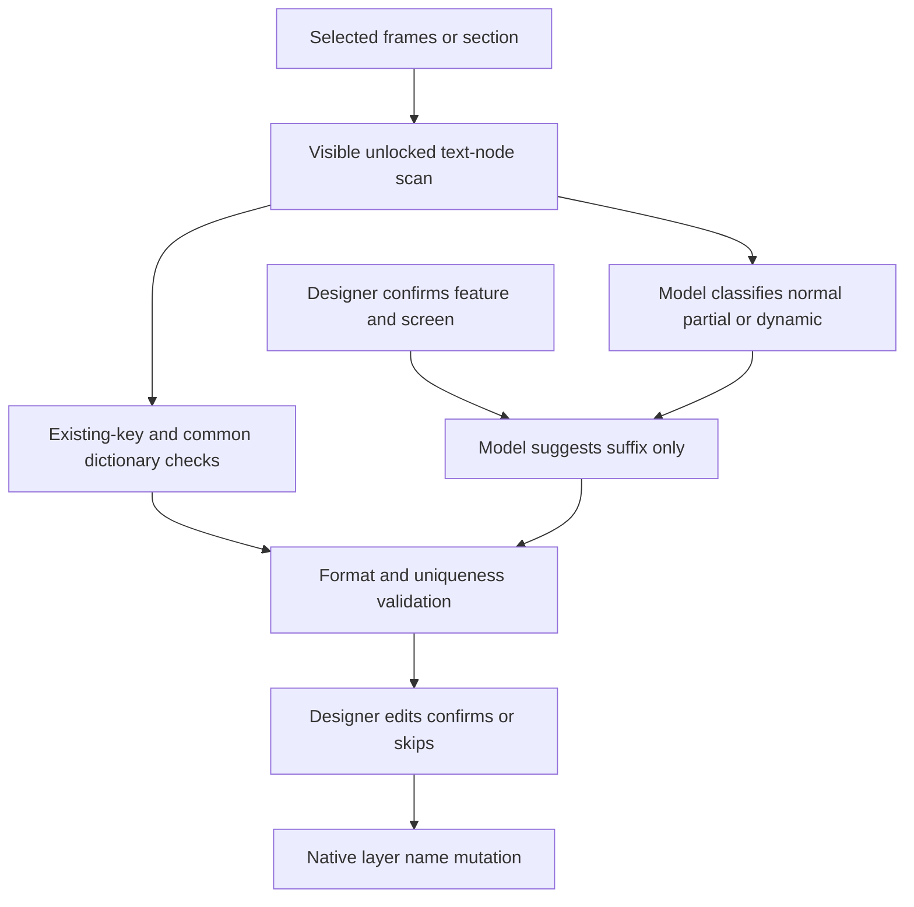

# AINaming

> Research status: **Source-level** · Last reviewed: **2026-08-12**

| Field | Verified value |
|---|---|
| Product | Figma localization-key naming plugin |
| Canonical artifact | confirmed names on native Figma text nodes plus a file-local common-key dictionary |
| Pinned source | [`02e4c8e0ca0a8e9000a383ea2b16dce04c7737d8`](https://github.com/donghuc/FigmaAI-Auto-Layer-Naming/tree/02e4c8e0ca0a8e9000a383ea2b16dce04c7737d8) |
| License evidence | inconsistent: README says MIT, package metadata says ISC, and no license file exists at the pinned revision |

AINaming turns visible Figma copy into structured localization keys. It deliberately divides the work among deterministic filters, human-provided architectural anchors and model suggestions; the model is not allowed to choose the whole key or mutate every layer automatically.

## Anchors constrain model output

Frame names produce initial feature/screen guesses, but the UI requires the designer to confirm those anchors. The system prompt tells the model not to change them and requests only remaining semantic segments. Common strings bypass the model through a dictionary, and accepted new mappings can grow that dictionary.

The scanner skips hidden or locked subtrees, detects already valid keys and caps the working set. After suggestions return, deterministic composition and uniqueness checks identify collisions; duplicate semantic keys receive text-derived descriptors. `src/main/code.ts` assigns `node.name` only when the UI sends an apply message for a reviewed key.

## Source map

| Pinned path | Decisive evidence |
|---|---|
| [`src/main/code.ts`](https://github.com/donghuc/FigmaAI-Auto-Layer-Naming/blob/02e4c8e0ca0a8e9000a383ea2b16dce04c7737d8/src/main/code.ts) | selection traversal, settings, dictionary state and native rename |
| [`src/ui/ai.ts`](https://github.com/donghuc/FigmaAI-Auto-Layer-Naming/blob/02e4c8e0ca0a8e9000a383ea2b16dce04c7737d8/src/ui/ai.ts) | OpenAI/Anthropic calls, classification and suffix-only prompt boundary |
| [`src/ui/validator.ts`](https://github.com/donghuc/FigmaAI-Auto-Layer-Naming/blob/02e4c8e0ca0a8e9000a383ea2b16dce04c7737d8/src/ui/validator.ts) | key grammar and collision checks |
| [`src/ui/ui.ts`](https://github.com/donghuc/FigmaAI-Auto-Layer-Naming/blob/02e4c8e0ca0a8e9000a383ea2b16dce04c7737d8/src/ui/ui.ts) | anchor confirmation, grouped review, edit, skip and apply flow |

The standalone Python file can read Figma through REST and generate a report, but its own comments acknowledge that REST cannot rename layer names; durable write authority remains the plugin. The repository has no automated test suite and its license declarations conflict, so neither reliability nor reuse rights should be inferred beyond what the files establish. Team region remains unknown.

## Primary evidence

- [Pinned repository](https://github.com/donghuc/FigmaAI-Auto-Layer-Naming/tree/02e4c8e0ca0a8e9000a383ea2b16dce04c7737d8)
- [Current user guide](https://donghuc.github.io/FigmaAI-Auto-Layer-Naming/guide.html)
