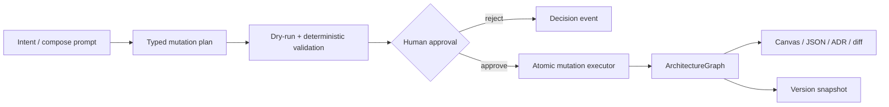

# Architect Studio X

> Research status: **Source-level** · Lifecycle: **active** · Last reviewed: **2026-08-12**

Architect Studio X defines architecture design as controlled evolution of a typed system graph. The canvas, validation findings, ADR drafts, diffs and history are projections; the graph is the product authority, and AI is restricted to proposing typed mutations against it.

## The single-writer invariant

At commit [`f02c1322`](https://github.com/Balchandar/Architect-Studio-X/tree/f02c132257996fd8c46e4e774a63862724dba1da), [`graphStore.ts`](https://github.com/Balchandar/Architect-Studio-X/blob/f02c132257996fd8c46e4e774a63862724dba1da/client/src/store/graphStore.ts) holds an `ArchitectureGraph` of services, connections, constraints and decisions. Manual canvas operations do not mutate this object ad hoc: they construct the same `GraphMutation` family used by AI plans. [`mutations.ts`](https://github.com/Balchandar/Architect-Studio-X/blob/f02c132257996fd8c46e4e774a63862724dba1da/client/src/lib/graph/mutations.ts) is the single executor and applies a multi-mutation plan atomically—any failed mutation returns the original graph.

That makes the interface more like a structured architecture IDE than a whiteboard:

## AI has proposal authority, not write authority

[`pipeline.ts`](https://github.com/Balchandar/Architect-Studio-X/blob/f02c132257996fd8c46e4e774a63862724dba1da/client/src/lib/ai/pipeline.ts) dry-runs a proposed plan, compares deterministic findings before and after, and computes human-readable impact. [`MutationApprovalModal.tsx`](https://github.com/Balchandar/Architect-Studio-X/blob/f02c132257996fd8c46e4e774a63862724dba1da/client/src/components/panels/MutationApprovalModal.tsx) exposes grouped changes, resolved findings, new warnings and malformed-reference warnings before the graph can change.

Approval then performs four linked writes: apply the plan, auto-layout the graph, derive an ADR draft, and save a version. Reject records a decision without touching the graph. Provider calls can use an offline deterministic demo planner, OpenAI-compatible gateways or Ollama; the thin [`server`](https://github.com/Balchandar/Architect-Studio-X/blob/f02c132257996fd8c46e4e774a63862724dba1da/server/src/index.ts) holds provider credentials but no application state.

## Versions are semantic snapshots inside one browser workspace

[`versionStore.ts`](https://github.com/Balchandar/Architect-Studio-X/blob/f02c132257996fd8c46e4e774a63862724dba1da/client/src/store/versionStore.ts) stores complete graph snapshots plus an actor-labelled event stream. This is distinct from the 50-deep undo stack: an “undo last apply” restores the pre-apply graph but deliberately leaves the approved version in history for auditability.

[`workspace.ts`](https://github.com/Balchandar/Architect-Studio-X/blob/f02c132257996fd8c46e4e774a63862724dba1da/client/src/lib/persistence/workspace.ts) persists graph, versions, events, ADR drafts, intent and planner prompt as `asx.workspace.v1` in `localStorage`. The sketched `.asx` directory format is not implemented, so this is durable across reloads but not portable, collaborative or server-backed.

## Why this is a distinct design definition

Many AI diagram systems regenerate source or shapes. Architect Studio X instead treats design as a reviewable transaction over domain objects, with deterministic rules outside the model. Its core contribution is governance at the artifact boundary: AI can suggest architectural intent, but only typed, valid, human-approved mutations can become design state.

## Evidence

- [Pinned architectural contract and limitations](https://github.com/Balchandar/Architect-Studio-X/blob/f02c132257996fd8c46e4e774a63862724dba1da/README.md)
- [Graph authority and history](https://github.com/Balchandar/Architect-Studio-X/blob/f02c132257996fd8c46e4e774a63862724dba1da/client/src/store/graphStore.ts)
- [Approval, ADR and snapshot pipeline](https://github.com/Balchandar/Architect-Studio-X/blob/f02c132257996fd8c46e4e774a63862724dba1da/client/src/lib/ai/pipeline.ts)
- [Reload persistence boundary](https://github.com/Balchandar/Architect-Studio-X/blob/f02c132257996fd8c46e4e774a63862724dba1da/client/src/lib/persistence/workspace.ts)
