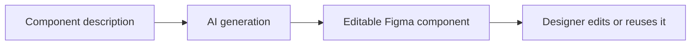

# Atomic Component Generator

> Research status: **Architecture-level** · Last reviewed: **2026-08-12**

Atomic Component Generator is Alexander Burgos's separate beta Figma plugin, not a mode of Design System Sync. Its public contract is prompt-to-component: the user describes a UI component and the model constructs a professional, visually consistent component inside Figma.

## The identity boundary is the component

The creator provides a stable Community destination and labels the product Beta with unlimited free generations. That is enough to establish an independent ordinary-user surface even though the same maintainer also ships a token-to-code plugin.

The public page does not state how descriptions become properties, variants, auto-layout, tokens or instance-swap relationships; whether generation modifies an existing component; how errors roll back; or whether prompts and revisions persist. No public source or authenticated acceptance run was found. The creator's first-party portfolio places the team lineage in Manchester, United Kingdom.

## Primary evidence

- [Creator portfolio and beta product contract](https://alexanderburgos.netlify.app/)
- [Figma Community product link](https://www.figma.com/community/search?resource_type=plugins&q=Atomic%20Component%20Generator)
