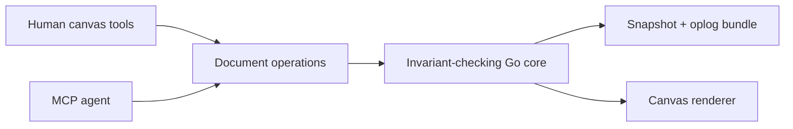

# brawt

> Research status: **Source-level** · Lifecycle: **active-transition** · Last reviewed: **2026-08-12**

brawt is a local-first vector editor whose MCP server behaves as another synchronized client. Its most important decision is an explicit protobuf document and operation model shared by the Go core browser renderer and agent tools.

## Operations are the unit of collaboration

At commit [`b2d1bc6`](https://github.com/bernardoforcillo/opendesigner/tree/b2d1bc61ef5e81c1c1e5a97cf899a8e7af4a7de2) [`opendesigner.proto`](https://github.com/bernardoforcillo/opendesigner/blob/b2d1bc61ef5e81c1c1e5a97cf899a8e7af4a7de2/proto/opendesigner/v1/opendesigner.proto) defines nodes pages and mutations. The core applies invariant-checked operations; snapshots plus an oplog persist them on disk. [`internal/mcp/tools.go`](https://github.com/bernardoforcillo/opendesigner/blob/b2d1bc61ef5e81c1c1e5a97cf899a8e7af4a7de2/internal/mcp/tools.go) lets an agent submit the same operation family and subscribe to live document updates.

SVG and PNG are exports from the scene. The repository calls its current state a milestone-driven vertical slice so advanced editor breadth should not be inferred. The maintainer's profile explicitly places them physically in Italy.

## Pinned evidence

- [Operation application](https://github.com/bernardoforcillo/opendesigner/blob/b2d1bc61ef5e81c1c1e5a97cf899a8e7af4a7de2/internal/core/apply.go)
- [Snapshot store](https://github.com/bernardoforcillo/opendesigner/blob/b2d1bc61ef5e81c1c1e5a97cf899a8e7af4a7de2/internal/store/snapshotfile.go)
- [Pinned README](https://github.com/bernardoforcillo/opendesigner/blob/b2d1bc61ef5e81c1c1e5a97cf899a8e7af4a7de2/readme.md)
