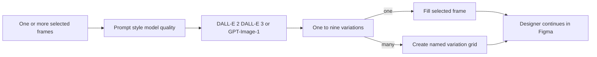

# Calino

> Research status: **Architecture-level** · Last reviewed: **2026-08-12**

Calino is a Figma-native image candidate workspace. It takes the dimensions and identity of selected frames, generates one or several raster candidates through an explicitly selected quality tier, and fills those frames or a generated grid with the resulting images.

## Candidate count changes the canvas mutation

The official help distinguishes a single inserted image, a named `Calino Grid`, batch generation that preserves each selected frame's name, and recreation from managed history. That is more specific than “images appear in Figma”: the plugin uses the native selection as placement authority and creates extra graph structure when the user asks for alternatives.

## Three clocks do not share one history

Figma owns the current frame and its fill. Calino's paid history stores the last 30 generated images with prompt/style and frame information. A separate credit ledger charges one to three flowers per image and does not deduct failed generations. These product records are not documented as part of Figma version history, and reinsertion from history is a new canvas mutation.

The official site currently names DALL-E 2, DALL-E 3 and GPT-Image-1; a future editing tab is still marked “Coming Soon” and is not counted. Server source, prompt storage, content retention, exact image-fill serialization, cancellation and concurrent batch recovery are not disclosed.

## Primary evidence

- [Current product surface](https://getcalino.com/)
- [Official help and complete operation limits](https://getcalino.com/help)
- [Creator launch](https://forum.figma.com/showcase-your-work-14/introducin-calino-ai-image-generator-create-stunning-images-without-leaving-figma-42988)
- [Figma Community plugin 1517540693787924133](https://www.figma.com/community/plugin/1517540693787924133/calino-ai-image-generator)

No reliable first-party team-location evidence was found.
