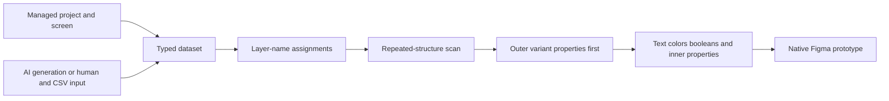

# ContentKit

> Research status: **Architecture-level** · Last reviewed: **2026-08-12**

ContentKit separates prototype content from composition without reducing content to plain text. Its managed hierarchy—project, screen, dataset, rows and typed columns—can drive text, colors, booleans, variant properties and component-instance choices across repeated and deeply nested Figma structures. AI creates or extends the dataset; deterministic bindings decide where accepted values land.

## The dataset is governed separately from the canvas

Content can be created in the plugin or web app, shared with teammates and clients, imported from Excel/CSV, or generated and revised through column-scoped AI instructions. Applying it is not model-driven free-form editing. The plugin scans repeated structures, maps dataset rows to groups, and uses an explicit ordering rule: outer component properties are applied before inner values so the layers required by a chosen variant exist when later assignments run.

## Identity is deliberately lightweight and fragile

Bindings are encoded in layer names. Renaming a bound layer deletes the assignment, and a component update can reset names on instances. Multiple properties may bind to one layer, but datasets of different lengths cycle independently and can create unintended combinations. These are not incidental limitations: they define when the managed content graph can reliably address the native design graph.

## Persistence and current operating boundary

Account-backed teams own projects, screens and datasets; roles distinguish owners, admins, editors, viewers and guests. Figma owns the materialized prototype state. The public contract does not describe a live reverse sync from manually changed layers back into dataset cells or include managed content in Figma version history.

The current landing page and paid plans remain published, while the web app currently says new registrations are closed. This record is therefore `active-transition`, not silently treated as generally available. The closed implementation, AI provider and model policy, assignment serialization details, conflict behavior, audit history and deletion execution remain unknown.

## Primary evidence

- [Current product contract](https://intersectionslab.com/contentkit/)
- [Creator release](https://intersectionslab.com/news/contentkit-release/)
- [Dataset AI and assignment algorithm](https://intersectionslab.com/news/introduction-1-create-and-insert-data/)
- [Nested component mutation ordering](https://intersectionslab.com/news/introduction-2-how-to-popupate-nested-designs/)
- [Current onboarding state](https://app.intersectionslab.com/)
- [Operator identity and Stuttgart location](https://intersectionslab.com/terms-of-service)
- [Figma Forum release](https://forum.figma.com/showcase-your-work-14/contentkit-insert-content-into-your-figma-designs-42323)
