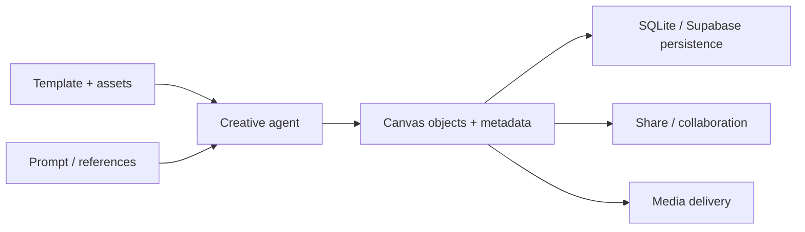

# Creative Forge

> Research status: **Source-level** · Last reviewed: **2026-08-12**

Creative Forge is a Jaaz-derived creative canvas that has established a separate product name, maintainer and expanded artifact contract. It is counted as an independent derivative—not as original upstream architecture and not as another alias for Jaaz.

## The derivative adds governed reusable work

Beyond image/video generation and canvas placement, the source adds reusable templates, template assets, sharing metadata, provider choice and multiple storage backends. Template records and migration history make campaign structures reusable rather than requiring every agent run to begin from a blank prompt.

## Source trace

At commit [`507b633`](https://github.com/solankiharsh/creative-forge/commit/507b633a9187046036399c797d44d56286d9fefc):

- [`template_model.py`](https://github.com/solankiharsh/creative-forge/blob/507b633a9187046036399c797d44d56286d9fefc/server/models/template_model.py) and [template routes](https://github.com/solankiharsh/creative-forge/blob/507b633a9187046036399c797d44d56286d9fefc/server/routers/template_router.py) define reusable work.
- [`canvas_saving_service.py`](https://github.com/solankiharsh/creative-forge/blob/507b633a9187046036399c797d44d56286d9fefc/server/services/canvas_saving_service.py) and [canvas routes](https://github.com/solankiharsh/creative-forge/blob/507b633a9187046036399c797d44d56286d9fefc/server/routers/canvas.py) preserve the working canvas.
- migrations add [sharing](https://github.com/solankiharsh/creative-forge/blob/507b633a9187046036399c797d44d56286d9fefc/server/services/migrations/v4_add_canvas_sharing.py), [template assets](https://github.com/solankiharsh/creative-forge/blob/507b633a9187046036399c797d44d56286d9fefc/server/services/migrations/v7_add_template_assets.py) and [canvas metadata](https://github.com/solankiharsh/creative-forge/blob/507b633a9187046036399c797d44d56286d9fefc/server/services/migrations/v8_add_canvas_metadata.py).
- database adapters expose SQLite and Supabase implementations under [`server/services`](https://github.com/solankiharsh/creative-forge/tree/507b633a9187046036399c797d44d56286d9fefc/server/services).

## Attribution and limits

Jaaz-derived file names and service structure remain visible and should be credited; separate counting rests on the changed product/release/maintainer boundary, not code originality. No license file was present. The maintainer profile identifies Dubai and supports a United Arab Emirates region label. A live collaborative deployment was not exercised.

## Decisive sources

- [Repository README](https://github.com/solankiharsh/creative-forge/blob/507b633a9187046036399c797d44d56286d9fefc/README.md)
- [Maintainer profile](https://github.com/solankiharsh)
