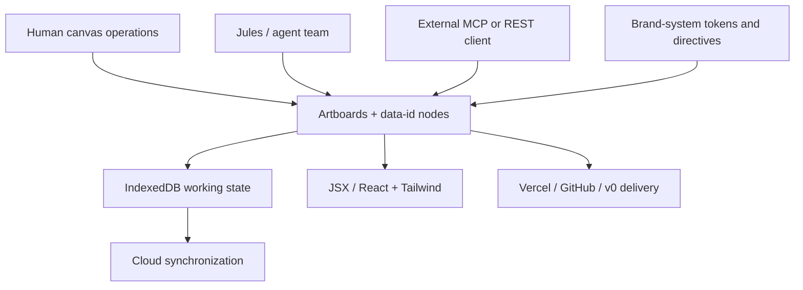

# Efecto

> Research status: **Architecture-level** · Last reviewed: **2026-08-11**

| Field | Value |
|---|---|
| Team | Efecto · team region not established by attributable evidence |
| Ordinary job | let people, an embedded design agent and external coding agents mutate one shared structured design |
| Canonical document | artboards and nodes serialized as JSX-like markup with stable `data-id` values |
| Public source boundary | the plugin/skill package is public; the hosted editor and MCP implementation are not |

## Visual editing and agent editing share one authority

Efecto documents contain artboards and typed nodes such as frames, text, images, buttons, links, components and shaders. The documented serialization is JSX-like markup with a `data-id` on each element; styling is expressed through Tailwind classes and inline style where needed. Direct manipulation, Jules and the 68-tool MCP surface address that same document instead of producing unrelated screenshots.

## Governance is executable at the node boundary

Brand systems carry identity, semantic color tokens, typography, components and AI directives. MCP tools can inspect and apply those rules as they create or update nodes. Reusable components maintain a master-instance relationship inside the canvas, while exports inline real markup. Agent teams build in parallel on separate artboards, which bounds concurrent authorship without claiming hidden merge semantics.

The correction model is visible at several levels: inline undo after an AI edit, ordinary undo/redo, persistent chat, dashboard files, local IndexedDB state and cloud synchronization. Changelog evidence also documents recovery guards for corrupt local storage. These are product contracts, not proof of transaction-level atomicity.

## Source and ownership boundary

The public `efecto-plugin` repository contains installation metadata, skills and client configuration. It does not expose the hosted canvas implementation or MCP server, so this record remains architecture-level. Delivery can move a design into JSX, a ZIP, GitHub, Vercel or v0; public evidence does not establish that downstream source edits can be merged back into the Efecto document.

## Primary evidence

- [Efecto MCP tool reference](https://efecto.app/docs/tools)
- [Efecto changelog](https://efecto.app/changelog)
- [Efecto public plugin package](https://github.com/pablostanley/efecto-plugin/tree/1394b1c70cfa75cfd55c8659cc88df41685ff4ac)
