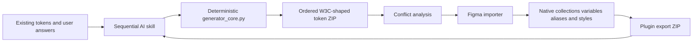

# Figma Variables Generator Ecosystem

> Research status: **Source-level** · Last reviewed: **2026-08-12**

| Field | Verified value |
|---|---|
| Maintainer | Shanmugha Sundaram Srinivasan |
| Ordinary job | design and synchronize a structured Figma variable system with an AI assistant |
| Pinned revision | [`2a51de3e82bae6eae9bc61abab8484f41ff9187e`](https://github.com/Shanmus4/figma-variables-tokens-generator/tree/2a51de3e82bae6eae9bc61abab8484f41ff9187e) |
| Public plugin | Variables Tokens Collections Importer · ID `1619733963699677957` |
| License boundary | root Apache-2.0; importer MIT; AI skill under a restrictive source-available license |

This is one workflow split across two executors. An agent skill interviews the user, selects a one- to four-tier token architecture and uses a deterministic Python builder to emit a numbered ZIP. A Figma plugin parses that package, resolves conflicts and aliases, then creates or synchronizes native collections, modes, variables and styles.

## The ZIP is the handoff contract

The skill keeps strategy questions sequential and delays implementation references until generation. `DesignTokenGenerator` owns stable IDs, scope derivation, hidden-publishing rules, collection numbering and alias verification. Its validator at the pinned revision passes all included regression fixtures when run with UTF-8 output, including a 662-token three-tier build and cross-chain validation.

The plugin is the mutation authority. It reads local collections, offers replacement rather than blind duplication, creates modes and variables, writes literal values first and aliases after their targets exist, and can generate bound text, effect and layout-grid styles. In replacement mode the ZIP is structural truth: absent variables or modes are deleted. Unresolved new aliases are pruned and surfaced as errors.

## Stability is dependency ordering rather than live co-editing

Numeric folders encode import topology—Primitives before Semantic or Theme, then responsive and component layers. Multi-mode variables reuse prebuilt IDs, and emitted aliases are checked against the actual output set. Existing Figma systems can be exported back to the same ZIP shape, given to the agent for revision and re-imported.

This is not a continuous agent connection to a Figma document. Between export and import there is no live node identity, transaction log or collaborative merge. Replace is destructive with respect to items absent from the package, so the conflict screen and human confirmation are the safety boundary.

## Source map

| Pinned path | What it establishes |
|---|---|
| [`instructions/01-interview-setup.md`](https://github.com/Shanmus4/figma-variables-tokens-generator/blob/2a51de3e82bae6eae9bc61abab8484f41ff9187e/figma-variables-tokens-generator/instructions/01-interview-setup.md) | sequential intake, existing-system export and explicit confirmation gates |
| [`references/01-architecture.md`](https://github.com/Shanmus4/figma-variables-tokens-generator/blob/2a51de3e82bae6eae9bc61abab8484f41ff9187e/figma-variables-tokens-generator/references/01-architecture.md) | tier topology, picker tips, modes, scopes and exact dependency order |
| [`scripts/generator_core.py`](https://github.com/Shanmus4/figma-variables-tokens-generator/blob/2a51de3e82bae6eae9bc61abab8484f41ff9187e/figma-variables-tokens-generator/scripts/generator_core.py) | deterministic token construction, stable IDs, ZIP output and verification gates |
| [`token-import-plugin-figma/code.js`](https://github.com/Shanmus4/figma-variables-tokens-generator/blob/2a51de3e82bae6eae9bc61abab8484f41ff9187e/token-import-plugin-figma/code.js) | conflict analysis, native variable mutation, alias pass, style generation and export |
| [`token-import-plugin-figma/ui.html`](https://github.com/Shanmus4/figma-variables-tokens-generator/blob/2a51de3e82bae6eae9bc61abab8484f41ff9187e/token-import-plugin-figma/ui.html) | ZIP parsing, replace confirmation, progress and error presentation |

## Change evidence

| Date | Commit | Causal change |
|---|---|---|
| 2026-04-10 | [`0f58a8e`](https://github.com/Shanmus4/figma-variables-tokens-generator/commit/0f58a8e) | moved generation into a high-level deterministic SDK and expanded its regression gate |
| 2026-04-15 | [`787d287`](https://github.com/Shanmus4/figma-variables-tokens-generator/commit/787d287) | made imported variables materialize bound typography, effect and grid styles |
| 2026-04-16 | [`422a8f1`](https://github.com/Shanmus4/figma-variables-tokens-generator/commit/422a8f1) | repaired case handling in typography style generation |

The plugin loads JSZip from a CDN and therefore needs network access on first use. No end-to-end Figma acceptance test is present in the pinned repository. Team region remains unknown.

## Primary evidence

- [Pinned repository](https://github.com/Shanmus4/figma-variables-tokens-generator/tree/2a51de3e82bae6eae9bc61abab8484f41ff9187e)
- [Figma Community importer](https://www.figma.com/community/plugin/1619733963699677957)
