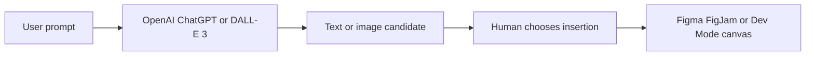

# FigPilot.ai

> Research status: **Architecture-level / current availability not live-verified** · Last reviewed: **2026-08-12**

FigPilot.ai is a bring-your-own-key conversational assistant released for Figma, FigJam and Dev Mode. Its meaningful boundary is the insertion action: conversation alone is generic, but generated images and copy can be deliberately materialized into the active host canvas.

## Conversation becomes a native object only at insertion

The creator says the OpenAI key and plugin settings are stored locally and that the plugin communicates only with OpenAI. That narrows the claimed transport topology; it does not establish the exact browser/plugin storage API, pixel and text retention at OpenAI, prompt composition or whether conversation history is durable.

FigPilot and PicWise.ai share a maintainer lineage but are independently released plugins with different contracts. FigPilot centers chat-to-text/image insertion; PicWise is an image creation and correction suite. They are therefore separate product records rather than aliases.

The only reachable first-party product description is dated December 2023. The Figma listing is indexed under plugin ID `1309912337130106358`, but robots controls prevented a current listing inspection and no official changelog, source repository or live acceptance path was found. “Active” records the absence of a discontinuation notice, not proof of current operational compatibility.

## Primary evidence

- [Creator release](https://forum.figma.com/showcase-your-work-14/introducing-my-figma-plugin-figpilot-ai-chatgpt-and-dall-e-3-in-figma-17092)
- [Figma Community plugin 1309912337130106358](https://www.figma.com/community/plugin/1309912337130106358)

Team location remains unknown.
