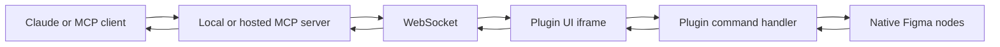

# Flaude

> Research status: **Source-level** · Last reviewed: **2026-08-12**

| Field | Verified value |
|---|---|
| Product | Flaude Figma plugin plus local or hosted MCP bridge |
| Canonical artifact | native Figma node graph with plugin metadata for schema-built screens |
| License | MIT |
| Pinned source | [`46c44205664cf1a22b7a299f6317043686d31c1d`](https://github.com/Ana-creates/flaude/tree/46c44205664cf1a22b7a299f6317043686d31c1d) |

Flaude connects Claude-compatible MCP clients to a Figma plugin. The pinned source supports read, create, edit, inspect, critique and verification operations over actual nodes; it also contains a schema-first build path that is materially different from executing arbitrary one-off edits.

## Commands cross a bidirectional relay

The UI iframe owns the WebSocket because the plugin sandbox cannot make the same network calls. Requests carry IDs and responses return through the same bridge. The client includes heartbeat, reconnect backoff and foreground/network wake behavior; connectivity status is therefore based on observed liveness rather than only an initially opened socket.

## The DSL makes repeat application convergent

The schema compiler converts a screen document into ordered operations and chunks them into batches. The applier tags nodes with `flaude:dslId`, stores acknowledged batch indexes by build ID and implements upsert semantics. Re-sending an acknowledged batch is skipped; applying an upsert again rewrites all desired properties.

The project is unusually explicit about authority drift. Raw Figma edits or escape-hatch commands can make the live node graph diverge from the last schema. A read-back report classifies tracked, drifted and untracked nodes rather than pretending it can reconstruct a complete schema without loss.

The website-to-plugin handoff carries a small clipboard reference, fetches a screen DSL in the UI iframe and applies it through the same batch builder. Tests assert that the result is a real editable frame and text-node tree, not a screenshot.

## Source map

| Pinned path | Decisive evidence |
|---|---|
| [`src/ui/mcp/websocket-client.ts`](https://github.com/Ana-creates/flaude/blob/46c44205664cf1a22b7a299f6317043686d31c1d/src/ui/mcp/websocket-client.ts) | local/hosted relay, request correlation, heartbeat and reconnect |
| [`src/plugin/mcp/command-handler.ts`](https://github.com/Ana-creates/flaude/blob/46c44205664cf1a22b7a299f6317043686d31c1d/src/plugin/mcp/command-handler.ts) | MCP routing, native tools, schema build and screen insertion |
| [`src/plugin/mcp/dsl-compiler-plan.ts`](https://github.com/Ana-creates/flaude/blob/46c44205664cf1a22b7a299f6317043686d31c1d/src/plugin/mcp/dsl-compiler-plan.ts) | screen document to ordered and chunked operations |
| [`src/plugin/mcp/dsl-apply.ts`](https://github.com/Ana-creates/flaude/blob/46c44205664cf1a22b7a299f6317043686d31c1d/src/plugin/mcp/dsl-apply.ts) | idempotent acknowledgements, node identity and native application |
| [`tests/mcp/insert-screen.test.ts`](https://github.com/Ana-creates/flaude/blob/46c44205664cf1a22b7a299f6317043686d31c1d/tests/mcp/insert-screen.test.ts) | clipboard/catalog DSL to editable-node round trip |

The open repository does not include every hosted Pro server component, so hosted authentication, model orchestration and server-side schema generation cannot be audited from this revision. Maintainer geography is not established by the repository and remains unknown.

## Primary evidence

- [Pinned repository](https://github.com/Ana-creates/flaude/tree/46c44205664cf1a22b7a299f6317043686d31c1d)
- [Current product](https://www.flaude.app/)
- [MIT license](https://github.com/Ana-creates/flaude/blob/46c44205664cf1a22b7a299f6317043686d31c1d/LICENSE)
