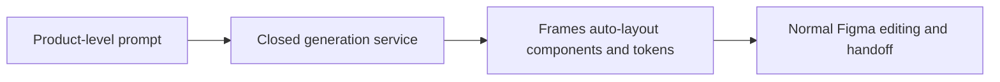

# Fluvara

> Research status: **Architecture-level** · Last reviewed: **2026-08-12**

Fluvara is a Figma plugin whose ordinary loop is short and native: open it in an existing file, describe a screen and receive editable Figma objects on the current canvas. The official surface specifically promises frames, named layers, auto-layout, component structure, spacing and design tokens rather than a flattened image.

## Intent crosses directly into the native graph

No separate account is required for the free path; usage is metered by prompts. Once inserted, the Figma document is the observable durable authority. This differs from a hosted preview whose editable structure disappears on export.

## Closed implementation boundary

The public page does not disclose its prompt schema, model, transport, node-construction protocol, component reuse policy, responsive constraints, regeneration targeting, persistence outside Figma or failure recovery. “Production-ready” is a vendor claim and was not accepted as evidence of code fidelity. No live plugin acceptance run or source repository was available. Team geography remains unknown.

## Primary evidence

- [Official product and workflow](https://fluvara.ai/)
- [Figma Community launch link](https://www.figma.com/community/search?resource_type=plugins&q=Fluvara)
