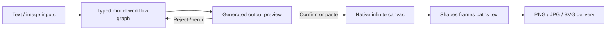

# Gloria

> Research status: **Architecture-level** · Last reviewed: **2026-08-11**

| Field | Value |
|---|---|
| Team | Gloria · team region not established by attributable evidence |
| Ordinary job | compose visual work on an infinite canvas, run reusable multi-model workflows and decide which outputs become design elements |
| Native authority | canvas elements and their properties |
| Automation authority | typed node-and-connection workflow graph |

## Two graphs meet at an explicit promotion decision

Gloria exposes both a visual canvas and a model workflow builder. The workflow graph has typed image and text ports and connects model nodes into a repeatable generation path. A result does not silently overwrite the design: preview actions let the user confirm it into a canvas element or paste it directly. That promotion boundary makes candidate generation and authored visual state distinguishable.

## Native structure survives generation

The canvas supports shapes, frames, paths and text rather than treating every result as one flattened bitmap. Auto-layout and direct manipulation continue after an output is promoted. This makes native graph authority primary; the model workflow graph is an adjacent reusable automation representation, not the only artifact.

The privacy contract gives unusually concrete persistence evidence. Project data includes canvas elements and their properties, workflow nodes and connections, camera position and page settings. Projects auto-save and may be stored in the cloud; team plans add real-time collaboration. Undo and redo provide a local correction path, although public documentation does not establish durable named versions or branch semantics.

## Evidence ceiling

No implementation source or complete serialization schema is public. Documentation establishes the two graph types, promotion action, storage fields, exports and collaboration contract, but not conflict resolution, model-run reproducibility, asset deduplication or whether an exported SVG round-trips back into native elements.

## Primary evidence

- [Gloria product](https://www.usegloria.com/)
- [Gloria documentation](https://www.usegloria.com/docs)
- [Gloria privacy policy](https://www.usegloria.com/privacy)
