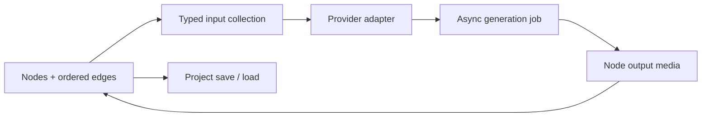

# Node Canvas

> Research status: **Source-level** · Last reviewed: **2026-08-12**

Node Canvas is a multimodal creative workflow editor. Typed React Flow nodes and ordered edges determine how prompts, images, audio and video-generation jobs compose; provider services execute the graph without erasing its editable structure.

## Workflow semantics survive model substitution

The user can change provider/model settings independently of node layout. Video adapters normalize capabilities and payloads across providers, while frontend utilities collect inputs according to edge order and node type. Project save/sanitize tests show that graph recovery is a separate concern from remote job execution.

## Source trace

Pinned commit [`fc8c772`](https://github.com/ozoshanniao/Node_Canvas/commit/fc8c772e5544baace73464009054d71319846e75) includes:

- the React editor under [`frontend/src`](https://github.com/ozoshanniao/Node_Canvas/tree/fc8c772e5544baace73464009054d71319846e75/frontend/src);
- project save/sanitize, edge ordering, node definitions and output tests under [`frontend/src/utils/__tests__`](https://github.com/ozoshanniao/Node_Canvas/tree/fc8c772e5544baace73464009054d71319846e75/frontend/src/utils/__tests__);
- provider-neutral video contracts in [`backend/video_generation`](https://github.com/ozoshanniao/Node_Canvas/tree/fc8c772e5544baace73464009054d71319846e75/backend/video_generation);
- settings persistence in [`backend/settings_store.py`](https://github.com/ozoshanniao/Node_Canvas/blob/fc8c772e5544baace73464009054d71319846e75/backend/settings_store.py).

## Boundary

This is a graph authoring product, not a count for every provider adapter. The repository is MIT-licensed. No reliable team-region evidence was found and a live provider-backed job was not run.

## Decisive sources

- [English README](https://github.com/ozoshanniao/Node_Canvas/blob/fc8c772e5544baace73464009054d71319846e75/README.md)
- [Chinese README](https://github.com/ozoshanniao/Node_Canvas/blob/fc8c772e5544baace73464009054d71319846e75/README.zh-CN.md)
- [MIT license](https://github.com/ozoshanniao/Node_Canvas/blob/fc8c772e5544baace73464009054d71319846e75/LICENSE)
