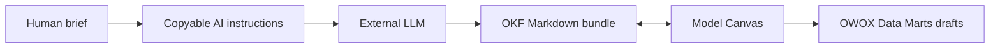

# OWOX Model Canvas

> Research status: **Source-level** · Lifecycle: **active** · Last reviewed: **2026-08-12**

OWOX Model Canvas defines data design as a round trip between a visual relationship graph and Open Knowledge Format documents. AI can author the same portable Markdown model that a person edits on the canvas; neither is forced to treat a screenshot as source.

## One model has two projections

At commit [`1d12fae`](https://github.com/OWOX/models/tree/1d12fae4001e99f4e6486e695945279e2c5ad553) each mart is represented by Markdown plus YAML frontmatter and joins. The [canvas](https://github.com/OWOX/models/blob/1d12fae4001e99f4e6486e695945279e2c5ad553/packages/web/src/components/canvas/Canvas.tsx) projects those objects as nodes and relationships and can export a bundle that re-imports without losing the model.

The AI boundary is deliberately modest. The browser explains the schema to Claude ChatGPT or Gemini and imports the returned files. A separate server-side [Gemini adapter](https://github.com/OWOX/models/blob/1d12fae4001e99f4e6486e695945279e2c5ad553/packages/server/src/llm/gemini.ts) generates schema-grounded insight questions. The data-model graph remains deterministic and portable.

Sharing serializes model state into a link; pushing creates draft marts behind an explicit gate. Public source does not establish OWOX's organization region so it remains unknown.

## Decisive evidence

- [Pinned README and OKF contract](https://github.com/OWOX/models/blob/1d12fae4001e99f4e6486e695945279e2c5ad553/README.md)
- [Canvas push gate tests](https://github.com/OWOX/models/blob/1d12fae4001e99f4e6486e695945279e2c5ad553/packages/web/src/components/canvas/Canvas.pushgate.test.tsx)
- [Example portable model bundle](https://github.com/OWOX/models/tree/1d12fae4001e99f4e6486e695945279e2c5ad553/bundles/ecommerce-subscription-store)
