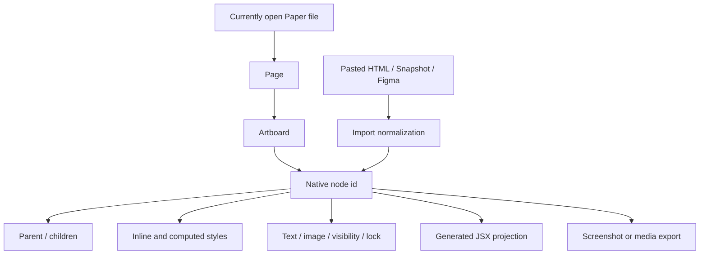

# Paper

> Research status: **Architecture-level / closed-source boundary reached** · Last reviewed: **2026-08-11**

| Field | Value |
|---|---|
| Organization / team | Lost Coast Labs, Inc. d/b/a Paper |
| Category | Hosted web-native design canvas with a desktop-local agent gateway |
| Status | Active; public alpha opened 2025-09-09, Desktop/MCP launched 2026-03, current Desktop/MCP `0.5.3` |
| Core source availability | Closed and proprietary |
| Public source boundary | Public agent-plugin configuration/skills at commit `cd89a2fd012cac8d6c0fa8f5420c9e49577f0c49`; Apache-2.0 Paper Shaders at commit `60467401863c1917dd02016d0c1ff2f791d0b3c8`; neither contains the editor, hosted document service or MCP implementation |
| Decisive technical question | Does “real HTML/CSS canvas” mean the Paper file is application source, or a hosted node graph that imports, normalizes and projects Web syntax? |
| Evidence snapshot | Official product, docs, build log, roadmap, legal/subprocessor pages, current public distributions and pinned adjacent repositories; no private Paper file or authenticated team was used as evidence |

## The shortest accurate description

Paper is a **hosted collaborative design document whose editable nodes use browser-compatible HTML/CSS semantics**, with a desktop app exposing the currently open file to local MCP clients.

That is materially different from a pixel-only canvas. Agents can read a selected node tree, computed CSS, screenshots, images and a JSX projection; they can create artboards, parse HTML into nodes, update CSS styles, preserve or replace native node ids through explicit operations and export media. Human direct manipulation and agent writes converge on the same hosted Paper file.

It is also materially different from editing an application's authored HTML or React tree:

- pasted HTML keeps only inline style semantics, drops class names and selector-applied CSS, rewrites several element/text cases and becomes normal Paper layers;
- Snapshot copies a rendered page element into Paper through the clipboard, not its module, source map or Git revision;
- Figma components, instances and variables are detached on import, while unsupported visual features are transformed or lost;
- `get_jsx`, Copy as React CSS and Copy as Tailwind are generated projections of selected Paper nodes;
- the official design-to-code plugin asks the external agent to author new repository files from structure/styles/computed layout;
- the corresponding code-to-design plugin asks the agent to read repository conventions and create a new Paper artboard;
- current roadmap items still place live code components, native Tailwind integration and components with props/slots in progress or coming soon.

Paper therefore shares a **language family** with Web applications without publicly establishing one shared source tree or a persistent node-to-code binding.

## One file, several non-atomic authorities

| Plane | Working object | Durable center | Identity / update clock | What does not follow automatically |
|---|---|---|---|---|
| Native design | hosted team file containing pages, artboards and an id-addressed node tree | current Paper file in the service | Paper file/page/node ids; live human and agent mutations | public docs do not expose the stored serialization, local canonical file, version graph, branch or restore protocol |
| Canvas style | inline/browser-compatible layout and visual properties plus computed CSS | properties attached to Paper nodes | direct property edit, `update_styles` or HTML parsing | sharing CSS vocabulary does not retain original classes, selectors, modules or cascade |
| Tokens | file-scoped color/type/spacing/container/breakpoint/radius values | token state in that Paper file | agent creates/updates; property panel attaches/detaches | copying a theme to another Paper file or CSS file creates a disconnected copy; theme modes and libraries are not yet current contracts |
| Imported page | selected rendered element captured by Snapshot or pasted HTML | newly created Paper nodes and uploaded assets | each capture/paste | authored file/range, framework component, source map, runtime state and repository revision are not retained by the public import contract |
| Figma import | copied Figma selection plus optionally retrieved images | detached Paper layers | each paste | component/instance/variable identity, code-connected components and several effects/text semantics are lost or rewritten |
| Code projection | JSX with Tailwind/inline styles, copied React CSS/Tailwind, or agent-authored framework code | clipboard/tool result or repository files actually written by the external agent | each projection/agent run | no documented round trip, revision guard or later automatic synchronization |
| Media delivery | PNG/JPG/SVG/PDF/video and other supported exports | actual downloaded/exported file | each export | media does not preserve the full editable document graph or responsive application behavior |
| Portable shader | Paper Shaders parameters expressed through the published JS/React package | application dependency and authored props | package version + chosen values | a shader component is one portable effect family, not a serialization of the whole Paper document |

The Paper file is the live design authority. The application repository is implementation authority after a design-to-code step. Tokens, imports, exports and shader packages are bridges with their own clocks rather than one transaction spanning both sides.

## Ordinary journey: explore in Paper, then deliberately materialize code

1. **Open or create the intended hosted file.** Use Paper Web for normal editing/collaboration or Paper Desktop when a local coding agent needs MCP access.
2. **Choose a starting point.** Draw directly, paste Figma/HTML, capture a running page through Snapshot, or ask an agent to create an artboard from codebase tokens and style conventions.
3. **Structure for the Web medium.** Use frames, flex layout, containers and explicit responsive frames. Paper's own design-to-code guide warns that larger/less structured designs translate less reliably.
4. **Connect the agent deliberately.** Keep Paper Desktop open with the correct file loaded. The local MCP server appears at `http://127.0.0.1:29979/mcp`.
5. **Verify file and selection before a write.** Ask for `get_basic_info` and `get_selection`; both Paper and other connected design tools use their currently open file/selection as implicit context.
6. **Let the agent inspect before mutating.** Tree summaries, node data, computed styles, images, screenshots and JSX offer different evidence. None alone is a complete application specification.
7. **Mutate the native graph.** Prefer id-addressed text/style/move/duplicate operations where preserving a known node matters; use `write_html` for bounded insertion/replacement and expect parser normalization.
8. **Watch the real canvas.** Paper shows agent presence/working indicators on affected artboards. Inspect layout, type, assets, effects, tokens and the intended responsive frames while changes arrive.
9. **Choose the implementation boundary.** Copy a code projection for a small selection or ask the external coding agent to implement the selected frame in an explicit repository folder and framework.
10. **Validate the application independently.** Review the repository diff, run it, exercise interaction/responsiveness/accessibility and compare with the selected Paper state.
11. **Create an application checkpoint.** Paper's own guide tells users to commit generated code and use Git branches for later application changes. Git protects the repository; it does not version the Paper file.
12. **Preserve the design separately.** Keep the intended Paper file/link and export critical visual references. Public docs do not establish a Paper version-history restore equivalent to the application's Git commit.

This journey works because the agent can see both design semantics and repository context. It remains an agent-mediated handoff: “the website looked close” and “the selected Paper frame is recoverable” require separate evidence.

## The public document model is a node graph, not an authored DOM tree

The MCP catalog reveals the minimum stable shape of the live document:



Public read operations expose:

- file and page name, node count, artboard ids and dimensions;
- current selection with ids, names, types, size and owning artboard;
- a node's visibility, lock, parent, children and text;
- bounded child lists and subtree summaries;
- computed CSS for one or more node ids;
- JSX in Tailwind or inline-style form;
- screenshots and image-fill data;
- font availability/weights/styles and guided workflows.

Public write operations expose:

- creation of an artboard;
- HTML parsing into inserted children or a replacement;
- batch text and name changes;
- deep duplication with new ids and a returned descendant-id map;
- move/reparent/reorder while preserving existing ids;
- style updates;
- recursive deletion;
- media export;
- clearing the agent working indicator from artboards.

This is enough to establish **native Paper identity**. A known node id can survive a move, while duplicate explicitly creates a new id family. It is not enough to reconstruct the stored schema or service transaction model. Public docs do not specify revision numbers, conditional writes, multi-tool atomicity, conflict responses or whether an HTML replacement preserves any replaced identity.

## HTML is an import/write language with explicit normalization

The strongest evidence against treating a Paper file as raw application source is Paper's own HTML-paste contract.

### Styles are deliberately flattened

Only inline styles are imported. Class names are dropped, and CSS applied through selectors is ignored. Every imported element receives `box-sizing: border-box`; redundant styles such as `gap` on a non-flex/non-grid element are removed.

The result can still render close to the source, especially when Snapshot has collected computed appearance. It no longer has the original cascade, selector specificity, stylesheet/module identity, pseudo-state logic or class-based design-system connection.

### Elements and text are translated

Current documented rewrites include:

- form inputs become frames with text children;
- hidden elements remain hidden;
- inline elements may become `inline-block`;
- a block with only inline children can be flattened into one Text node;
- frame style and text style can be split by creating a wrapping frame;
- rich text is not currently represented as multiple styles inside one Text node.

These transformations optimize the result for Paper's editable graph. They make a byte-for-byte or AST-level reverse import impossible from the public contract.

### Agent-specific HTML extensions

Paper adds a small operation language to HTML paste:

- `<x-paper-clone node-id="…">` clones an existing Paper node inline;
- `layer-name="…"` names a layer;
- `data-paper-locked` creates a locked layer;
- `hidden` creates an invisible layer.

That is a useful bridge between LLM-generated markup and native operations. `node-id` addresses the Paper document, not application source.

### Assets cross a hosted boundary

Images referenced through `` or `background-image` are uploaded into Paper. The docs require those URLs to be publicly accessible. For local development servers, Snapshot's support guide asks the server to allow cross-origin requests from `https://app.paper.design`; otherwise local images do not survive the paste.

The captured subtree is therefore not self-contained merely because its boxes and text appear. Asset access, CORS and later hosted asset availability form a separate acceptance boundary.

## Snapshot copies a rendered subtree, not its provenance

Paper Snapshot is a Chrome extension that lets a user activate an element picker, move up/down the ancestor chain, capture the target and paste it into Paper Web or Desktop as editable layers.

The public Chrome Web Store distribution observed on 2026-08-11 was:

| Distribution fact | Value |
|---|---|
| extension id | `lidfahaahiogmnlccifabccgplofocck` |
| version | `0.3.6` |
| last updated | 2026-07-30 |
| publisher | Lost Coast Labs, Inc. |
| listed size | 82.8 KiB |
| store privacy disclosure | publisher declares that it does not collect or use user data |

The ordinary target-return chain stops after import:

1. browser selection identifies a live rendered element;
2. Snapshot packages enough rendered HTML/style/asset material for clipboard transfer;
3. Paper's importer normalizes it into ordinary Paper nodes;
4. those nodes receive Paper ids and can be edited by humans/MCP;
5. an external agent can later reconstruct repository code from them.

No official contract carries the original file, line/range, module, framework component, source map or Git revision into the Paper node. Snapshot is stronger than a screenshot and weaker than source identity.

## Figma paste is an explicit semantic conversion

Paper's current import guide documents both the easy path and its loss map.

The user copies a Figma selection and pastes it into Paper. When images are present, Paper can ask for an optional Figma connection; if the connected account cannot open the file or the API is rate-limited, the paste can succeed while images are missing.

The current documented translation boundary includes:

- components, instances and variables are detached;
- code-connected components are unsupported;
- masks and affected nodes are hidden;
- diamond gradients become radial gradients and radial rotation is dropped;
- unsupported stroke/effect types are removed or approximated;
- rich text and truncation semantics differ;
- CSS-inexpressible visual constructs cannot remain native Paper CSS.

Figma ids/library links do not become Paper ids through a documented identity ledger. A visually acceptable paste is a new design authority, not an editable view of the original Figma file.

## The MCP gateway is local; the file is still hosted

Paper Desktop starts the MCP server only while the application is running with a file open. Official configuration points every supported agent host at:

```text
http://127.0.0.1:29979/mcp
```

The endpoint reduces network distance between the agent harness and editor. It does not make the document local-first:

- Paper Web and Desktop share URL-addressed files;
- teams have folders, editors/admins/viewers and real-time multiplayer cursors;
- the product requires sign-in and documents network allowlisting for `*.paper.design`;
- the editor warns when internet connectivity is lost;
- the subprocessor list names MongoDB as primary application database, Cloudflare R2/Workers/Durable Objects/KV for hosted infrastructure and Redis for cache/real-time pub/sub;
- ToDesktop packages and updates the desktop client.

The exact design serialization and placement across those systems remain undisclosed. The evidence supports a hosted file service with a local control gateway, not a repository-owned file format.

### Current tool surface

The 2026-08-11 documentation enumerates 21 tools, divided into five functional groups:

| Group | Tools | Key boundary |
|---|---|---|
| file/selection/tree | `get_basic_info`, `get_selection`, `get_node_info`, `get_children`, `get_tree_summary` | always bound to the file currently open in Desktop; wrong-file context is an ordinary failure |
| render/style/context | `get_screenshot`, `get_jsx`, `get_computed_styles`, `get_fill_image`, `get_font_family_info`, `get_guide` | JSX and computed styles are projections; screenshot/image data can be large and still omit behavior |
| structure creation | `create_artboard`, `write_html`, `duplicate_nodes`, `move_nodes` | ids are created/preserved according to the operation, but transaction/revision semantics are closed |
| bounded mutation | `set_text_content`, `rename_nodes`, `update_styles`, `delete_nodes` | write access can alter or recursively delete the active design; tool permission should be scoped deliberately |
| delivery/presence | `export`, `finish_working_on_nodes` | export creates separate files; working indicators are coordination state, not save/history proof |

The free plan currently allows 100 MCP calls per week; Pro lists one million. Docs record a historical/current-version issue where an upgrade did not refresh limits until updating and restarting Desktop. Quota/account state is therefore another failure plane even though transport is localhost.

### Long agent sessions and implicit context fail visibly

Paper's troubleshooting guidance names three common failures:

- a long-running agent session holds a stale MCP connection;
- the host reports a server but the agent hallucinates unavailable tools or malformed parameters;
- changes appear in a different design because Desktop has another file open.

The official remedy is frequently to restart the agent/host/Desktop and verify the file through `get_basic_info`. This is a session-oriented interface, not a stateless file API where every call names a durable document and revision.

## The public agent repository is an adapter, not the MCP server

The official `paper-design/agent-plugins` repository was pinned at commit `cd89a2fd012cac8d6c0fa8f5420c9e49577f0c49`.

Its product-relevant contents are small and legible:

- `mcp.json` points a client at the localhost HTTP endpoint;
- one rule reminds the agent to start Desktop first;
- `code-to-design/SKILL.md` tells the agent to read repository styles/tokens/themes and create an artboard;
- `design-to-code/SKILL.md` tells it to read a selected frame's structure, styles, text and computed layout, then generate framework-conforming code;
- Cursor, Claude and Codex manifests package the same adapter;
- the Codex plugin manifest declares version `0.1.0` and license `MIT`.

There is no MCP implementation, editor model, renderer, persistence client or tool schema source in that repository. It also has no root `LICENSE` file at the pinned commit, so the manifest's MIT declaration should be applied to the packaged adapter—not generalized to the whole public repository or closed Paper product.

The commit history mainly tracks harness packaging: initial Claude/Cursor work in March 2026, Codex integration in late March and Codex documentation in May. That corroborates the control-plane expansion; it does not expose the product core.

## “Design ↔ code” currently means two agent skills plus projections

### Design to code

The agent reads the selected Paper artboard through node structure, computed styles, text, images, JSX and screenshots, then writes new files using the repository's framework and conventions. Paper's own tutorial recommends starting with a small, well-structured frame and acknowledges that larger work increases error probability.

### Code to design

The agent reads CSS variables, stylesheets, theme files or component patterns from the repository, creates an artboard and reconstructs that design language through Paper operations.

### What is not currently proven

Neither skill carries a mapping file, code symbol id, source range, source-map coordinate, repository revision or conflict precondition. Both are natural-language orchestration around the same MCP.

The current roadmap sharpens that conclusion:

- **Use your code components** is in progress;
- **native Tailwind CSS integration** for real-time render/import/export is in progress;
- **components with props and slots** are coming soon;
- the current Figma guide says components are not yet supported as retained component semantics.

These are future/current-development contracts, not evidence that a Paper node today is a live React component instance.

## Tokens align values without creating a shared registry

Paper tokens currently cover color, font family/weight/size, line height, letter spacing, spacing, container, breakpoint and radius.

Their current lifecycle is asymmetric:

1. only an agent can create or update tokens;
2. a human can attach/detach them in the property panel;
3. updating one token changes every use in the current file;
4. the theme can be copied to another Paper file or pasted into CSS;
5. copied tokens explicitly do not update when the original file changes.

Multiple theme modes and reusable libraries remain roadmap items. Asking an agent to re-read CSS or re-export a theme can reconcile two copies, but no public revision or identity makes that synchronization automatic or conflict-safe.

The phrase “codebase as source of truth” is therefore a workflow choice: the agent can repeatedly materialize code values into the hosted file. The Paper file still owns the token instances used by its canvas.

## Rendering is browser-native where documented and extended where useful

Paper publicly commits to real CSS features rather than a generic vector approximation:

- flex layout, constraints and browser-compatible sizing;
- CSS filters and backdrop filters;
- mixed sRGB, Display P3, OkLCH/OkLab colors;
- system/web/variable fonts and OpenType features;
- SVG import/edit/generation;
- raster image and shader layers;
- real-time multiplayer visual state.

The roadmap simultaneously marks CSS Grid as planned. This matters: “real CSS” describes the supported rendering medium, not complete browser-platform coverage.

### Paper Shaders is one genuinely portable rendering path

`paper-design/shaders` was pinned at commit `60467401863c1917dd02016d0c1ff2f791d0b3c8`. It publishes Apache-2.0 zero-dependency canvas/WebGL effects for vanilla JavaScript and React. Current package manifests at the pinned revision are `@paper-design/shaders@0.0.80` and `@paper-design/shaders-react@0.0.80`.

The library lets a visual shader configuration become explicit component props in application code. That is a stronger portability path than flattening the effect to an image. The repository warns that breaking changes may ship under `0.0.x`, so production output should pin the exact package version.

The library still does not expose Paper's stored shader-node schema, conversion routine, document renderer or full code exporter. It is an adjacent runtime accepted by both design and code, not source for the hosted editor.

## Persistence and collaboration are strong live features with an unpublished recovery model

Established collaboration behavior includes:

- Web and Desktop access to URL-addressed files;
- team folders/subfolders;
- unlimited free-plan viewers and editors;
- editor/admin team access and view-only external sharing;
- anonymous visitors;
- real-time cursors, following a teammate and cursor chat;
- agent presence in the file;
- short links to files, pages and individual elements;
- undo/redo behavior in the current editor.

Public sources do **not** document:

- the save/autosave acknowledgment boundary;
- immutable version history, named checkpoints or restore;
- branches/merge for Paper files;
- how undo is scoped across users and agents;
- revision conditions on MCP writes;
- export of the complete editable native document;
- deletion recovery, retention or an offline/local canonical copy.

Terms allow an inactive account to be terminated after 180 days and say content may be deleted when service/access terminates. A code/media export is not a complete Paper-document backup. Until a native backup/version contract is public, critical decisions need separate evidence—application Git commits, exported visuals and documented links/selection state.

## Code and media exits are projections with different fidelity

| Exit | Public mechanism | What survives | Acceptance gap |
|---|---|---|---|
| JSX context | MCP `get_jsx` in Tailwind or inline-style form | selected node hierarchy and supported style projection | no documented component factoring, behavior, app state or reverse identity |
| React CSS | Copy as React CSS | clipboard code for selected design | build-log fixes show layout/position/font details have changed over time; paste success is not runtime proof |
| Tailwind | Copy as Tailwind / JSX Tailwind | supported classes/styles for the selection | native Tailwind roundtrip is still in progress; token/config/component conventions can diverge |
| agent implementation | external coding agent reads Paper and writes the repository | whatever files, assets and tests the agent actually creates | model interpretation, permissions and repository conventions determine the result |
| image/PDF | PNG/JPG/SVG and PDF routes | bounded visual delivery | fonts, gradients, blend modes and complex effects require output inspection |
| video | MP4/video export on eligible plans | animated visual result | frame rate, dimensions, shader support and encoder stability are separate from canvas success |
| portable shader | published vanilla/React library with parameters | executable effect in a supported WebGL/browser environment | package is pre-1.0 and one effect does not reproduce surrounding Paper structure |

The build log documents repeated code/export repairs: missing `position: relative`, rotated-element positions, redundant properties, text/fill fidelity, narrow-font Windows output, video frame rate and shader export edge cases. “Same language” reduces translation distance; it does not eliminate implementation bugs or destination-specific semantics.

## Source identity stops at the Paper node

Paper establishes one strong identity domain and three reconstruction boundaries:

| Boundary | Identity preserved | Identity lost / undisclosed |
|---|---|---|
| human/MCP edit inside the native file | Paper node id; move preserves it; duplicate returns a new descendant-id map | stored revision and cross-tool transaction are undisclosed |
| Snapshot/HTML into Paper | rendered structure/style intent becomes editable Paper nodes | original file/range/module/component/source map/Git revision and CSS selector identity |
| Figma into Paper | visual structure becomes editable Paper nodes; assets may be copied | Figma component/instance/variable identities and code-connected components |
| Paper into repository | selected structure, styles, computed layout, text/images and screenshots condition an agent | no public Paper-id-to-file/range/AST mapping, revision guard or reverse synchronization |

This is not a deterministic source-return implementation. It is a semantic, Web-native context bridge whose native ids become authoritative after material enters Paper.

## Security, privacy and external-agent boundaries

### Local write authority

The MCP endpoint is bound to localhost, but it can read and recursively mutate the currently open file. Official docs repeatedly tell users to review permissions, especially for write tools. The public adapter does not disclose an application-level token, origin check or per-file capability scheme; those controls remain unknown rather than assumed absent.

### Hosted document data

Paper's privacy policy classifies works and other content made available to the service as user-generated content. The Terms say users retain ownership but grant Paper a broad license for operating/providing the service. The platform uses hosted database/object-storage/real-time infrastructure, so sensitive design content should be treated as cloud data.

### Model/provider data

The Terms say information provided to Paper's AI Agents may be shared with third-party AI services. The privacy policy also notes that users can connect third-party agents to interact with design files and directs users to those providers' policies. The subprocessor list names Anthropic, OpenAI, Google Gemini and Replicate for AI features.

An external Cursor/Claude/Codex agent can additionally receive Paper node data through the user's chosen harness. Its retention and model-training boundary is that provider's contract, not implied by localhost transport.

### Imported content and sharing

Snapshot/Figma/HTML imports can upload images/content to Paper. View-only/anonymous links expose a projection to other people, and privacy terms warn that shared/published content can be copied or cached elsewhere. The selected file, asset permissions and share scope should be verified before granting agent access or distributing a URL.

## Failure atlas

| Boundary | Visible symptom | Underlying risk | Verification / recovery |
|---|---|---|---|
| current-file context | agent edits the wrong design or sees no recent change | MCP implicitly follows Desktop's open file | call `get_basic_info` and `get_selection` before writes |
| stale session | server appears connected but tools fail/hallucinate | long-lived MCP host/session lost the live connection/schema | restart agent/host/Desktop; recheck tool list and file |
| MCP quota | writes stop or old plan limit remains after upgrade | account/version quota state differs from local connection state | update Desktop, restart, verify plan before a long run |
| WSL | localhost endpoint is unreachable from the Linux agent | loopback is not shared under default networking | enable WSL mirrored networking and retest `127.0.0.1:29979` |
| concurrent human/agent edit | a correct node changes underneath another operation | no public MCP revision precondition or transaction contract | work on bounded selections, observe presence, reread before destructive calls |
| `write_html` replace | hierarchy/styles appear but ids or unsupported semantics change | parser normalization and replacement identity are not fully documented | use bounded container, inspect tree/styles/screenshot immediately |
| HTML import | layout loses stylesheet-dependent appearance | classes/selectors are dropped; only inline styles enter | compare computed appearance; reapply tokens/styles explicitly |
| remote/local images | boxes paste without images | URL inaccessible, missing Figma permission/rate limit or CORS block | make the intended asset reachable, verify upload and reopen the file |
| Figma conversion | components/variables/masks/rich text/effects disappear | destination lacks or rewrites those semantics | use the official loss map; compare every critical frame/asset |
| token “sync” | Paper and CSS show the same initial value then drift | copy/agent materialization has no retained shared token identity | declare one authority, record revision, reconcile deliberately |
| design-to-code | plausible application differs in structure/interaction/responsiveness | agent reconstructs rather than applies a bound source patch | inspect Git diff, run real journeys and compare selected breakpoints |
| code projection | copied React/Tailwind compiles but is awkward or wrong | projection has no app conventions/behavior/semantic factoring guarantee | refactor/review in repo and render independently |
| media export | font/effect/video/PDF differs from canvas | destination renderer/encoder has its own failures | inspect the actual exported file at target size/environment |
| network loss | Desktop warns or hosted state stops updating | hosted file/collaboration authority is unavailable | stop destructive work; confirm reconnect and current file state |
| undo vs recovery | undo is available but an earlier durable state cannot be located | public version/restore scope is undocumented | keep external checkpoints and avoid treating undo as version history |
| account/service termination | hosted file becomes inaccessible or content is deleted | no public native backup/retention guarantee | export critical evidence and keep implementation in Git |
| shader package drift | exported effect changes after dependency update | project explicitly permits breaking changes under `0.0.x` | pin exact package and visually regression-test |

## Architecture evolved in five visible steps

| Date | Public change | Architectural effect |
|---|---|---|
| 2025-09-09 | Paper Alpha opened with real flex layout, Copy as React, image generation and shaders | established the hosted Web-semantic visual graph and code projection before the agent gateway |
| 2026-03 | Paper Desktop and MCP launched | added a localhost read/write control plane bound to the hosted file currently open in Desktop |
| 2026-04 to 2026-05 | Snapshot, teams, external viewing, Figma paste, file/page agent tools and PDF landed | added rendered-source import and real-time collaboration around the same cloud file |
| 2026-06 | MCP-created tokens, folders and agent presence landed | introduced file-scoped design-system values and stronger human/agent coordination without a cross-file live library |
| 2026-08-07 | downloads page listed Desktop/MCP `0.5.3` | pins the current product/control distribution used by this dossier |

The adjacent agent-plugin history follows the Desktop launch rather than preceding it. Paper Shaders predates the alpha and later became one reusable code/runtime shared between Paper and applications.

## Facts, inferences and consequential unknowns

### Established facts

- Paper describes its canvas as real HTML/CSS and exposes native files/pages/artboards/nodes through a local Desktop MCP server.
- Humans and agents can mutate the same current hosted file, while teams collaborate in real time through Web/Desktop URLs.
- HTML import accepts inline styles and explicitly drops classes/selector styles while normalizing element and text structures.
- Native MCP operations address Paper node ids; moves preserve ids and duplication returns new-id mappings.
- Snapshot and Figma paste create editable Paper layers with documented provenance/semantic losses.
- `get_jsx`, React CSS/Tailwind copy and external-agent implementation are downstream code routes.
- Tokens are currently agent-created/updated, file-scoped and disconnected after copying between files/code.
- Code components, native Tailwind roundtrip, richer components/slots, token theme modes and libraries remain roadmap work.
- The product core is closed; public agent plugins package configuration/instructions, and Paper Shaders is a separate Apache-2.0 runtime.
- Public docs do not specify native document serialization or version-history/restore semantics.

### Evidence-backed inferences

- The hosted Paper file is the durable design center because Web/Desktop, team collaboration and MCP all address it; the exact backend serialization is closed.
- Paper's Web semantics reduce representational distance but do not make the Paper file application source because import and export contracts normalize/reconstruct data.
- Native node ids are useful target identity inside Paper, while every external design/runtime/repository crossing loses or replaces identity.
- Real-time collaboration increases the need for revision-aware agent writes, but no such public MCP field is documented.
- Application Git and exported evidence are necessary recovery layers because the hosted document has no public complete backup/version contract.

### Consequential unknowns

- Stored document schema, node/style serialization, migrations and backend consistency model.
- Save/autosave acknowledgment, offline cache and reconnect conflict behavior.
- Immutable file history, undo scope across collaborators/agents, deletion retention and restore.
- MCP authorization, origin/client isolation, per-file capability, revision/transaction and partial-failure semantics.
- Exact `write_html` replacement-id behavior and parser coverage beyond documented cases.
- How screenshots, computed CSS, JSX and actual render state are kept consistent during concurrent edits.
- Source mapping or conflict protocol for future code-component/Tailwind integrations.
- Full native-document export/import and organization backup facilities.
- Whether every shader/effect/code export has a stable portable representation.

## Acceptance checklists

### Agent-mutated Paper design

- [ ] Open the intended file/page in Paper Desktop.
- [ ] Read `get_basic_info` and `get_selection`; record critical node ids.
- [ ] Keep write permissions bounded to the intended task.
- [ ] Prefer id-addressed edits when identity matters; isolate `write_html` replacements.
- [ ] Inspect hierarchy, computed styles and a screenshot after mutation.
- [ ] Check fonts, images, tokens, responsive frames and effects directly on canvas.
- [ ] Preserve a share link/exported reference for the accepted state.

### Snapshot or HTML import

- [ ] Record the source URL and application Git revision independently.
- [ ] Capture the smallest meaningful subtree.
- [ ] Verify remote/local image access and CORS before trusting the paste.
- [ ] Expect classes, selectors and runtime behavior to be absent.
- [ ] Inspect normalized text/input/hidden-node structure.
- [ ] Treat resulting Paper ids as a new authority, not source pointers.

### Figma import

- [ ] Confirm the connected Figma account can access the source file.
- [ ] Check all images after paste.
- [ ] Inventory components/variables/masks/rich text and unsupported effects before conversion.
- [ ] Compare every critical visual rather than one thumbnail.
- [ ] Record that Paper components/tokens are detached replacements where recreated.

### Design-to-code delivery

- [ ] Select the exact frame(s) and record the Paper link/node ids used.
- [ ] Pin the repository revision and give the agent explicit framework/design-system constraints.
- [ ] Review every filesystem change rather than trusting tool completion.
- [ ] Run responsive/interaction/accessibility/data-state journeys.
- [ ] Compare the application against the actual accepted Paper state.
- [ ] Commit the repository result; do not claim later Paper edits automatically propagate.

### Persistence and recovery

- [ ] Verify team/file access and share scope.
- [ ] Keep critical assets and delivered code outside the hosted-only file.
- [ ] Export visual checkpoints for material decisions.
- [ ] Test account/offboarding/export requirements before relying on Paper as the only archive.
- [ ] Pin Paper Shaders/package dependencies where used in production.

## Evidence boundary reached

The available public evidence now establishes:

- the ordinary Web/Desktop/MCP journey and its current-file/selection dependency;
- the native id-addressed node operations and the closed storage/transaction boundary;
- exact HTML/Snapshot/Figma normalization and provenance loss;
- code projection, agent reconstruction and token-copy semantics;
- live collaboration versus unpublished version/recovery semantics;
- hosted/local/provider/security boundaries;
- current distribution versions, adjacent public repositories and relevant commit history;
- current roadmap items that must not be reported as shipped synchronization.

The public `agent-plugins` repository is pinned and inspected only as a control adapter. The public Paper Shaders repository is pinned only as an adjacent portable effect runtime. Neither is used as a proxy for the proprietary editor, hosted service or MCP implementation, and the Terms prohibit reverse engineering of the closed service.

Further source-level conclusions would require Paper to publish the editor/document/MCP code, a stable document schema, or a revision-aware public protocol. Without that, claims about database shape, autosave, undo internals, parser implementation or node-to-source mapping would be guesses.

## Primary sources

### Product, workflow and current behavior

- [Paper homepage](https://paper.design/)
- [Paper MCP guide and current tool catalog](https://paper.design/docs/mcp)
- [FAQ, shortcuts and troubleshooting](https://paper.design/docs/support)
- [downloads and current Desktop/MCP version](https://paper.design/downloads)
- [pricing and MCP quotas](https://paper.design/pricing)
- [2026 roadmap](https://paper.design/roadmap)
- [build log](https://paper.design/build-log)
- [Desktop/MCP product thesis](https://paper.design/blog/a-real-space-to-design-in-the-age-of-agents)
- [July 2026 company/product update](https://paper.design/blog/series-a)

### Import, data model and portability boundaries

- [HTML paste contract](https://paper.design/docs/paste/html)
- [Figma paste contract and loss map](https://paper.design/docs/paste/figma)
- [Paper Snapshot guide](https://paper.design/snapshot-extension)
- [Snapshot with local images / CORS](https://paper.design/docs/support/snapshot-local-images)
- [tokens](https://paper.design/docs/tokens)
- [SVG/vector editing](https://paper.design/docs/svg)
- [Paper's HTML/CSS comparison contract](https://paper.design/compare/pencil)

### Current public distributions

- [Paper Snapshot Chrome Web Store listing](https://chromewebstore.google.com/detail/paper-snapshot/lidfahaahiogmnlccifabccgplofocck)
- [Windows Desktop download endpoint](https://download.paper.design/windows/nsis/x64)
- [macOS ARM Desktop download endpoint](https://download.paper.design/mac/dmg/arm64)
- [Linux AppImage download endpoint](https://download.paper.design/linux/appImage)

### Pinned public adjuncts

- [`paper-design/agent-plugins` at `cd89a2fd`](https://github.com/paper-design/agent-plugins/tree/cd89a2fd012cac8d6c0fa8f5420c9e49577f0c49)
- [pinned localhost MCP configuration](https://github.com/paper-design/agent-plugins/blob/cd89a2fd012cac8d6c0fa8f5420c9e49577f0c49/plugins/paper-desktop/mcp.json)
- [pinned code-to-design skill](https://github.com/paper-design/agent-plugins/blob/cd89a2fd012cac8d6c0fa8f5420c9e49577f0c49/plugins/paper-desktop/skills/code-to-design/SKILL.md)
- [pinned design-to-code skill](https://github.com/paper-design/agent-plugins/blob/cd89a2fd012cac8d6c0fa8f5420c9e49577f0c49/plugins/paper-desktop/skills/design-to-code/SKILL.md)
- [`paper-design/shaders` at `60467401`](https://github.com/paper-design/shaders/tree/60467401863c1917dd02016d0c1ff2f791d0b3c8)
- [pinned shader package manifest](https://github.com/paper-design/shaders/blob/60467401863c1917dd02016d0c1ff2f791d0b3c8/packages/shaders/package.json)
- [pinned Apache-2.0 license](https://github.com/paper-design/shaders/blob/60467401863c1917dd02016d0c1ff2f791d0b3c8/LICENSE)
- [npm registry metadata for `@paper-design/shaders@0.0.80`](https://registry.npmjs.org/@paper-design%2Fshaders/0.0.80)

### Hosting, content and provider boundaries

- [privacy policy](https://paper.design/legal/privacy)
- [terms of service](https://paper.design/legal/tos)
- [subprocessor list](https://paper.design/legal/subprocessors)

Distribution and repository metadata were rechecked on 2026-08-11. The closed Desktop/editor/MCP implementation was not decompiled or treated as public source.
