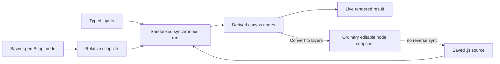

# pen.dev

> Research status: **Architecture-level / closed-source boundary reached** · Last reviewed: **2026-08-11**

| Field | Value |
|---|---|
| Organization / team | High Agency, Inc. / pen.dev |
| Former name | Pencil / Pencil.dev; the extension id, compatibility command, session path and older documentation still retain `pencil` |
| Category | Repository-native design document, agent-controllable canvas and headless design runtime |
| Status | Active |
| Core source availability | Closed and proprietary |
| Public implementation boundary | Live `.pen` format documentation, public MCP/CLI contracts, packaged extension and CLI manifests, and an MIT repository of Script-node examples |
| Decisive artifact question | Which object is authoritative after visual editing, Script execution, browser import, design-to-code conversion and Git collaboration? |
| Evidence snapshot | Official product/docs/legal pages; Open VSX extension `0.6.65`; npm CLI `0.3.2`; public Script examples at commit `e86417027afaa80525cbdd949cce439294417889`; bounded unauthenticated Windows CLI observation on 2026-08-11 |

## The shortest accurate description

pen.dev is a **file-native design system around a proprietary editor engine**.

Its canonical design object is an explicitly saved JSON `.pen` document that can live beside application code. The same closed editor/renderer is distributed through an IDE custom editor, a desktop surface and a headless CLI. Agents reach that engine through MCP or the CLI's JavaScript `execute` operation; humans reach it through the canvas.

That does not make every visible result one reversible artifact:

- the `.pen` graph is durable only after an explicit save;
- an imported `.lib.pen` file is a separate design-library dependency;
- a Script node points to repository-side JavaScript and re-derives its rendered children on every run;
- converting Script output to ordinary layers deliberately forks it away from the script;
- browser/Figma imports become normal design nodes rather than live views of their original source;
- AI-generated framework code and deterministic HTML export become downstream code artifacts, not alternate serializations of one shared graph;
- raster/PDF exports flatten or project the selected design;
- Git versions files, but public documentation does not expose a semantic merge protocol for design-node identities, imports or library revisions.

The format is public enough to inspect and version. The core editor, renderer, agent implementation, MCP executable and bundled WASM are not. “Open design format” is therefore a meaningful portability property, not evidence that pen.dev itself is open source.

## The authority map

| Plane | Working object | Durable authority | Update clock | What does not follow automatically |
|---|---|---|---|---|
| Native design | JSON object tree, components, instances, variables, themes and canvas geometry | the saved `.pen` file | explicit editor/CLI save and Git commit | a visible canvas change is not durable before save; the public format can introduce breaking changes |
| Design library | reusable components and variables imported from a `.lib.pen` file | the library file plus the consumer's relative import | library edit/publication and repository version | public docs do not define pinning, lockfiles, missing-library behavior or conflict recovery |
| Code on Canvas | a Script node with relative `scriptUri`, typed inputs and regenerated output nodes | the `.pen` Script reference plus the referenced `.js` file | every JavaScript save or input change reruns from source | derived children are not ordinary undo history; Convert to layers replaces the Script node with a snapshot fork |
| Application code | React, Next.js, Vue or another implementation created or updated by an AI agent | files in the application checkout | agent write, human edit and Git | no public retained node-to-file/range/AST binding or cross-artifact transaction exists |
| Deterministic web export | HTML plus Tailwind or CSS and optional image assets | exported filesystem files | each `export_html` run | optional layer ids/names help inspect output but do not make it round-trip into the `.pen` graph |
| Media export | PNG, JPEG, WEBP or PDF | the actual exported file | each export | media does not preserve the editable design program or application behavior |
| Imported rendered page | browser DOM/computed style context converted into normal canvas nodes | the resulting `.pen` nodes after save | each browser import | the original authored module, file/range, source map and repository revision are not retained by the public contract |
| Agent/control state | local MCP process, CLI session, provider credentials, prompts and tool calls | separate local credentials/logs or provider-side state | each client and provider independently | local design operations do not imply offline authentication or offline model execution |

The ordinary recovery unit is therefore not “the pen.dev project.” It is a set of repository files—at minimum the `.pen` file and any referenced libraries, scripts and assets—plus whatever application code or exports the user intentionally accepts and commits.

## Journey A: edit a design beside the codebase

The ordinary IDE journey is:

1. **Install and authenticate the extension.** The shipped extension registers a custom editor for `*.pen`. Product authentication remains required even though design operations are performed locally.
2. **Create or open a `.pen` file in the repository.** The canvas and raw JSON are two views of an explicit file rather than an opaque hosted document.
3. **Establish design dependencies.** Add local components/variables, import a relative `.lib.pen` library, or attach relative Script files where procedural output is appropriate.
4. **Ask an agent or edit visually.** An MCP-capable coding assistant can inspect and mutate the open document; a human can select, arrange and style the same graph in the custom editor.
5. **Inspect the actual canvas.** Layout, text, assets, component overrides and Script results must be checked visually. A successful tool result proves only that an operation returned.
6. **Save explicitly.** pen.dev documents that it has no autosave. `Cmd/Ctrl+S` is the boundary between a visible in-memory edit and the repository file.
7. **Review the JSON diff and referenced files.** Git can show and version text changes, but a syntactically mergeable diff is not proof that node ids, component references, imports or layouts remain semantically valid.
8. **Choose a delivery route.** Keep the `.pen` design as the shared specification, export media/HTML, or ask the coding agent to implement or update application code.
9. **Verify the destination independently.** Run generated code, check responsive behavior and interactions, and review the Git diff. The canvas is not production-runtime acceptance.
10. **Commit all required clocks together.** Commit the `.pen`, referenced `.js`, `.lib.pen`, assets and accepted application changes that make the result reproducible.

This journey is strongest when the design file is treated like source: saved deliberately, reviewed with its dependencies and recovered through Git. It becomes fragile when “the canvas looked right” substitutes for a saved file and a verified downstream artifact.

## Journey B: run the same engine headlessly

The CLI exposes a second ordinary journey around the same proprietary engine:

1. install `@pen.dev/cli` and verify `pen version`;
2. authenticate interactively or provide the organization-scoped `PEN_CLI_KEY` used for CI/CD;
3. create a new design with `--out`, or load an existing file with `--in` and choose a separate output path when preservation matters;
4. let the configured Claude, Codex or Gemini agent call design tools, or enter the interactive shell and call the public operations directly;
5. use `get_app_state` and screenshots to inspect the current design rather than trusting a prompt completion;
6. call `save()` in an interactive session or otherwise ensure the requested output was materialized;
7. export only after the saved graph has been checked;
8. compare and commit the actual output file.

The CLI docs describe two execution modes:

- **app mode** connects over WebSocket to a running pen.dev application;
- **headless mode** opens a local editor/renderer without a GUI.

“Headless” means the editor surface is not required. It does not mean the product has no service boundary. The CLI verifies authentication with the backend, stores a separate session under `~/.pencil/session-cli.json`, can call hosted model providers, and supports a product API base URL.

## The `.pen` graph is the native design program

### Root document and object identity

The published format is a JSON object tree. A document contains a format `version`, top-level `children`, optional `imports` and `variables`, and the other fields described by the live schema documentation. Every design object has a `type` and a unique `id`.

The current documented object family includes frames, groups, rectangles, ellipses, paths, polygons, text, notes, prompts, context nodes, icons, scripts and component references. Common entity fields can carry names, positioning, dimensions, rotation, opacity, visibility, locking, context, metadata and theme-conditioned values.

Coordinates have two meanings:

- top-level objects occupy the infinite canvas with explicit positions;
- nested objects are positioned relative to their parent and may participate in the parent's flex-like layout.

That distinction matters when reviewing diffs. A number changing on a root frame and the same number changing inside an auto-layout frame do not represent the same constraint.

### Layout and graphics

Frames can use free positioning or horizontal/vertical layout. The schema exposes container sizing, gaps, padding, alignment, wrapping and child sizing such as fixed, fill-container and fit-content behavior.

The graphics model is richer than “HTML in JSON.” Published fills include solid colors, gradients, images, meshes and shaders; nodes can also carry strokes, effects, clipping, opacity and path geometry. Rendering those fields faithfully is an editor-engine responsibility. The public schema defines data shape, not the proprietary paint, text-layout, shader, image-decoding or export implementation.

### Components, refs and descendant overrides

A node becomes a component origin through `reusable: true`. An instance is a `ref` node whose `ref` field names the origin id. Instance-specific changes live in `descendants` as overrides or replacements.

Nested component children can be addressed through slash-delimited id paths. This preserves a native document identity inside the `.pen` domain: selection, component navigation and agent writes can refer to graph nodes without first guessing from pixels.

It does not create application-source identity. A `.pen` id is not documented as a React component path, DOM source location or Git revision.

### Slots

Slots are empty frames in a component origin that declare which same-document components may be inserted. The schema models a slot as `false` or an array of component ids. An instance can then replace slot contents through descendant overrides.

The public docs explain authoring and composition but do not establish namespace behavior across libraries, migrations after origin deletion, or semantic merge repair when two branches edit the same override path.

### Variables and themes

Variables act like design tokens. A variable has a type and a value; values can be conditional on theme selections. When multiple conditional values match, the documentation says the last satisfied value wins.

Changing a variable updates its uses in the design. The product can also ask AI to import or update variables from CSS. That workflow is a prompted conversion between two token stores, not a documented live binding between a CSS declaration and a `.pen` variable id.

### Imports and libraries

The document's `imports` map gives an alias to a relative `.pen` URI. A design-library file conventionally uses `.lib.pen` and contributes reusable assets to consuming designs.

Library changes are documented as reflecting wherever a component is used. Converting an existing component collection into a library cannot be undone through the product workflow. The docs do not expose:

- a lockfile or immutable library revision;
- compatibility negotiation between document versions;
- fallback behavior when a relative library disappears or moves;
- an atomic transaction across library and consumer files;
- semantic conflict repair for simultaneous Git branches.

Those gaps make the repository revision—not a floating “latest library”—the safest reproducibility boundary.

## The format is open, but its version contract is live

The official format page explicitly describes itself as live documentation and reserves breaking changes. The inspected evidence contains several simultaneous schema versions:

| Evidence surface | Observed version marker |
|---|---:|
| current Document schema page | `2.14` |
| current Code on Canvas header requirement | `2.17` |
| current Code on Canvas prose examples | `2.11` |
| public `pencil-scripts` collection at pinned commit | document `2.11`; scripts declare `@schema 2.10` |
| four `.lib.pen` files bundled in CLI `0.3.2` | document `2.8` |

This does not prove incompatibility: the proprietary engine may migrate or accept several versions. It does prove that consumers cannot infer one stable schema number from the marketing phrase “open format.”

Consequential public gaps are:

- no published compatibility matrix for reader/writer versions;
- no documented migration algorithm or downgrade path;
- no public canonical validator tied to an immutable format release;
- no guarantee that an external writer preserving JSON syntax also preserves editor semantics;
- no disclosed policy for unknown fields, stale ids or library-version skew.

An external tool should therefore preserve unknown fields, pin its tested schema assumptions and validate the result in the actual pen.dev version used by the team.

## Code on Canvas creates a second program inside the design

A Script node stores a relative `scriptUri` and typed `inputs`. The referenced synchronous JavaScript reads the node dimensions and inputs, then returns an array of `.pen` nodes.



The documented sandbox deliberately narrows execution:

- no DOM, network or filesystem access;
- no asynchronous functions or timers;
- deterministic `Math.random()`;
- errors appear on the Script node with a line reference;
- a run is limited to 1,000 returned nodes and two seconds;
- number, string, boolean, color, enum and node-reference inputs are supported.

Saving the `.js` file reruns the node. The returned children are derived output and do not participate in ordinary undo history. “Convert to layers” replaces the Script with normal nodes, after which those nodes can be edited visually but no longer follow the JavaScript.

This is not merely a plugin hook. It is a repository-side generative source file with a deterministic render projection inside the design graph. Reproducibility requires both files; review should treat a Script input change, a JavaScript change and a converted-layer fork as different operations.

### What the public examples establish

High Agency publishes `highagency/pencil-scripts` under MIT. At pinned commit `e86417027afaa80525cbdd949cce439294417889`, it contains a `collection.pen` plus chart, clock, gauge, radar, flow-field and other JavaScript examples.

The collection provides direct format evidence:

- its root declares version `2.11`;
- Script nodes retain normal ids, dimensions and optional input values;
- each `scriptUri` is a relative filename such as `chart.js`;
- the referenced scripts declare typed inputs in header comments and return ordinary node objects;
- procedural examples use `pencil.width`, `pencil.height` and `pencil.input` rather than the browser DOM.

That repository establishes the public Script authoring contract. It does **not** expose the sandbox, editor, renderer, MCP server or CLI implementation.

## One proprietary engine is shipped through several surfaces

### IDE extension distribution

The official Open VSX API exposed the following current package on 2026-08-11:

| Distribution fact | Observed value |
|---|---|
| extension id | `highagency.pencildev` |
| version | `0.6.65` |
| published | 2026-08-07 13:40 UTC |
| VSIX SHA-256 | `350BA0E4ABE987FE1D46C373A32767CA31420D624B6D94F06A9665D08056A375` |
| VS Code engine | `^1.100.0` |
| workspace/UI kind | workspace extension |
| custom editor | `pencil.designEditor` for `*.pen` |
| raw-file escape hatch | `pencil.openRawDesignFile` |
| license | proprietary pen.dev EULA |

The manifest also contributes commands for new designs, design-mode toggling, bundled demo/design-library files and product settings. The continued `pencil` namespace is a compatibility residue, not evidence for a separate active product.

The public manifest reveals extension integration points. It does not make the packaged editor source available, and the EULA prohibits reverse engineering or redistribution.

### CLI distribution

The npm registry exposed `@pen.dev/cli@0.3.2`, published 2026-08-07:

| Distribution fact | Observed value |
|---|---|
| npm package | `@pen.dev/cli@0.3.2` |
| command aliases | `pen` and `pencil` |
| tarball SHA-256 | `B70FC74CDE6458A2D5AF408B0DD8A1A5584A088CA380E6083BB4A8CB51CA9C91` |
| npm integrity | `sha512-3wjsaQ5Ojh27Z6XdwhjVifIe3J3hqHgmyymT7ARSFx7F+FM79fuMWCqX5GyCUg/aaJVhSbdcsdzrKYQ6dB5Zsw==` |
| package license field | `UNLICENSED`; bundled proprietary license |
| packed / unpacked size | about 20.6 MB / 58.4 MB across 70 files |

The package inventory includes:

- the proprietary command program;
- six platform/architecture MCP executables for macOS, Linux and Windows;
- `@highagency/pencil-wasm` `0.1.19`, also marked `UNLICENSED`;
- four bundled design libraries named Halo, Lunaris, Nitro and shadcn;
- a public agent `SKILL.md` and package documentation.

Its own README says headless rendering uses the same engine as the application and CanvasKit. That establishes a product contract and distribution composition, not the undisclosed rendering implementation. This dossier did not decompile or claim source identity for the proprietary JavaScript, native executables or WASM.

The predecessor package `@pencil.dev/cli` ended at `0.2.9`, published 2026-07-20. The new package, old binary alias, old `~/.pencil` session directory and old documentation coexist during the rebrand.

## The current operation language is `execute`, not the older MCP vocabulary

The current CLI `interactive --help` exposes seven operation groups:

| Operation | Public role | Durable effect |
|---|---|---|
| `browser` | load a page, import or screenshot it, return an element or screenshot, and target full page/selection/query | import creates normal canvas nodes only after the document is saved |
| `execute` | run JavaScript design operations; use `editId`/`edits` to patch a failed snippet, then execute it again from scratch | mutates the in-memory `.pen` graph; explicit save remains required |
| `export_html` | emit HTML with Tailwind or CSS, optional scaffolding and layer ids/names | creates a downstream filesystem fork |
| `export_nodes` | export selected design nodes to supported media | creates downstream files |
| `get_app_state` | request current design, schema, scripts/shaders and canvas state according to flags | observation only |
| `get_guidelines` | retrieve product design guidance | context only |
| `get_screenshot` | render visual evidence of the current state | evidence only |

Older official AI-integration and CLI pages still describe `batch_design`, `batch_get`, `get_editor_state` and `snapshot_layout`. Some stale pages also use `pencil`, `PENCIL_CLI_KEY` and `api.pencil.dev`. The shipped `0.3.2` help uses `pen`, `PEN_CLI_KEY`, `execute` and `get_app_state`.

That is not a cosmetic docs issue for automated clients. Tool names, argument shapes, environment variables and binary names are part of the agent interface. A setup guide should be pinned to the actual installed distribution and tested rather than copied from a floating documentation page.

### `execute` is a design operation program

The current CLI describes `execute` as JavaScript snippets operating on the active design. A failed snippet can be addressed by `editId` and patched with `edits`, but the resulting program executes again from the beginning.

This gives an agent a compact, compositional mutation surface. It also creates familiar program semantics:

- operations earlier in a rerun may repeat unless the snippet is written idempotently;
- a tool result is not a file save;
- public docs do not promise an atomic rollback across all mutations in a snippet;
- a screenshot or app-state read is needed to verify geometry and rendering;
- Git diff remains the durable review boundary.

The closed MCP and engine implementation prevent a source-level conclusion about transaction isolation, selector stability, partial failure or concurrency.

## Browser import improves context without preserving authored source identity

The current CLI browser tool can load a page, target the full document, the current selection or a query, and return DOM plus computed-style context. When importing a page, it labels resulting node `context` with a detected component name and HTML tag, for example `Card - div`.

The same help text explicitly says imported pages become normal canvas nodes and should be treated as design rather than HTML/CSS. The public packet does not retain:

- original repository path;
- line/column or AST node;
- source-map location;
- stable live-DOM identity;
- framework instance identity;
- repository revision;
- reverse update channel to the running page.

A semantic label and computed CSS make reconstruction better grounded. They do not create target return. Once imported and saved, the `.pen` node id is canonical only inside the design document.

## “Design ↔ code” is an agent-mediated reconstruction loop

Official documentation describes both directions:

- **design to code:** save the `.pen` file, then ask the AI assistant to generate React, Next.js, Vue or another implementation;
- **code to design:** give the agent access to application code and a `.pen` file, then ask it to recreate structure, layout and style;
- **continued iteration:** visually edit the design, then ask the agent to update code, or change code and ask it to refresh the design.

This is useful workflow continuity, but the public contract does not expose a persistent binding table between design ids and code symbols. No documented revision guard proves that the agent read the same design/code versions that the user reviewed. No two-phase commit joins a `.pen` mutation to an application-source mutation.

The deterministic `export_html` route is different from model-generated framework code: it produces a defined HTML/CSS or HTML/Tailwind fork and can include layer names/ids. It still has no documented round trip.

The correct acceptance statement is therefore: pen.dev can place design and code in one repository and let the same agent reason across both. It does not publicly establish that they are one synchronized source of truth.

## Import and export are semantic forks

### Figma and media input

The product documents full Figma-file import and copy/paste of individual Figma layers. Image content is excluded from the individual-layer copy/paste path. PNG, JPEG and SVG can also be imported as design material.

The destination becomes pen.dev's graph. Public docs do not promise preservation of Figma plugin data, library identity, prototype behavior, variables, comments, branches or original node ids through every route.

### Output routes

The GUI documents PNG, JPEG, WEBP and PDF export for selected elements. The CLI adds HTML/CSS or HTML/Tailwind and headless media export. An agent can separately author framework/application code.

Each destination has its own acceptance criterion:

| Destination | Verify |
|---|---|
| `.pen` | reopen with the intended editor version; inspect components, variables, libraries, scripts and visual layout |
| image/PDF | dimensions, crop, fonts, color, transparency, pagination and export fidelity |
| HTML export | asset paths, semantic structure, responsive behavior, accessibility and browser rendering |
| agent-generated application | source diff, dependency choices, interactions, data/state, responsive behavior, tests and deployment |
| Figma-origin design | missing images, component/library semantics, text and layout fidelity |

No successful export is evidence that the destination remains connected to later `.pen` edits.

## Save, undo, Git and collaboration have different limits

pen.dev documents all four boundaries unusually clearly:

- **no autosave:** canvas work must be saved manually;
- **limited undo/redo:** in-memory history is not a complete recovery ledger;
- **no real-time multiplayer:** team collaboration is performed through Git rather than simultaneous canvas editing;
- **Git-friendly JSON:** branches, text diffs, commits and pull requests can version the file beside code.

Git solves durable byte history. It does not by itself solve semantic design merges. The public materials do not explain whether the editor validates:

- duplicate ids introduced by a textual merge;
- descendant overrides whose origin moved or disappeared;
- concurrent variable/theme edits;
- relative import or Script path renames;
- two branches converting the same Script/library structure differently;
- format-version migrations performed on separate branches.

The safe ordinary workflow is one task per branch, explicit save, raw diff review, reopen/render validation after merge, and a commit that includes all referenced files.

## Local execution and cloud data are separate questions

The product says its MCP server runs locally for design read/write operations. The privacy policy and distribution contracts reveal the wider boundary:

| Data / operation | Documented route |
|---|---|
| `.pen` editing and text AI input/output | local editor/filesystem; text AI content goes directly from the device to the selected third-party model provider |
| product authentication | High Agency backend; account/session tokens are processed and retained for operation |
| CLI automation | requires login or `PEN_CLI_KEY`; `pen status` verifies the session with the backend |
| image generation / stock-image request | transits High Agency infrastructure to the relevant third-party image provider; policy says it is forwarded in real time and not retained by High Agency |
| analytics / diagnostics | PostHog usage, device and error events linked to the profile; policy says prompts, outputs and source code are excluded |
| source code and keystrokes | privacy policy says High Agency does not collect them |
| Script node execution | local constrained sandbox with no network, DOM or filesystem access |

The terms place responsibility for third-party model data practices and high-risk data on the user. The EULA requires authentication and prohibits reverse engineering, modification and redistribution of the software.

The defensible statement is “the design-operation server and files are local.” “The whole product is offline” would be false for authentication, hosted model use, image services and analytics.

## Failure atlas

| Boundary | User-visible failure | Durable risk | Verification / recovery |
|---|---|---|---|
| manual save | canvas looks current but file remains old | work disappears on close/crash | save, check mtime/diff, reopen |
| limited undo | a destructive edit has no usable in-memory reversal | local state cannot be reconstructed | recover the saved file from Git; keep smaller commits |
| format drift | current docs/examples/distributions use `2.8`, `2.10`, `2.11`, `2.14` and `2.17` markers | another writer/editor version may reinterpret or reject data | pin tool versions; preserve unknown fields; reopen and render |
| Git merge | JSON merges without syntax errors but ids/references/layout are wrong | graph is semantically corrupt | validate JSON, reopen, inspect component instances and compare screenshots |
| library change | imported component changes or path disappears | consumers update unexpectedly or fail to resolve | commit library and consumer revision together; inspect all uses |
| Script rerun | error, timeout or 1,000-node limit appears on the node | derived result is absent/stale | fix reported line/input; rerun; screenshot; save both sources |
| Convert to layers | visual snapshot survives but future JS changes do nothing | provenance and generative control are intentionally severed | branch/commit before conversion; keep the script if recovery matters |
| browser import | page looks recognizable but behavior/source identity is missing | design cannot patch the original application deterministically | treat as reconstruction input; review normal nodes and implement through code |
| Figma layer paste | images are missing | incomplete design enters the repository | import assets separately and compare with the origin |
| design-to-code | agent produces plausible but wrong framework code | canvas approval is mistaken for application acceptance | inspect diff and run the real user journey |
| HTML/media export | exported appearance differs from canvas | delivery artifact is wrong despite editor success | open the actual output in its target environment |
| auth | CLI/MCP reports invalid or missing credentials | no output file is created | `pen login`, validate `PEN_CLI_KEY`, run `pen status`, then retry to a deliberate path |
| docs/tool skew | copied setup calls an old binary, variable or tool name | automation cannot connect or invokes the wrong contract | trust installed `--help`; pin package and setup instructions |
| no live multiplayer | simultaneous edits happen on separate branches/files | last writer or merge loses intent | coordinate through Git and render after merge |
| platform surface | official installation and troubleshooting pages disagree about a Windows desktop app; Wayland/Hyprland issues are documented | chosen surface may not start or render correctly | use the supported IDE extension on the affected platform and test before committing to a workflow |

### Bounded Windows CLI observation

On Windows with Node.js `24.16.0`, `npx --yes --package @pen.dev/cli@0.3.2 pen interactive --help` printed the full current operation help and then reproducibly exited with a libuv assertion:

```text
Assertion failed: !(handle->flags & UV_HANDLE_CLOSING), file src\win\async.c, line 94
```

It reproduced in two independent invocations. Starting an interactive session without credentials first reported authentication as required, created no `.pen` output, and then reached the same assertion.

This establishes one distribution/environment failure at CLI `0.3.2` + Windows + Node `24.16.0`. It is not evidence that every Windows or supported-Node installation fails. The product docs require Node 18 or later, so a compatibility bug remains possible and should be retested with the project's supported/recommended runtime before escalation.

## Rebrand and distribution drift are part of the interface

The 2026 rebrand is not complete at every boundary:

| Boundary | Older identity still visible | Current identity |
|---|---|---|
| product | Pencil / Pencil.dev | pen.dev |
| npm | `@pencil.dev/cli@0.2.9` | `@pen.dev/cli@0.3.2` |
| binary | `pencil` | `pen`, with `pencil` alias retained |
| environment | `PENCIL_CLI_KEY`, `PENCIL_API_BASE` on stale pages | `PEN_CLI_KEY`, `PEN_API_BASE` / current backend contract |
| MCP docs | `batch_design`, `batch_get`, `get_editor_state` | shipped help centers `execute` and `get_app_state` |
| extension | `highagency.pencildev`, `pencil.designEditor` | marketed as pen.dev |
| local session | `~/.pencil/session-cli.json` | still the documented current CLI path |

This makes version-pinned distribution evidence essential. A current product name on a floating page does not prove that example commands, tool schemas and installed packages have migrated together.

## Facts, inferences and consequential unknowns

### Established facts

- The native design is an explicitly saved, versioned JSON `.pen` object tree.
- The official format supports reusable components/refs, descendant overrides, slots, variables/themes, imports and Script nodes.
- pen.dev documents no autosave, limited undo/redo and Git-based rather than real-time collaboration.
- The same proprietary engine is distributed through the custom editor and headless CLI; the CLI states CanvasKit-based rendering.
- Current shipped CLI help exposes browser context, `execute`, HTML/media export, app-state/guideline/screenshot reads and explicit save behavior.
- Browser-imported pages become normal canvas nodes rather than retained HTML/CSS documents.
- Code on Canvas derives nodes from a relative synchronous JavaScript file in a constrained sandbox; conversion to layers is a one-way fork.
- Official design-to-code/code-to-design guidance is expressed as AI-agent requests.
- The core product repository is private, and the distributed editor, CLI, MCP executables and WASM are proprietary.
- The public MIT Script repository is an adjunct and does not expose those core implementations.

### Evidence-backed inferences

- The saved `.pen` file is the strongest native design authority because both the GUI and headless engine converge on it and Git can recover it.
- Script source should be reviewed as part of the design program because derived output is recreated from the `.js` rather than stored as ordinary editable history.
- Browser import and AI code conversion are reconstruction boundaries because their public contracts omit stable authored-source identity and reverse synchronization.
- The current format should be treated as evolvable rather than stable because official pages reserve breaking changes and shipped/examples carry multiple schema versions.
- Repository co-location improves agent context and coordinated review; it does not make design and application code one transactional source of truth.

### Consequential unknowns

- The internal scene graph, renderer, text/shader semantics and fidelity rules beyond the public schema.
- MCP transport, mutation transaction, selector stability, rollback and concurrency semantics.
- Exact validation/migration behavior between every observed format version.
- Semantic Git-merge behavior for ids, refs, descendants, themes, imports and libraries.
- Library pinning, cache invalidation and failure behavior when an imported file changes or disappears.
- Whether and how application/component identity is retained internally during browser, Figma or code conversions.
- Agent revision guards when a prompt reads one `.pen`/code revision and files change before writeback.
- Round-trip semantics for deterministic HTML export or generated framework code.
- Undo/history boundaries across visual edits, MCP calls, `execute`, Script reruns and library updates.
- The precise Windows/libuv compatibility envelope for CLI `0.3.2`.

## Acceptance checklists

### Repository-native design change

- [ ] Open the intended `.pen` and confirm imported libraries/scripts resolve.
- [ ] Make the human or agent edit.
- [ ] Inspect the real canvas, including component instances and themes.
- [ ] Save explicitly.
- [ ] Review the raw `.pen` diff and every referenced-file diff.
- [ ] Close/reopen or reload with the intended editor version.
- [ ] Commit the design, scripts, libraries and assets needed to reproduce it.

### Code on Canvas change

- [ ] Confirm the Script node points to the intended relative `.js`.
- [ ] Review schema header, typed inputs and node-count/runtime constraints.
- [ ] Save the JavaScript and inspect the rerendered result.
- [ ] Check the node for errors and capture a screenshot where visual regression matters.
- [ ] Decide explicitly whether the deliverable remains procedural or is converted to layers.
- [ ] If converting, preserve a Git branch/commit that retains the Script source.

### Design-to-code handoff

- [ ] Save and commit the reviewed `.pen` revision first.
- [ ] Record the application revision and exact implementation request.
- [ ] Inspect which files and dependencies the agent changed.
- [ ] Run the application independently of the design canvas.
- [ ] Exercise responsive, interactive, data/state, accessibility and failure paths.
- [ ] Treat later design or code changes as a new reconciliation task, not automatic sync.

### Headless / CI run

- [ ] Pin the CLI package version and a supported Node runtime.
- [ ] Scope and protect `PEN_CLI_KEY` and provider credentials.
- [ ] Use deliberate input/output paths; never overwrite the only good design during experimentation.
- [ ] Verify app state and screenshot before save/export.
- [ ] Confirm the output file exists and changed as intended.
- [ ] Reopen/render the result in the target pen.dev version.
- [ ] Review and commit only the accepted artifact.

## Evidence boundary reached

The decisive public boundary is now explicit:

- the product behavior, artifact authority, format graph, Script derivative model, agent/tool vocabulary, import/export forks, save/Git semantics and local/cloud data routes are documented;
- the current extension and CLI distributions are versioned and hashed;
- the official Script example repository is pinned to an immutable commit and used only for the surface it actually exposes;
- the browser import and design/code workflows are classified by the identities they preserve rather than by “bidirectional” marketing;
- reproducible public contradictions and the bounded Windows CLI failure are recorded without generalizing beyond the evidence;
- proprietary binaries were inventoried at their public manifest/help boundary, not decompiled or treated as source.

Further source-level analysis would require High Agency to publish the editor, renderer, MCP, CLI or WASM implementation, or a public protocol that exposes their decisive internals. Until then, inventing the scene graph, transaction model or mapping algorithm would reduce rather than increase the dossier's accuracy.

## Primary sources

### Product and native workflow

- [pen.dev homepage](https://www.pen.dev/)
- [pen files](https://docs.pen.dev/core-concepts/pen-files)
- [design as code](https://docs.pen.dev/core-concepts/design-as-code)
- [variables](https://docs.pen.dev/core-concepts/variables)
- [components](https://docs.pen.dev/core-concepts/components)
- [design libraries](https://docs.pen.dev/core-concepts/design-libraries)
- [import and export](https://docs.pen.dev/core-concepts/import-and-export)
- [design to code](https://docs.pen.dev/design-and-code/design-to-code)
- [troubleshooting](https://docs.pen.dev/troubleshooting)

### Format, Script and agent contracts

- [live `.pen` format documentation](https://docs.pen.dev/for-developers/the-pen-format)
- [Code on Canvas](https://docs.pen.dev/core-concepts/code-on-canvas)
- [AI integration and MCP](https://docs.pen.dev/getting-started/ai-integration)
- [current pen.dev CLI](https://docs.pen.dev/for-developers/pen-cli)
- [older Pencil CLI page retained for contract-drift evidence](https://docs.pen.dev/for-developers/pencil-cli)
- [installation](https://docs.pen.dev/getting-started/installation)

### Public source adjunct

- [`highagency/pencil-scripts` at pinned commit `e8641702`](https://github.com/highagency/pencil-scripts/tree/e86417027afaa80525cbdd949cce439294417889)
- [pinned `collection.pen`](https://github.com/highagency/pencil-scripts/blob/e86417027afaa80525cbdd949cce439294417889/collection.pen)
- [pinned chart Script](https://github.com/highagency/pencil-scripts/blob/e86417027afaa80525cbdd949cce439294417889/chart.js)
- [MIT license at the pinned commit](https://github.com/highagency/pencil-scripts/blob/e86417027afaa80525cbdd949cce439294417889/LICENSE)

### Shipped distributions and legal boundary

- [Open VSX API for extension `0.6.65`](https://open-vsx.org/api/highagency/pencildev/0.6.65)
- [Open VSX extension page](https://open-vsx.org/extension/highagency/pencildev)
- [npm registry metadata for `@pen.dev/cli@0.3.2`](https://registry.npmjs.org/@pen.dev%2Fcli/0.3.2)
- [npm registry metadata for predecessor `@pencil.dev/cli@0.2.9`](https://registry.npmjs.org/@pencil.dev%2Fcli/0.2.9)
- [privacy policy](https://www.pen.dev/privacy-policy)
- [terms of use](https://www.pen.dev/terms-of-use)
- [EULA](https://www.pen.dev/eula)

### Bounded distribution observation

The Open VSX manifest/SHA endpoints and npm registry metadata/tarball were inspected on 2026-08-11. Package inspection was limited to public manifests, documentation, help output, file inventory, open-format `.pen` data and cryptographic hashes. No proprietary implementation was decompiled. The Windows failure was reproduced with the exact environment recorded above and is intentionally not generalized beyond it.
