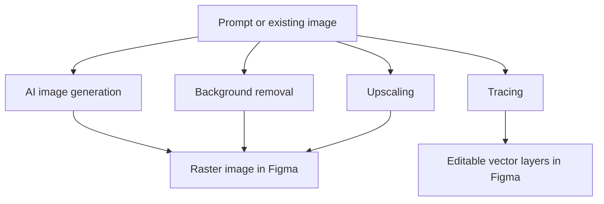

# PicWise.ai

> Research status: **Architecture-level / current listing indexed** · Last reviewed: **2026-08-12**

PicWise.ai is an independently released Figma image workshop. It combines model generation with three correction/materialization paths: background removal, raster upscaling and image tracing into vector layers.

## One surface produces artifacts with different editability

The tracing branch is structurally different from inserting a generated bitmap: it claims to create host-native vector layers, while generation, background removal and upscaling leave a raster result. A dossier that called all four outputs “editable” would erase the product's decisive authority difference.

The creator does not disclose model providers, prompt or input-image transport, vectorization algorithm, output grouping, history, licensing, resolution limits or whether the vector path preserves colors and holes. The public post is from December 2023; a current third-party plugin index still reports PicWise.ai, but no current first-party changelog or source repository was found.

## Primary evidence

- [Creator release](https://forum.figma.com/showcase-your-work-14/introducing-a-powerful-image-editing-plugin-18579)
- [Figma Forum category record](https://forum.figma.com/showcase-your-work-14/index10.html)

PicWise.ai and FigPilot.ai share the Qutesoft/quill zhou maintainer lineage but expose distinct plugin identities and ordinary-user loops. Team location remains unknown.
