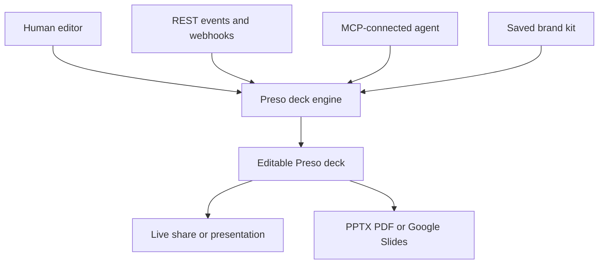

# Preso

> Research status: **Architecture-level** · Last reviewed: **2026-08-12**

| Field | Value |
|---|---|
| Team | Preso · team region not established |
| Ordinary job | create and govern editable brand decks manually by chat or from an external agent |
| Authority | Preso slide project and brand kit until export |
| Interfaces | browser editor REST API MCP and event triggers |
| Lifecycle | active |

## One deck engine behind three control surfaces

In the browser a user describes a deck then edits generated copy layout charts and images by chat or by nudging elements. A stored brand kit contributes colors fonts logo and written voice rules. The same engine is presented through a headless presentation API and MCP so external LLM agents can create and export without operating the browser.

Counting the API and MCP as separate products would duplicate the team and artifact. Conversely delivery targets should not be treated as synchronized replicas: first-party material establishes push or export but not changes flowing back into Preso.

## Evidence ceiling

Public material names the interfaces and ordinary operations but does not publish a slide schema exact MCP tools version graph or format-fidelity tests. Quality claims are excluded from the architecture judgment.

## Primary evidence

- [Preso editor brand and delivery workflow](https://www.trypreso.com/)
- [Official Preso MCP control surface](https://www.trypreso.com/mcp)
