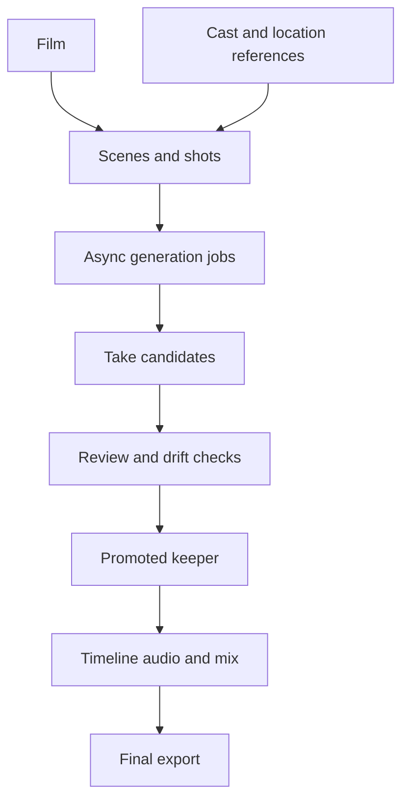

# Reel Studio

> Research status: **Architecture-level** · Last reviewed: **2026-08-12**

| Field | Value |
|---|---|
| Team | Reel Studio · team region not established |
| Ordinary job | let a human or external agent plan a multi-shot video compare takes preserve continuity and finish the cut |
| Authority | Reel Studio film project and timeline |
| Agent interface | hosted streamable-HTTP MCP with personal token and workspace scope |
| Lifecycle | active invite-gated access |

## Its data model encodes production decisions

Reel separates a film into scenes shots cast locations reusable assets generation jobs and take candidates. References can be bound to descriptions; several takes can be generated asynchronously reviewed and one promoted into the project. The post-production phase then owns cut order voiceover sound effects score mix and export.

The public MCP reference makes the boundary unusually concrete. It exposes list create and update tools for project entities then `review_takes` `promote_take` timeline assembly and export. An idempotency key makes retried generation distinguishable from a new creative request. The guide also requires a human checkpoint before overwriting timeline work or exporting the final render.

## Evidence ceiling

The tool contract exposes entity and operation boundaries but not implementation source database schema or exact continuity model. Invite gating is recorded so an agent-readable reference is not confused with unrestricted public access.

## Primary evidence

- [Reel Studio product and ordinary production loop](https://reel.studio/)
- [Official compact agent and MCP reference](https://reel.studio/llms.txt)
