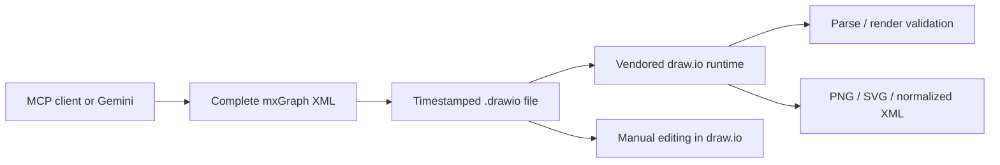

# Sketch.chat / AI Diagram

> Research status: **Source-level** · Lifecycle: **active** · Last reviewed: **2026-08-12**

Sketch.chat treats draw.io itself—not a look-alike canvas or an LLM response—as the execution authority for AI-generated diagrams. It packages an MCP server around native mxGraph XML and uses a pinned draw.io runtime to validate, normalize and export what the model creates.

## Native XML is the agent–editor contract

At commit [`4d002e16`](https://github.com/vishalmaheshkumar/Sketch.chat/tree/4d002e162247b5c73a11155d2104d1989e19e547), [`generateDiagram.ts`](https://github.com/vishalmaheshkumar/Sketch.chat/blob/4d002e162247b5c73a11155d2104d1989e19e547/src/tools/generateDiagram.ts) asks Gemini for complete mxGraph XML, extracts it and writes a timestamped `.drawio` file. [`editDiagram.ts`](https://github.com/vishalmaheshkumar/Sketch.chat/blob/4d002e162247b5c73a11155d2104d1989e19e547/src/tools/editDiagram.ts) sends the current file or supplied XML with the requested change, then writes the returned complete document as another timestamped file instead of silently overwriting the input.

The MCP surface exposes generation, editing, validation, export and a diagram guideline. An external agent can therefore manipulate a portable native artifact without needing a proprietary cloud canvas API.

## The real editor arbitrates validity and delivery

[`render.ts`](https://github.com/vishalmaheshkumar/Sketch.chat/blob/4d002e162247b5c73a11155d2104d1989e19e547/src/render.ts) launches local headless Chrome with Puppeteer and exchanges messages with the vendored draw.io embed. [`validateDiagram.ts`](https://github.com/vishalmaheshkumar/Sketch.chat/blob/4d002e162247b5c73a11155d2104d1989e19e547/src/tools/validateDiagram.ts) loads candidate XML into that runtime; validation succeeds only if the editor can parse and export it. [`exportDiagram.ts`](https://github.com/vishalmaheshkumar/Sketch.chat/blob/4d002e162247b5c73a11155d2104d1989e19e547/src/tools/exportDiagram.ts) uses the same path for PNG, SVG and normalized XML.

That is a materially stronger validity boundary than checking whether an XML string is well formed: the delivery runtime is also the validator.

## Two AI paths share the artifact but not the provider

The MCP tools include a concrete Gemini integration with fallback across Gemini 2.5 variants. The standalone web bridge is deliberately more open-ended: it provides instructions and current XML for a user to copy into an external LLM, then accepts the returned XML into the real editor. The latter does not secretly call Gemini.

This makes the artifact format the stable interface while the conversational model can vary. It also keeps manual draw.io editing possible between agent turns.

## Timestamped files are coarse, local provenance

[`files.ts`](https://github.com/vishalmaheshkumar/Sketch.chat/blob/4d002e162247b5c73a11155d2104d1989e19e547/src/files.ts) constrains writes to the output root and constructs timestamped names. Generation, edits and exports accumulate files that can be compared or versioned externally. There is no database, merge protocol or semantic revision graph; provenance is file-level and local.

Sketch.chat contributes an interoperability-first definition of AI design: an agent produces the native document of a mature editor, and that editor is used as the rendering oracle. Its main trust boundary is equally explicit—model output is whole-document XML, so correctness beyond renderability still depends on review in draw.io.

## Evidence

- [Pinned architecture and submodule contract](https://github.com/vishalmaheshkumar/Sketch.chat/blob/4d002e162247b5c73a11155d2104d1989e19e547/README.md)
- [Whole-document generation](https://github.com/vishalmaheshkumar/Sketch.chat/blob/4d002e162247b5c73a11155d2104d1989e19e547/src/tools/generateDiagram.ts)
- [Non-destructive timestamped edit path](https://github.com/vishalmaheshkumar/Sketch.chat/blob/4d002e162247b5c73a11155d2104d1989e19e547/src/tools/editDiagram.ts)
- [Real draw.io render bridge](https://github.com/vishalmaheshkumar/Sketch.chat/blob/4d002e162247b5c73a11155d2104d1989e19e547/src/render.ts)
