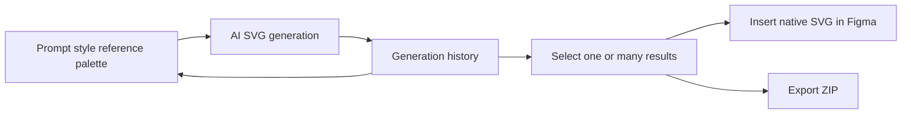

# SVGenius for Figma

> Research status: **Architecture-level** · Last reviewed: **2026-08-12**

> Identity note: this is Figma plugin `1585442932233795342` by Dmitrii Teleganov. It is not the unrelated SVG animation website or the academic SVGenius benchmark.

SVGenius generates editable vector illustrations inside a Figma workflow. A user combines a text prompt with one of more than forty presets or a custom style, optionally supplies a reference image and palette, then chooses generated SVGs to insert onto the canvas.

## History makes generation reusable

The generation history retains prompts and styles and supports batch insertion and export. That is an explicit candidate-management surface, although the creator does not describe branching, merging or semantic version history. After insertion, Figma owns the editable vector objects.

The model, SVG sanitization, reference-image handling, privacy, native node decomposition and whether inserted vectors retain a link to history are not publicly documented. The plugin uses credit packs after five trial generations. No source or authenticated acceptance run was available, and team region remains unknown.

## Primary evidence

- [Creator launch post](https://forum.figma.com/showcase-your-work-14/svgenius-ai-svg-illustration-generator-for-figma-51177)
- [Figma Community plugin 1585442932233795342](https://www.figma.com/community/plugin/1585442932233795342)
