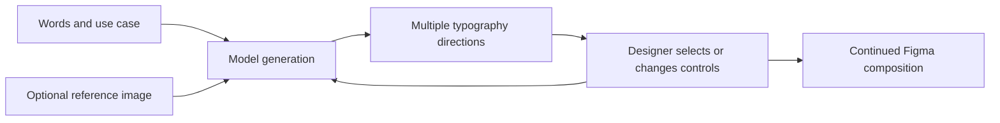

# TypeCraft

> Research status: **Architecture-level** · Last reviewed: **2026-08-12**

TypeCraft treats typography as a generated visual direction rather than a font-setting utility. A designer supplies words, optionally supplies a reference image, explores several title or poster treatments, and chooses what to carry into the surrounding Figma composition.

## The decision loop is visual and reference-conditioned

The creator positions the plugin for poster titles, campaign headers, social covers, event visuals, branding exploration and stylized headline concepts. Later releases add preset style groups, stroke and layout controls, content-sensitive “Gacha Mode,” multilingual examples and 2K output. This is not evidence that TypeCraft reconstructs editable glyph geometry or preserves font semantics; the public contract only establishes generated title visuals returned to a Figma workflow.

## Reference history creates a separate persistence boundary

Imported reference images are uploaded to the product server and may be retained in a history of up to 100 items. The creator says users can delete them and that deletion removes them from the server. Text/options also receive local autosave. These are different clocks from the Figma document and should not be inferred to participate in Figma version history.

The model provider, prompt representation, output layer type, editability, licensing of generated lettering, failure recovery and generation-history retention are not disclosed. The server-side reference store also lacks a published source or independently verified deletion implementation.

## Primary evidence

- [Creator release and update history](https://forum.figma.com/showcase-your-work-14/typecraft-ai-creative-typography-title-poster-generator-for-figma-53208)
- [Figma Community plugin 1611461961334838806](https://www.figma.com/community/plugin/1611461961334838806)
- [Earlier review-queue identity](https://forum.figma.com/ask-the-community-7/the-review-status-of-the-typecraft-plugin-has-been-in-review-52895)

The reviewed first-party material identifies the creator only as Jason/杰森 and provides no reliable team-location evidence.
