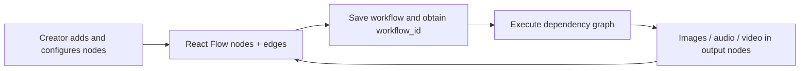

# Vibe Workflow

> Research status: **Source-level** · Last reviewed: **2026-08-12**

Vibe Workflow counts because its durable object is not an image-generation request. It is a reusable visual program: typed nodes, ports and edges determine how references and model outputs travel through an image/video pipeline. The hosted MuAPI surface and the self-hosted repository are two delivery surfaces of that same product.

## The workflow is the artifact

The ordinary loop is create or reopen a workflow, add model/media nodes, connect their handles, configure inputs, save, run, inspect outputs and continue changing the graph. Node execution explicitly saves the workflow first, so a transient canvas is not mistaken for authority.

## Execution follows graph dependencies

At pinned commit [`27059d0`](https://github.com/SamurAIGPT/Vibe-Workflow/commit/27059d0a3d88288b8f1fd5b51ce3f27b81a9dd46):

- [`WorkflowBuilder.jsx`](https://github.com/SamurAIGPT/Vibe-Workflow/blob/27059d0a3d88288b8f1fd5b51ce3f27b81a9dd46/packages/workflow-builder/src/WorkflowBuilder.jsx) owns the embeddable editor boundary.
- [`NodeFlow.jsx`](https://github.com/SamurAIGPT/Vibe-Workflow/blob/27059d0a3d88288b8f1fd5b51ce3f27b81a9dd46/packages/workflow-builder/src/components/NodeFlow.jsx) coordinates graph state, save-before-run and connected-node execution.
- Typed nodes such as [`ImageNode.jsx`](https://github.com/SamurAIGPT/Vibe-Workflow/blob/27059d0a3d88288b8f1fd5b51ce3f27b81a9dd46/packages/workflow-builder/src/components/ImageNode.jsx) use the same graph contract rather than hiding each generation in a separate modal.
- [`workflow_router.py`](https://github.com/SamurAIGPT/Vibe-Workflow/blob/27059d0a3d88288b8f1fd5b51ce3f27b81a9dd46/server/app/routers/workflow_router.py) and [`workflow_helper.py`](https://github.com/SamurAIGPT/Vibe-Workflow/blob/27059d0a3d88288b8f1fd5b51ce3f27b81a9dd46/server/app/utils/workflow_helper.py) form the server save/run boundary.

## What this record does not claim

This is distinct from the same team's Open AI Design Agent: one owns a user-authored node graph; the other owns an agent-planned campaign kit. It is also distinct from a generic model gallery because connections and saved workflow state remain editable after generation. The repository is MIT-licensed. Public evidence did not establish the team's operating region, so the census preserves `unknown`.

## Decisive sources

- [Repository README](https://github.com/SamurAIGPT/Vibe-Workflow/blob/27059d0a3d88288b8f1fd5b51ce3f27b81a9dd46/README.md)
- [MIT license](https://github.com/SamurAIGPT/Vibe-Workflow/blob/27059d0a3d88288b8f1fd5b51ce3f27b81a9dd46/LICENSE)
- [Hosted workflow surface](https://muapi.ai/workflow)
