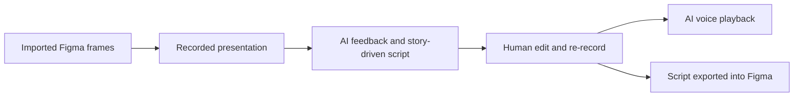

# Worried Presenter

> Research status: **Architecture-level** · Last reviewed: **2026-08-12**

Worried Presenter treats a design presentation as an artifact attached to the frames being presented. The Figma plugin imports those frames, records the designer's spoken run, generates delivery feedback and a more coherent story-driven script, then supports editing, rehearsal and export back into Figma.

## The loop joins visual order and spoken narrative

This differs from a general writing assistant because the script is produced in the context of a selected visual sequence and returned to the design file. The public announcement does not disclose whether frame images, text, ordering metadata or all three are sent to the model; nor does it specify how script passages remain mapped to individual frames after reordering.

## Evidence ceiling

The creator demonstrates the complete ordinary-user path, but the implementation is closed and newly released. Recording retention, transcription provider, model and prompt versions, accessibility, collaboration, exported layer format and history semantics remain unknown. AI voice playback is a rehearsal aid, not evidence that the resulting narrative has been validated with an audience.

No reliable first-party organization location was found, so team region remains unknown.

## Primary evidence

- [Creator workflow announcement](https://forum.figma.com/ask-the-community-7/what-do-you-think-of-our-new-plugin-worried-presenter-55383)
- [Figma Community plugin](https://www.figma.com/community/plugin/1647613618742509370/worried-presenter)
