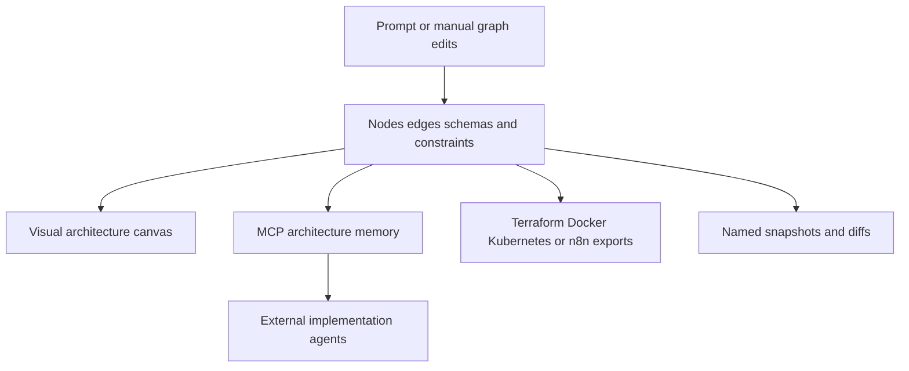

# Zinloop

> Research status: **Architecture-level** · Last reviewed: **2026-08-12**

Zinloop defines Design as system architecture made spatial and agent-readable. Its canonical artifact is a graph of services nodes edges schemas and operational constraints; a rendered diagram is one projection of that graph rather than the whole result.

## The canvas is architecture memory

A user can start from a prompt or manually add and connect more than forty node types. Nodes can carry API database authentication retry and risk information. The graph is then exposed over MCP so coding agents can query topology and constraints while implementing the system.

This is system governance as well as native artifact authoring: the value is not only explaining an architecture to people but giving later agents a queryable decision boundary.

## Snapshots govern change but do not prove deployment

Named snapshots and diffs let a team compare graph states. Compliance analysis incident simulation and roadmap tools operate on the modeled architecture. Infrastructure exports can materialize parts of it and session bundles or read-only links can carry it elsewhere.

None of those exits proves that a deployed system matches the graph. Generated IaC requires review and a live deployment can drift after export. Public evidence does not disclose a reverse inventory process or an enforced graph-to-runtime reconciliation loop.

## Evidence ceiling

The node schema persistence backend diff granularity model prompts MCP authorization and export compilers are closed. “Forty-plus node types” establishes breadth but not formal completeness or provider fidelity. Team region is unknown because the reviewed first-party product did not publish a stable location claim.

## Primary evidence

- [Zinloop product](https://www.zinloop.com/)
- [Zinloop canvas MCP snapshots and exports](https://www.zinloop.com/)
