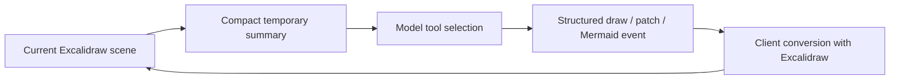

# Apo

> Research status: **Source-level** · Lifecycle: **active-transition** · Last reviewed: **2026-08-12**

Apo’s implemented core is an inspect-then-mutate assistant for an Excalidraw planning surface. The repository also contains a much larger product plan, so its current technical definition must be separated from proposed persistence, collaboration and research infrastructure.

## A lossy canvas summary gives the assistant situational awareness

At commit [`c047609a`](https://github.com/madebyshaurya/APO/tree/c047609a918990bd21d4acc99bbe0e7e9147d4f7), [`AssistantInput.tsx`](https://github.com/madebyshaurya/APO/blob/c047609a918990bd21d4acc99bbe0e7e9147d4f7/src/components/AssistantInput.tsx) extracts a compact summary of the current selection, viewport or board and uploads it before starting an assistant stream. [`contextStore.ts`](https://github.com/madebyshaurya/APO/blob/c047609a918990bd21d4acc99bbe0e7e9147d4f7/src/lib/runtime/contextStore.ts) keeps that context in a process-local map for five minutes.

The primary [streaming route](https://github.com/madebyshaurya/APO/blob/c047609a918990bd21d4acc99bbe0e7e9147d4f7/src/app/api/ai/assistant/stream/route.ts) lets the chosen model call tools to read or search the summary, inspect element details, search the web, write Mermaid, draw native Excalidraw structures, or patch existing elements. Results return as server-sent events. This is materially more capable than prompt-to-image generation, but the model sees a compact context projection rather than the lossless scene.

## Structured proposals cross a client event bridge

[`schemas.ts`](https://github.com/madebyshaurya/APO/blob/c047609a918990bd21d4acc99bbe0e7e9147d4f7/src/lib/ai/schemas.ts) constrains generated DAG and Excalidraw-spec objects. [`specToExcalidraw.ts`](https://github.com/madebyshaurya/APO/blob/c047609a918990bd21d4acc99bbe0e7e9147d4f7/src/lib/board/specToExcalidraw.ts) supplies deterministic sizing and breadth-first placement when an Excalidraw spec needs layout. [`ExcalidrawComponent.tsx`](https://github.com/madebyshaurya/APO/blob/c047609a918990bd21d4acc99bbe0e7e9147d4f7/src/components/ExcalidrawComponent.tsx) receives the events, asks the real Excalidraw library to convert skeletons, then merges, updates, connects or removes elements by ID.

The interface narrows raw model authority: the server emits structured operations and the client owns actual scene materialization. It is not transactional, however; multiple streamed events can partially change the live scene.

## Mermaid is a second reviewable representation

[`DiagramPanel.tsx`](https://github.com/madebyshaurya/APO/blob/c047609a918990bd21d4acc99bbe0e7e9147d4f7/src/components/panels/DiagramPanel.tsx) keeps editable Mermaid source and a real rendered preview. A structured DAG can produce Mermaid and also become native Excalidraw nodes and arrows. The two surfaces share intent, but Apo does not establish a lossless bidirectional binding between later Mermaid edits and later canvas edits.

The repository has real Firecrawl search routes and a LangGraph endpoint, yet the ordinary UI path at this revision is the streaming tool route. Parts of the documented research panel and the broader orchestration architecture are present but not fully mounted or integrated; they should not be counted as one completed end-to-end agent system.

## The current artifact is session state

The live Excalidraw scene and Mermaid code are React/client state. The pinned source does not durably save boards, retain board versions, authenticate projects or enable the documented realtime collaboration service. The README itself marks database insertion, snapshots and Excalidraw-room integration as incomplete.

Apo therefore contributes a distinctive agent interface before it contributes a complete product lifecycle: a model can inspect a bounded projection of a human-edited visual, choose typed read/write tools, and return native editable structures. Persistence and collaborative authority remain the missing layer rather than an assumed feature.

## Evidence

- [Pinned implementation/status ledger](https://github.com/madebyshaurya/APO/blob/c047609a918990bd21d4acc99bbe0e7e9147d4f7/README.md)
- [Canvas-aware streaming tool loop](https://github.com/madebyshaurya/APO/blob/c047609a918990bd21d4acc99bbe0e7e9147d4f7/src/app/api/ai/assistant/stream/route.ts)
- [Structured native-element compiler](https://github.com/madebyshaurya/APO/blob/c047609a918990bd21d4acc99bbe0e7e9147d4f7/src/lib/board/specToExcalidraw.ts)
- [Client scene mutation boundary](https://github.com/madebyshaurya/APO/blob/c047609a918990bd21d4acc99bbe0e7e9147d4f7/src/components/ExcalidrawComponent.tsx)
