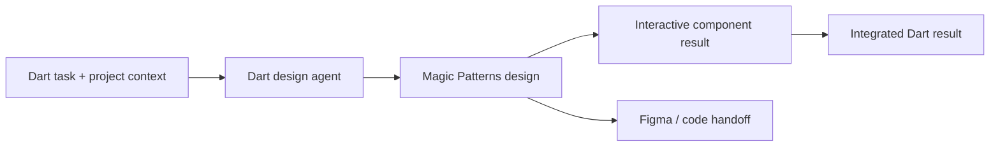

# Dart AI Design Agent

> Research status: **Architecture-level** · Last reviewed: **2026-08-11**

| Field | Value |
|---|---|
| Team | Dart · team region not established |
| Ordinary job | assign a Design task from project work and receive an interactive component back in the originating dartboard |
| Dart authority | task intent status context and returned result reference |
| Downstream authority | Magic Patterns interactive prototype and production-oriented component code |

## A coordination surface across two products

Dart lets a user assign a Design task as if assigning work to a teammate. Its agent turns the task into an interactive result and places the finished component back on the dartboard. The first-party page explicitly says mockups are created in Magic Patterns and can then move to Figma with code behind the component.

## Inclusion does not duplicate Magic Patterns' canvas

Dart independently owns the ordinary coordination loop: the trigger is a project task and the visible outcome returns to the work board. Magic Patterns remains the actual prototype authority and is already counted as its own product. This record therefore uses an external-agent-canvas architecture and does not attribute Magic Patterns' editor schema or version model to Dart.

The product value being tested is a Design-specific task skill inside a broader agent/project platform. A generic task-planning feature would be out of scope; an assignable Design operation with an inspectable interactive result meets the agent-platform surface boundary.

## Evidence ceiling

Public pages do not explain identity mapping between task and Magic Patterns design IDs, failure/retry behavior, result versioning, permission propagation or whether later prototype edits update the Dart result automatically.

## Primary evidence

- [Dart AI design agent](https://www.dartai.com/features/ai-design-agent)
- [Magic Patterns product authority](https://www.magicpatterns.com/)
- [Dart MCP help](https://help.dartai.com/en/articles/9908878-dart-mcp)
