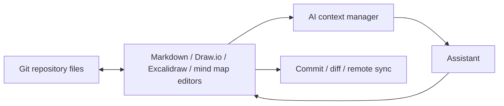

# Gitary

> Research status: **Source-level** · Lifecycle: **active** · Last reviewed: **2026-08-12**

Gitary defines design as repository-native knowledge work. A Git repository may contain prose, Draw.io XML, Excalidraw JSON or a mind map; the visual application edits those artifacts without taking ownership away from Git.

## Git is the persistence and version model

At commit [`4e44fb17`](https://github.com/Peiiii/gitary/tree/4e44fb17f478e01bd77bfc2f63c8acc0bd16b762) provider packages abstract GitHub, Gitee and GitCode operations. Visual state is serialized back into repository files, so ordinary commits and diffs—not an opaque workspace database—supply durable history and portability.

The Excalidraw path is genuinely AI-aware. [`use-provide-excalidraw-ai-contexts`](https://github.com/Peiiii/gitary/blob/4e44fb17f478e01bd77bfc2f63c8acc0bd16b762/src/hooks/use-provide-excalidraw-ai-contexts.ts) exposes current drawing context, and [`use-excalidraw-ai`](https://github.com/Peiiii/gitary/blob/4e44fb17f478e01bd77bfc2f63c8acc0bd16b762/src/hooks/use-excalidraw-ai.ts) brings model results back into the editor.

This architecture makes Gitary an agent-platform design surface rather than one diagram product. Its strongest design claim is continuity across formats and commits. It does not imply that every repository file was AI-generated.

The maintainer's first-party profile locates the team lineage in Hefei China.

## Decisive source anchors

- [Pinned product overview](https://github.com/Peiiii/gitary/blob/4e44fb17f478e01bd77bfc2f63c8acc0bd16b762/README.md)
- [Global AI context manager](https://github.com/Peiiii/gitary/blob/4e44fb17f478e01bd77bfc2f63c8acc0bd16b762/src/core/managers/ai-context.manager.ts)
- [Git provider contract](https://github.com/Peiiii/gitary/tree/4e44fb17f478e01bd77bfc2f63c8acc0bd16b762/packages/git-provider)
