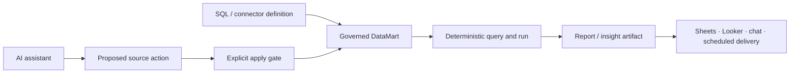

# OWOX Data Marts

> Research status: **Source-level** · Lifecycle: **active** · Last reviewed: **2026-08-12**

OWOX Data Marts defines design as the governed construction of reusable data products and reports. It is not the same product as OWOX Model Canvas: the canvas authors a portable relationship model and can push draft marts into this platform; Data Marts owns the SQL or connector definition lifecycle, access context, runs, insights, destinations and scheduled delivery.

## The artifact is a governed mart plus its delivery graph

At commit [`24932f68`](https://github.com/OWOX/owox-data-marts/tree/24932f68b7f90f3553de0b496887cc1ba61511e8) the persistent [`DataMart`](https://github.com/OWOX/owox-data-marts/blob/24932f68b7f90f3553de0b496887cc1ba61511e8/apps/backend/src/data-marts/entities/data-mart.entity.ts) records a definition type and definition beside schema, status, ownership, contexts, quality configuration and update timestamps. SQL or connector logic remains the numerical authority; reports and AI prose consume it rather than silently replacing it.

The [`create-data-mart` service](https://github.com/OWOX/owox-data-marts/blob/24932f68b7f90f3553de0b496887cc1ba61511e8/apps/backend/src/data-marts/use-cases/create-data-mart.service.ts) establishes the managed object. Relationships, reports, insight templates and run history are separate persisted entities around it; that is why the product is counted as a managed design workspace rather than as a chat response generator.

## AI proposes; an apply action changes authority

The decisive mechanism is not merely narrative generation. An assistant session may propose a source or template action, but [`AiSourceApplyService`](https://github.com/OWOX/owox-data-marts/blob/24932f68b7f90f3553de0b496887cc1ba61511e8/apps/backend/src/data-marts/services/ai-source-apply.service.ts) persists the selected action, verifies that it is still the latest proposal, executes it transactionally and records an applied or failed lifecycle result. A repeated request is idempotently resolved from the stored action. This creates an explicit boundary between conversational suggestion and mutation of the governed artifact.

AI-generated narrative is also downstream from deterministic computation. The public contract states that analysts own SQL and that AI writes prose from approved results; source-level query services and run records preserve that separation. The repository therefore demonstrates a different definition of AI-native design from a visual canvas: controlled transformation of a durable analytical specification and its delivery outputs.

## MCP designs reports without gaining numerical authority

The hosted MCP surface lets external assistants inspect catalog and schema, run bounded structured queries and create or revise reports. [`add_report`](https://github.com/OWOX/owox-data-marts/blob/24932f68b7f90f3553de0b496887cc1ba61511e8/apps/backend/src/ee/mcp/tools/add-report.tool.ts) carries selected fields, filters, slices, aggregations, date buckets and sort into a persistent destination-bound report. [`update_report`](https://github.com/OWOX/owox-data-marts/blob/24932f68b7f90f3553de0b496887cc1ba61511e8/apps/backend/src/ee/mcp/tools/update-report.tool.ts) replaces explicit parts of that configuration rather than accepting arbitrary SQL.

This interface can create an external Google Sheet and can schedule or run supported deliveries, but secrets and the Looker Studio connection step stay outside the agent. The distinction matters: the agent can design and deliver a report artifact while the data mart definition and warehouse computation remain governed sources of truth.

## Persistence and limits

TypeORM entities keep mart definitions, schemas, owners, contexts, assistant sessions, proposed/apply actions, reports, schedules and run history in the application database. `createdAt`, `modifiedAt` and soft deletion provide lifecycle evidence, but the inspected source does not establish a user-facing branch or commit history for arbitrary mart revisions. This dossier therefore describes persistent state and auditable actions rather than claiming Git-like versioning.

OWOX's GitHub organization profile publishes no location, so team region remains `unknown`. The repository is source-available under a mixed MIT and Elastic License 2.0 boundary; enterprise MCP files are inspectable in the repository but are not part of the MIT connector subset.

## Decisive evidence

- [Pinned README and product boundary](https://github.com/OWOX/owox-data-marts/blob/24932f68b7f90f3553de0b496887cc1ba61511e8/README.md)
- [Persistent data-mart entity](https://github.com/OWOX/owox-data-marts/blob/24932f68b7f90f3553de0b496887cc1ba61511e8/apps/backend/src/data-marts/entities/data-mart.entity.ts)
- [Assistant action apply and stale-action guard](https://github.com/OWOX/owox-data-marts/blob/24932f68b7f90f3553de0b496887cc1ba61511e8/apps/backend/src/data-marts/services/ai-source-apply.service.ts)
- [MCP report creation contract](https://github.com/OWOX/owox-data-marts/blob/24932f68b7f90f3553de0b496887cc1ba61511e8/apps/backend/src/ee/mcp/tools/add-report.tool.ts)
- [Bounded structured query implementation](https://github.com/OWOX/owox-data-marts/blob/24932f68b7f90f3553de0b496887cc1ba61511e8/apps/backend/src/ee/mcp/tools/query-data-mart.tool.ts)
