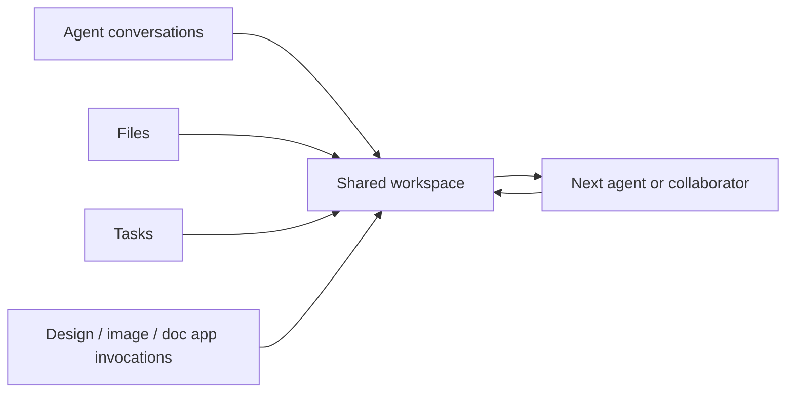

# Tutti

> Research status: **Source-level for the workspace; app implementations evidence-bounded** · Last reviewed: **2026-08-12**

Tutti defines Design as one callable capability inside a real-time multi-agent workspace. Its value is not another generator UI: conversations, files, tasks and app outputs can be referenced across Codex, Claude Code and other agents without download/upload handoffs.

## Context is the shared artifact

A workspace persists agent sessions, file links, task state and app invocations. A prototype-design or AI Canvas result can be referenced directly by a later coding-agent conversation. The user can inspect pending actions and choose which agent/app receives the next step.

This record counts the Tutti product once. Individual remote apps are not multiplied into census entries unless they establish separate teams and artifact contracts.

## Source-visible workspace core

At commit [`0cef928`](https://github.com/tutti-os/tutti/commit/0cef9281fedb59190fcb9c204993688730b3b21b):

- desktop, mobile and CLI clients live under [`apps/`](https://github.com/tutti-os/tutti/tree/0cef9281fedb59190fcb9c204993688730b3b21b/apps);
- [workspace packages](https://github.com/tutti-os/tutti/tree/0cef9281fedb59190fcb9c204993688730b3b21b/packages/workspace) cover files, app center and external content;
- agent GUI/activity packages live under [`packages/agent`](https://github.com/tutti-os/tutti/tree/0cef9281fedb59190fcb9c204993688730b3b21b/packages/agent);
- the canonical workspace service is implemented under [`services/tuttid/service/workspace`](https://github.com/tutti-os/tutti/tree/0cef9281fedb59190fcb9c204993688730b3b21b/services/tuttid/service/workspace);
- architecture documents describe SQLite-backed workspace/session storage, deletion and durable outbox behavior under [`docs/architecture`](https://github.com/tutti-os/tutti/tree/0cef9281fedb59190fcb9c204993688730b3b21b/docs/architecture).

## Evidence boundary

The Apache-2.0 repository establishes workspace persistence and cross-agent/app transport. Current first-party docs establish prototype, AI Canvas, docs and presentation apps, but those app implementations are not all present in the same source tree; their internal artifact models remain architecture-level. No reliable organization region was found.

## Decisive sources

- [Repository README](https://github.com/tutti-os/tutti/blob/0cef9281fedb59190fcb9c204993688730b3b21b/README.md)
- [Documentation index](https://github.com/tutti-os/tutti/tree/0cef9281fedb59190fcb9c204993688730b3b21b/docs)
- [Apache-2.0 license](https://github.com/tutti-os/tutti/blob/0cef9281fedb59190fcb9c204993688730b3b21b/LICENSE)
- [Product site](https://tutti.sh/)
