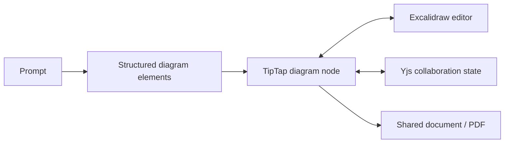

# WriterFlow

> Research status: **Source-level** · Lifecycle: **active** · Last reviewed: **2026-08-12**

WriterFlow treats a diagram as an inline collaborative document node. Its product boundary is therefore wider than an AI diagram generator but narrower than a general whiteboard: prose, Excalidraw elements, presence and export all belong to the same saved document.

## The diagram lives inside the document model

At commit [`d7e15b1c`](https://github.com/Pruthviraj141/Collaborative-Editor/tree/d7e15b1c9c676b2ccfba0824b86d6e2f7b61b106) the TipTap [`diagram-node`](https://github.com/Pruthviraj141/Collaborative-Editor/blob/d7e15b1c9c676b2ccfba0824b86d6e2f7b61b106/lib/editor/extensions/diagram-node.tsx) stores diagram data as editor content. Its node view mounts the real [`diagram-canvas`](https://github.com/Pruthviraj141/Collaborative-Editor/blob/d7e15b1c9c676b2ccfba0824b86d6e2f7b61b106/components/diagram/diagram-canvas.tsx), so generated shapes remain movable and annotatable rather than collapsing into an image.

The AI route returns structured elements. The modal inserts those elements into the document; it does not create a parallel chat-only artifact. Arrow-binding helpers preserve Excalidraw relationships after movement.

## Collaboration is part of artifact authority

Yjs state is persisted through a dedicated collaboration server and Supabase migrations. That means the authoritative object is the converged document state including embedded diagram elements—not whichever participant or model last sent an update.

The public source does not establish the maintainer's region; it remains unknown.

## Evidence trail

- [AI diagram generation route](https://github.com/Pruthviraj141/Collaborative-Editor/blob/d7e15b1c9c676b2ccfba0824b86d6e2f7b61b106/app/api/ai/generate-diagram/route.ts)
- [Persisted collaborative diagram state](https://github.com/Pruthviraj141/Collaborative-Editor/blob/d7e15b1c9c676b2ccfba0824b86d6e2f7b61b106/lib/collab/diagram-state.ts)
- [Yjs database migration](https://github.com/Pruthviraj141/Collaborative-Editor/blob/d7e15b1c9c676b2ccfba0824b86d6e2f7b61b106/supabase/migrations/0004_collab_yjs_state.sql)
