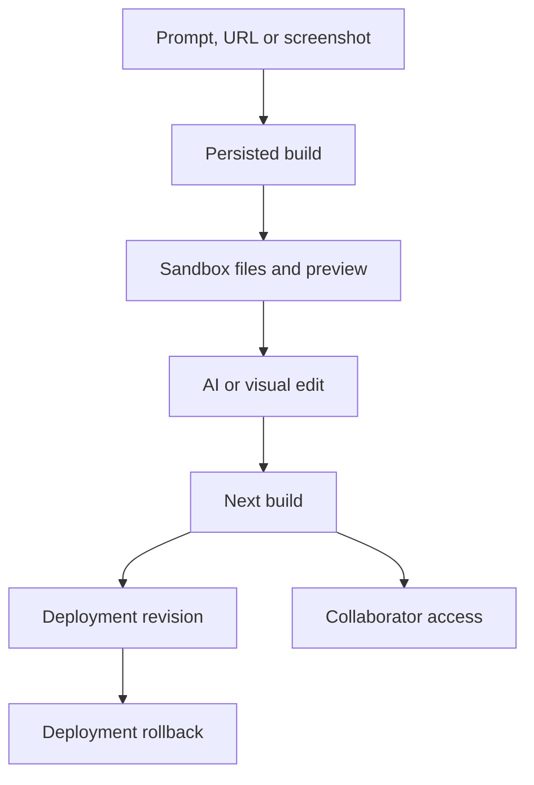

# Argus by Sammy Tourani

> Research status: **Source-level** · Lifecycle: **active** · Last reviewed: **2026-08-13**

Argus is a material derivative of Firecrawl's Open Lovable lineage. It retains URL/screenshot-to-React generation and sandbox preview, then adds durable projects, builds, messages, visual edits, collaborators, teams, deployment history and rollback. Those additions change the source of truth enough to count a separate product while preserving upstream attribution.

## A project contains an ordered build lineage

Pinned revision: `bb2af4b19fd41b0095a79bc2eed774b754d02dbc`.

Project routes own metadata; nested build routes own generated states and their messages. The workspace can resume a sandbox from a selected build, inspect files, apply streamed AI changes or visual-editor changes, and expose a version history panel. This is not just a renamed copy of the transient Open Lovable session.

## Deployment history is a second version ledger

Deployment routes record history and expose rollback separately from project builds. A rollback changes the delivered projection; it does not necessarily move the editor's active build. Conversely, a new build does not publish itself. This split is a meaningful product mechanism, not surface decoration.

## Pinned evidence

- [Repository](https://github.com/SammyTourani/Argus)
- [Project/build API](https://github.com/SammyTourani/Argus/tree/bb2af4b19fd41b0095a79bc2eed774b754d02dbc/app/api/projects)
- [Visual editor](https://github.com/SammyTourani/Argus/blob/bb2af4b19fd41b0095a79bc2eed774b754d02dbc/components/builder/VisualEditor.tsx)
- [Deployment history](https://github.com/SammyTourani/Argus/tree/bb2af4b19fd41b0095a79bc2eed774b754d02dbc/app/api/deploy)
- [Upstream Open Lovable](https://github.com/firecrawl/open-lovable)
