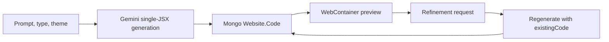

# Cobra AI 2.0

> Research status: **Source-level** · Lifecycle: **active** · Last reviewed: **2026-08-13**

Cobra AI 2.0 is counted for a narrow but complete website-authoring loop: a user chooses a site type, name and theme, asks the model to create a single React artifact, sees it run in a WebContainer and can ask the system to recreate that saved website from its existing code.

## One persisted code field is the product's authority

Pinned revision: `9bb3248560732c380565ca0dc73a6bbfa18beb63`.

The Mongo `Website` record stores the owner, prompt, site metadata, current `Code` string and status. Creation writes the model response into that record. Recreation loads the same record, sends `existingCode` together with the new instruction, then replaces the stored code. There is no separate component graph and no version ledger in the inspected source.

The creator prompt deliberately constrains output to one JSX file. That makes Cobra materially different from Bolt's multi-file artifact protocol even though both use WebContainers for projection.

## Runtime and recovery boundary

The browser boots a WebContainer and turns the saved JSX into an executable preview. Mongo preserves the latest website record, but the schema does not preserve prior source revisions. A successful regeneration is therefore an overwrite, and runtime state inside the preview is not a recoverable product version.

## Evidence ceiling

Source establishes persistence and execution, not the reliability of the advertised production output. The repository contains broad product copy beyond the implemented creator path; this dossier only credits mechanics found in the code.

## Pinned evidence

- [Repository](https://github.com/201Harsh/Cobra-AI-2.0)
- [Website persistence model](https://github.com/201Harsh/Cobra-AI-2.0/blob/9bb3248560732c380565ca0dc73a6bbfa18beb63/Backend/models/Website.model.js)
- [Creation and recreation controller](https://github.com/201Harsh/Cobra-AI-2.0/blob/9bb3248560732c380565ca0dc73a6bbfa18beb63/Backend/controllers/ai.controller.js)
- [WebContainer runtime](https://github.com/201Harsh/Cobra-AI-2.0/tree/9bb3248560732c380565ca0dc73a6bbfa18beb63/frontend/app/site)
