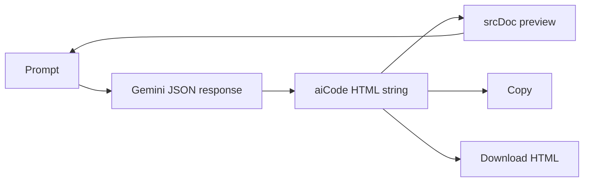

# Front-end Builder by Siddhartha Kumar

> Research status: **Source-level** · Lifecycle: **active** · Last reviewed: **2026-08-13**

Front-end Builder is intentionally small: Gemini returns one complete HTML document, the page renders that string with `iframe.srcDoc`, and the user can request another generation, copy the source or download it as an HTML file.

## The artifact is one replaceable document

Pinned revision: `140a04a79e4921c60c78fdb70b576b76468f6905`.

`App.jsx` asks for JSON containing a `code` field and stores that field as `aiCode`. The same string feeds the code view and the preview. A new prompt clears or replaces it; there is no patch grammar, component graph or multi-file merge.

## What the project does not establish

The displayed code is a `<pre>`, not a text editor, and no persistence or version history is implemented. “Regenerate” is replacement through a new prompt, not recovery. This limited authority is still enough for a complete ordinary-user visual-authoring loop, so the project is included without inflating it into a platform.

## Pinned evidence

- [Repository](https://github.com/siddharthakumar579/Front-end-Builder)
- [Generation, preview and download loop](https://github.com/siddharthakumar579/Front-end-Builder/blob/140a04a79e4921c60c78fdb70b576b76468f6905/src/App.jsx)
- [Earlier preview component](https://github.com/siddharthakumar579/Front-end-Builder/blob/140a04a79e4921c60c78fdb70b576b76468f6905/src/Components/Preview.jsx)
