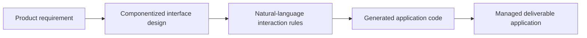

# Gemcoder.AI

> Research status: **Architecture-level** · Last reviewed: **2026-08-12**

Gemcoder.AI is the broader requirement-to-software product operated by Hangzhou Yuantiao Technology. It is counted separately from GemDesign because the ordinary artifact is a deliverable application project rather than a design-only prototype workspace.

## “The requirement is software” compresses three product stages

The first-party surface describes componentized interface design, natural-language interaction authoring and AI-generated application code as one project path. Its strongest product claim is that the prototype's visual appearance is the final product appearance, reducing a separate style-inspection stage.

This differs from exporting a static mockup: interactions and implementation source belong to the resulting software. It also differs from GemDesign's two prototype modes and Figma/Axure/PRD handoff. The two products share an organization and can inform each other without sharing one canonical artifact.

## Access and implementation ceiling

The current product is application-only. Public material establishes the intended user stages but does not expose the project schema, code-generation runtime, persistence/version model, deployment boundary or how a componentized design maps to generated source. The record is therefore `active-transition` at architecture level and does not promote marketing statements such as a tenfold efficiency increase into verified technical facts.

## Team evidence

The official contact block identifies the `yuantiaotech.com` email domain and a Hangzhou address. Team region is recorded as China from that first-party source rather than inferred from the Chinese-language page.

## Primary evidence

- [Gemcoder.AI product and application request](https://ai.gemcoder.com/)
- [GemDesign sibling product](https://design.gemcoder.com/)
- [GemDesign dossier in this repository](../gemdesign/)
