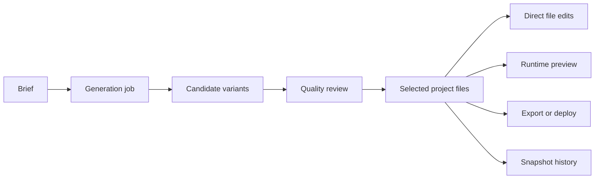

# Website Builder Agent by peter890176

> Research status: **Source-level** · Lifecycle: **active** · Last reviewed: **2026-08-13**

This project treats website generation as a reviewed build job rather than a single chat completion. A user starts a project, receives variants, lets the service inspect quality, modifies concrete files, runs the workspace and can export or deploy the chosen result.

## Build jobs and workspace files are separate state

Pinned revision: `624a05c2c3f75544f4d31c52e106cb30965c5ad4`.

The FastAPI backend represents projects and their files explicitly. Workspace services materialize files for execution, while project-edit operations apply bounded source changes. Generation jobs can produce alternatives and review results before a user chooses what to continue. A snapshot/history route preserves recoverable project states rather than treating the model transcript as the only log.

## Selection precedes delivery

The important product decision is not merely which model response arrived. Variants are evaluated and one source state becomes the continuing project. Export and deployment operate on that selected workspace, so the product has a genuine candidate-promotion boundary.

## Evidence limit

The source establishes the orchestration and file lifecycle, not that automated quality review predicts user preference or that every deploy target is production-ready. Runtime, snapshot and remote deployment can fail independently.

## Pinned evidence

- [Repository](https://github.com/peter890176/website-builder-agent)
- [Project API](https://github.com/peter890176/website-builder-agent/blob/624a05c2c3f75544f4d31c52e106cb30965c5ad4/backend/app/api/routes/projects.py)
- [Bounded project editing](https://github.com/peter890176/website-builder-agent/blob/624a05c2c3f75544f4d31c52e106cb30965c5ad4/backend/app/services/project_edit.py)
- [Export and deployment routes](https://github.com/peter890176/website-builder-agent/blob/624a05c2c3f75544f4d31c52e106cb30965c5ad4/backend/app/api/routes/export_deploy.py)
