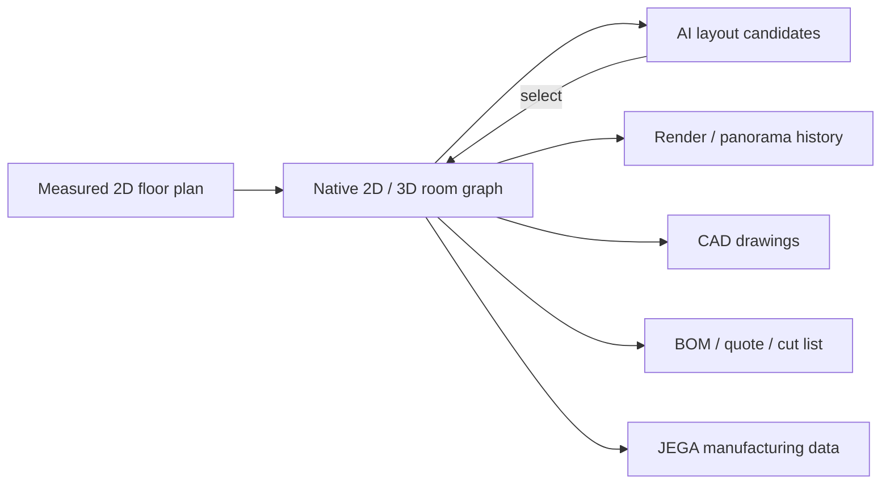

# AIHouse

> Research status: **Architecture-level** · Last reviewed: **2026-08-11**

| Field | Value |
|---|---|
| Team | Sunvega / AIHouse · Guangzhou, China |
| Ordinary job | create a precise interior project, compare AI layouts, edit it in 2D/3D and carry the same design into quoting and manufacturing |
| Native authority | room, wall, opening, furniture and material state in the cloud design project |
| Production projections | renders, panoramas, CAD drawings, cut lists, bills of materials and quotations |

## Generated layouts return to an editable spatial graph

AI Layout starts from a room and its constraints, produces multiple furniture layouts and asks the user to choose one. The chosen option returns to the ordinary 3D design environment for manual customization. AI rendering and style transfer then project the current design and camera into imagery; generation history allows results to be revisited without making the raster output the only authority.

## One design-to-manufacture lineage matters more than isolated AI tools

The product spans home design, rendering and production. Its design-manufacturing materials describe one data source connecting design choices to factory-facing outputs. That is why constraint-driven engineering is primary: dimensions, room topology, products and materials must remain coherent enough to support CAD, quantities and quotations. Generative rendering is an additional projection, not the mechanism that defines the record.

The public interface also exposes an 80-million-item model library and collaboration-oriented cloud projects. A large catalog is not itself counted as an agent; AI layout, rendering and other assistants are capabilities operating on the same canonical project.

## Evidence ceiling

Public help establishes selection, continued editing, history and downstream outputs, but not the internal scene schema, constraint solver, manufacturing interchange format or whether every catalog object supports the full JEGA path. Claims of production continuity are not treated as proof that every exported drawing is automatically buildable without professional verification.

## Primary evidence

- [AIHouse 3D Cloud Design](https://www.aihouse.com/global/product/design)
- [AI Layout help](https://www.aihouse.com/global/help-center/3d-home-design/2053)
- [AIHouse company profile](https://www.aihouse.com/global/about)
