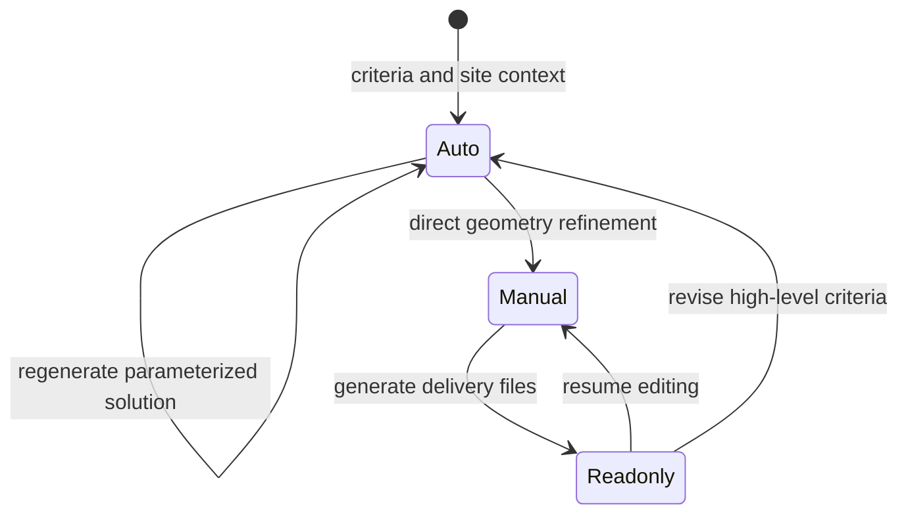

# ARCHITEChTURES

> Research status: **Architecture-level** · Last reviewed: **2026-08-12**

| Field | Value |
|---|---|
| Team | ARCHITEChTURES · operating-team region not yet established from the reviewed first-party pages |
| Ordinary job | evaluate and refine residential building variants against geometry program cost and planning constraints |
| Authority | hosted navigable BIM project with linked analytical metrics |
| Lifecycle | active |

## Three modes control how authority changes

Auto mode uses parameters and generative assistance to create or regenerate building floor parking and site layouts. Manual mode behaves like an online CAD or BIM editor for direct geometric correction while continuing to update areas unit counts ratios budgets and other metrics. Readonly mode freezes editing for review or delivery.

Project folders contain design variants that can be duplicated shared or independently edited. OSM or uploaded CAD supplies site context. Each accepted decision updates a navigable 3D BIM model and analytical panels rather than producing an isolated rendering.

IFC DXF and XLSX files are generated from the current project. The product documents an important invalidation rule: returning to an editing mode after file generation requires regenerating downloads. This prevents a stale export from being treated as synchronized authority.

## Scope and evidence limit

The current ordinary scope centers multi-family residential developments with related commercial hotel and parking cases. Public material exposes the workflow and BIM boundary but not optimization algorithms database schema collaboration conflicts or exact IFC mapping.

## Primary evidence

- [ARCHITEChTURES current BIM and parameter workflow](https://architechtures.com/en)
- [Official mode and project tutorials](https://architechtures.com/en/tutorials)
- [IFC DXF and XLSX regeneration semantics](https://architechtures.com/en/blog/posts/t8-downloading-files-xls-cad-bim)
- [Current user manual](https://architechtures.com/UserManual.pdf)
