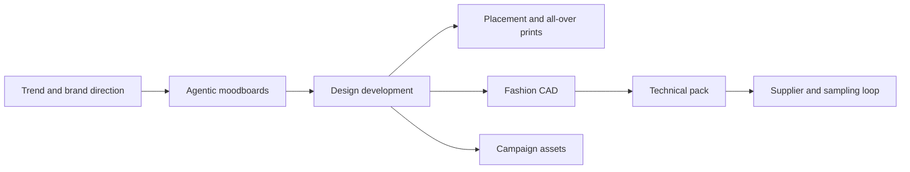

# ARTISO

> Research status: **Architecture-level** · Last reviewed: **2026-08-12**

| Field | Value |
|---|---|
| Team | ARTISO AI · Barcelona, Spain |
| Ordinary job | carry a fashion collection from inspiration through technical product material and campaign content |
| Authority | the collection workflow linking moodboards product designs prints CADs and technical packs |
| Lifecycle | active |

## The unit of work is a collection lifecycle

ARTISO begins with trend runway fabric shape and Pantone-aware moodboards. Design development turns selected direction into garment and accessory concepts. Placement and all-over print tools create production graphics; CAD and tech-pack outputs carry choices toward suppliers. Campaign generation reuses the same collection direction after product definition.

This differs from generic fashion-image generation. The product explicitly links creative exploration to technical documentation and production communication so a chosen concept has downstream consequences.

## Human promotion remains essential

Agentic AI expands moodboard and concept candidates. Designers decide which direction becomes CAD or a technical pack and suppliers still validate feasibility fit material behavior and manufacturing data. A visually plausible garment is not itself a manufacturable specification.

## Evidence ceiling

The project data model CAD format tech-pack schema material database sizing rules version history and supplier integrations are not public. Current evidence establishes an operating professional workflow but not how much data transfers automatically between modules.

## Primary evidence

- [ARTISO platform and artifact chain](https://www.artiso.ai/)
- [Barcelona founding team](https://www.artiso.ai/about-us)
- [Professional services and adoption boundary](https://www.artiso.ai/services)
