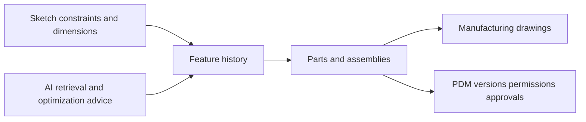

# 大腾智能 CAD

> Research status: **Architecture-level** · Last reviewed: **2026-08-12**

| Field | Value |
|---|---|
| Team | Shenzhen Dateng Information Technology · Shenzhen China with additional offices in Dongguan Shanghai and Suzhou |
| Domain | browser-native industrial 2D and 3D CAD plus PDM |
| Authority | parametric sketches features parts assemblies drawings and references resolved by proprietary geometry and constraint kernels |
| AI role | historical-part retrieval and knowledge-graph-backed structural optimization suggestions |
| Lifecycle | active |

## Why this qualifies without a chat-first generator

The census asks whether AI participates in an evidenced Design loop over a real artifact; it does not require every product to begin from a prompt. 大腾智能 CAD embeds AI into an authoritative engineering workflow: million-scale part retrieval reduces duplicate modeling and historical data plus an industry knowledge graph proposes structural improvements while the engineer continues editing the actual CAD model.

The native model carries geometric and engineering intent. Sketch constraints and dimensions feed feature chains; parts feed multi-level assemblies; drawings are derived for manufacturing. The team states that its own geometry and constraint kernels support solid Boolean and feature operations long rebuild histories cross-feature references and large assemblies.

## PDM makes versions release state

Cloud collaboration records every model and file operation. Projects support permissions review tasks automatic saving and restoration to earlier versions. The integrated PDM archives models drawings and attributes without a manual upload and connects change review document status and approval to the design itself.

AI suggestions do not replace kernel validation or engineer approval. Public evidence establishes the product architecture but not the proprietary kernels algorithms or model implementation.

## Primary evidence

- [大腾智能 CAD product surface](https://www.datengcad.com/)
- [Geometry constraint and platform architecture](https://www.datengcad.com/product)
- [3D CAD and PDM integration](https://www.datengcad.com/3d-cad)
- [Company and office evidence](https://www.datengcad.com/about)
