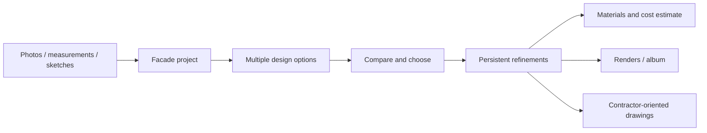

# Facade

> Research status: **Architecture-level** · Last reviewed: **2026-08-11**

| Field | Value |
|---|---|
| Team | Facade · operator identified in terms; team region not established by attributable evidence |
| Ordinary job | assemble exterior evidence, compare facade options, refine one and turn the decision into a contractor-oriented package |
| Continuing authority | managed facade project containing sources, options and refinements |
| Professional boundary | conceptual assistance; users are told to obtain professional review |

## Options remain attached to a physical project

Facade distinguishes itself from a transient chat by keeping photos, angle views, measurements, sketches and documents together. It can generate several design options, preserve them side by side and carry refinements, materials and colors forward. That makes variant decision primary: candidates remain comparable until the user promotes a direction into a more detailed project.

## Candidate promotion is the safest architecture claim

The public product contract is clear about source evidence, variants and delivery outputs, but it does not expose a native BIM or CAD scene graph. Candidate isolation and promotion therefore describes what can be verified without treating a render-to-blueprint claim as proof of parametric engineering. The managed project retains the decision history around those candidates.

Costs, material lists and blueprint-oriented outputs bring physical constraints into the workflow. Terms and product copy also maintain a professional-review boundary. The dossier consequently records constraint-driven engineering as an additional definition, not a guarantee that the system independently validates structure, permits or quantities.

## Evidence ceiling

No public source or schema establishes geometry extraction, scale calibration, revision storage, drawing generation or export formats. The product and legal contract establish project continuity and intended outputs; actual buildability, measurement accuracy and rollback remain unverified.

## Primary evidence

- [Facade product](https://getfacade.ai/)
- [Facade terms](https://getfacade.ai/terms)
- [Facade privacy policy](https://getfacade.ai/privacy)
