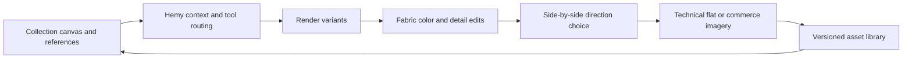

# Hemline

> Research status: **Architecture-level** · Last reviewed: **2026-08-12**

| Field | Value |
|---|---|
| Team | Hemline · team region not established |
| Ordinary job | develop a fashion collection from references and sketches through variants technical flats and commerce imagery |
| Authority | shared collection canvas asset library and attached generation history |
| Agent | Hemy selects fashion-specific tools and parameters from project context |
| Lifecycle | active |

## Results stay attached to the collection

Hemline's infinite canvas holds fabric swatches references renders and tasks around a collection. Its shared library tags and versions those assets for reuse. Hemy reads the current project then selects operations such as sketch-to-render render-to-technical-flat fabric and color replacement on-body visualization off-body product imagery and upscale.

The workflow builder turns repeated steps into a collection process. Public material also describes an end-to-factory ambition including tech packs but the current live-feature list is narrower and centers image and canvas operations; unobserved future custom-brand training is not recorded as shipped.

## Evidence ceiling

JPEG and PNG are the documented user inputs so garment construction knowledge does not imply a parametric garment pattern. Technical flats are production handoff images unless stronger structure is established. Internal asset schema agent tool contract and version graph remain closed.

## Primary evidence

- [Hemline fashion workspace and current features](https://hemline.ai/)
- [Hemline Hemy agent surface](https://hemline.ai/#agent)
- [Hemline collection workflow](https://hemline.ai/#workflow)
